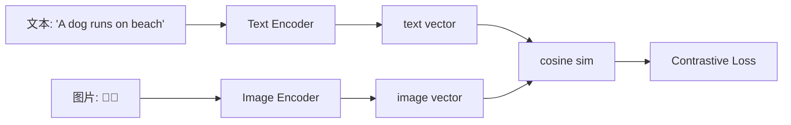

# 多模 Embedding（Multimodal Embedding）

!!! tip "一句话理解"
    让**不同模态的内容（文字、图像、音频、视频）落到同一个向量空间**，使得"文描图 / 图描文 / 音描文"之间能直接比距离。这是"多模数据湖检索"真正起作用的关键。

## 它为什么是"多模数据湖"的关键

一张湖上的多模表 `(id, image, caption, tags, audio, video_clip)`——每种模态各自有 embedding 不够用，关键是让它们**可对齐**：

- 给一段文字，**检索相关图片**
- 给一张图，**检索相似视频段**
- 给用户画像，**混合文 + 图 + 行为**一起排序

没有多模对齐，每种模态都得自己一套独立索引，业务层手动组合；有了多模对齐，**一个向量空间管所有模态**。

## 核心范式

### Dual Encoder（双塔对比学习）

CLIP 是经典。两个独立编码器 $f_t$（文本）和 $f_v$（图像），训练目标是让**匹配的图文对**向量近、**不匹配的对**向量远（InfoNCE loss）。结果：文本和图像共享一个向量空间。



### 统一编码器（多模 LLM 型）

近年 BLIP-2、SigLIP、CLIP-V 系列把两侧打通在一个模型里，甚至同时产出生成能力。代价是模型更大、训练数据更贵。

## 主流模型家族

| 家族 | 覆盖模态 | 维度 | 特点 |
| --- | --- | --- | --- |
| **CLIP** (OpenAI) | 图 + 文 | 512 | 开山之作，生态最广 |
| **SigLIP** (Google) | 图 + 文 | 768 | Sigmoid loss，对大 batch 更友好 |
| **BLIP / BLIP-2** | 图 + 文 | 多种 | 带生成能力，可用于 caption |
| **Jina CLIP** | 图 + 文 (含中文) | 768 | 开源商用友好 |
| **EVA-CLIP** | 图 + 文 | 768/1024 | 视觉侧能力强 |
| **CLAP** | 音频 + 文 | 512 | 音频检索 |
| **Video-CLIP 系** | 视频 + 文 | varies | 视频帧聚合 |

## 工程要点

- **预处理一致性** —— 图像分辨率 / 均值方差 / 文本 tokenizer 必须和训练一致，否则向量跑偏
- **维度对齐** —— 不同模型输出不能直接混用；如果一张表有多种 embedding（如 CLIP + BGE），要各自建独立向量列
- **归一化** —— 一律 L2 归一化，简化距离语义
- **长文本** —— CLIP 家族文本侧只支持 77 tokens，长文要先切块或换长文本 embedding

## 在湖上的存储形态

多模表的典型布局：

```sql
CREATE TABLE multimodal_assets (
  asset_id     BIGINT,
  kind         STRING,    -- image / video / audio / text
  raw_path     STRING,    -- 原始文件在对象存储的位置
  caption      STRING,
  tags         ARRAY<STRING>,
  clip_vec     VECTOR<FLOAT, 512>,    -- CLIP 多模空间
  text_vec     VECTOR<FLOAT, 1024>,   -- 纯文本 embedding（长文/精准）
  audio_vec   VECTOR<FLOAT, 512>,    -- 如适用
  ts           TIMESTAMP,
  partition    STRING
) USING iceberg
PARTITIONED BY (kind, bucket(16, asset_id));
```

一张表、多种 embedding、多模过滤，配合 [Hybrid Search](hybrid-search.md) 就能覆盖绝大多数多模检索场景。

## 相关概念

- [Embedding](embedding.md) —— 单模态的基础
- [Hybrid Search](hybrid-search.md) —— 多向量 + 稀疏的融合
- [多模数据建模](../unified/multimodal-data-modeling.md) —— 湖上怎么落这类表

## 延伸阅读

- *Learning Transferable Visual Models From Natural Language Supervision* (CLIP, Radford et al., 2021)
- *SigLIP: Sigmoid Loss for Language Image Pre-Training* (Zhai et al., 2023)
- *BLIP-2* (Li et al., 2023)
