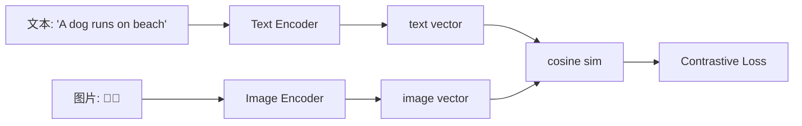

# 多模 Embedding · 原理 + 失败模式 + 边界

!!! tip "一句话理解"
    让**不同模态的内容**（文字 · 图像 · 音频 · 视频）落到**同一个向量空间** · 让"文描图 / 图描文 / 音描文"之间能直接比距离。**这是多模检索的起点不是终点**——在生产里 **"一个空间统万物"** 往往被现实击碎。

!!! warning "重要免责 · 不要被"统一空间"印象误导"
    CLIP / SigLIP / ImageBind 类模型让"多模在一个空间"看起来简单 · 但**生产检索**里以下事实必须认清：

    - **跨模态对齐 ≠ 同等质量对齐** · 图文对齐好 ≠ 图音对齐也好（往往差一个量级）
    - **统一空间里两模态距离可比** 是弱语义的——具体相似度值不一定反映人类直觉
    - **实际生产多数仍走多 embedding 列并存**（CLIP + BGE + CLAP 各自一列）+ 模态分治多路召回（见 [多模检索架构模式](multimodal-retrieval-patterns.md) Pattern D）
    - 统一空间是**探索方向**不是**生产默认**

!!! abstract "TL;DR"
    - **两大核心范式**：Dual Encoder 双塔（CLIP · SigLIP）+ 统一编码器（BLIP-2 · ImageBind · LanguageBind）
    - **模态对齐质量排序（2026-Q2）**：图 ↔ 文 强 >> 视频 ↔ 文 中 >> 音频 ↔ 文 弱 >> 其他组合 更弱
    - **5 类典型失败模式**：文本过强 / Caption shortcut / 模态不平衡 / 长文 OCR 能力缺失 / 对齐度≠检索质量
    - **工程默认**：多 embedding 列并存 + 多路检索 + Rerank · 别依赖单一统一空间
    - **选型三轴**：模态组合 × 开源/API × 语言覆盖 × 对齐训练数据域

## 1. 它为什么是多模检索的关键

一张湖上的多模表 `(id, image, caption, tags, audio, video_clip)` 里 · 让这些模态**可对齐** 能做：

- 给一段文字 · 检索相关**图片** / **视频段**
- 给一张图 · 检索相似**视频段** / **caption 文本**
- 给用户画像 · 混合 **文 + 图 + 行为** 一起排序

**但这些能力的质量差异极大**——这是 §4 失败模式的来源。

## 2. 核心范式

### Dual Encoder · 双塔对比学习（CLIP 为代表）

两个独立编码器 $f_t$（文本）· $f_v$（图像）· 训练目标是**匹配对近 · 不匹配对远**（InfoNCE）：



**优势**：
- 训练/推理都独立模态 · 工程简洁
- 索引友好（标准 ANN 就能查）

**限制**：
- 表示能力有限于**对比学习的 alignment** · 没有 deep fusion
- 对"图里的具体对象 / 属性"理解弱——模型学到的是"总体语义"

### 统一编码器（多模 LLM 型）

**BLIP-2 · SigLIP · ImageBind · LanguageBind · CLIP-V 系列**——把多侧打通在一个模型里 · 有时同时产出生成能力：

**优势**：
- 细粒度语义理解好
- 可产出 caption · 或零样本分类

**代价**：
- 模型大（几 GB）· 推理慢
- 对齐质量仍不均匀（音视频远弱图文）
- **野心场景 · 非生产默认**

## 3. 主流模型家族（2026-Q2 矩阵）

| 家族 | 覆盖模态 | 维度 | 特点 |
|---|---|---|---|
| **CLIP / OpenCLIP** | 图 + 文 | 512 / 768 | 开山之作 · 生态最广 · 英文语义强 · 中文弱 |
| **SigLIP** (Google) | 图 + 文 | 768 | Sigmoid loss · 对大 batch 友好 · 2024 生态渐起 |
| **Jina CLIP v2** (2024+) | 图 + 文（含中文 · 多语）| 768 | 开源商用友好 · 多语支持 |
| **BLIP-2** | 图 + 文 | 多种 | 带生成能力 · 可用于 caption |
| **EVA-CLIP** | 图 + 文 | 768/1024 | 视觉侧能力强 |
| **CLAP** (LAION) | 音频 + 文 | 512 | 音频检索主流 · 但对齐弱图文一档 |
| **VideoCLIP / InternVideo** | 视频 + 文 | 多种 | 视频帧聚合 · 对齐弱图文 |
| **ImageBind** (Meta) | 6 模态（图/文/音/视/热/IMU）| 1024 | 野心统一 · 非图文模态对齐弱 |
| **LanguageBind** (PKU) | 多模 · 以文本为锚 | varies | 以文本为纽带桥接多模 |

**关键观察**：图 ↔ 文**对齐质量**一直最成熟；其他组合（图 ↔ 音 / 视 ↔ 文 / 音 ↔ 视）**都弱一个量级**——截至 2026-Q2 这个格局没变。

## 4. 失败模式 · 多模检索翻车的 5 类

**这一节是本页最重要的内容**——比讲"一空间统万物"更诚实。

### 失败 1 · 文本侧过强 · 视觉侧过弱

**现象**：CLIP 召回"猫在沙滩上"的图片时 · 查询 "a cat at the beach" 会返回**任何和 beach 相关的图**——因为文本侧主导了语义 · 视觉侧只做了粗分类。

**原因**：
- CLIP 类模型的文本侧继承自预训练 LLM · 语义能力强
- 视觉侧训练目标是**对齐文本** · 不是深度理解图像细节

**对策**：
- **视觉细粒度场景走专用模型**（detection 输出 + ROI embedding）
- **业务关键词走 BM25 + OCR**（见失败 4）
- **Rerank 模型**（SigLIP / BLIP-2 作 Cross-Encoder）做精细判断

### 失败 2 · Caption Shortcut

**现象**：模型学会了从图像预测典型 caption · 但不是真正理解图像——看到海边图就预测 "a photo of a beach"，模型内部并没有真正的"理解"。

**诊断**：抽一批模型召回的 case · 人工 review 图文相关度——很多"**语义相关但视觉不准**"。

**对策**：
- 不要在"完整理解图像"假设上建立业务（如医学影像 / 缺陷检测 / 需区分同类细分物体）
- 这类场景 **fine-tune 专用域模型** 或走非 CLIP 路径（如视觉特征 + 分类器）

### 失败 3 · 模态召回不平衡

**现象**：在 Pattern D（多路召回）里 · 文本路返回 Top-10 都是文本对象 · 图像路 0 个图像 · 原因是两路 recall 分数分布尺度不同 · 融合层被文本主导。

**诊断**：分桶看 Top-K 里各模态比例 · 长期不平衡 = 有问题。

**对策**：
- **分数归一化**（Min-Max · Z-score）后再融合
- **RRF** 不依赖分数尺度 · 是多路融合的**鲁棒默认**
- **Per-modality quota**（每模态至少返回 N 个）

### 失败 4 · OCR 图像被当图像检索

**现象**：海报 / 截图 / 文档图**主要含文字** · 用 CLIP image 召回往往很差——这些图的语义主要在**文字内容**。

**对策**：
- **OCR 识别后走文本检索路径**（BM25 + Dense）
- **Pattern D 多路召回** · OCR 路径独立 · 能解决 80% 问题
- 复杂场景 · 用 VLM 直解（Qwen-VL · 见 [document-pipeline](../pipelines/document-pipeline.md) VLM 段）

### 失败 5 · 对齐度 ≠ 检索质量

**现象**：模型 benchmark 显示图文对齐精度 80% · 生产实际 Recall@10 只有 40%。

**原因**：
- benchmark（COCO / Flickr30k）的 query 分布和业务 query 分布差距大
- 生产数据的视觉多样性远超训练集
- 常用 benchmark 的 "1 query 1 正确答案" 设定和生产"1 query 多正确答案"不同

**对策**：
- **自家 Golden Set 评估** · 不要直接套 benchmark 结论（见 [evaluation](evaluation.md) 多模评估段）
- 上线前**业务端抽样 review**

## 5. 工程要点

### 预处理一致性 · 错一个就跑偏

**这是多模 embedding 最容易踩的生产坑**：

| 维度 | 错的表现 | 正确做法 |
|---|---|---|
| **图像分辨率** | 训练 224x224 · 推理 512x512 | 匹配模型 `preprocess` 函数的 resize |
| **图像归一化**（mean / std）| 用 ImageNet 归一化但模型需 OpenAI 归一化 | 用 `CLIPProcessor` / 对应 preprocess |
| **文本 tokenizer** | 用 HuggingFace 默认 · 但模型需 CLIP tokenizer | 用模型配套的 tokenizer |
| **EXIF 旋转** | 手机竖拍图被当横屏 · 物体方向错 | `ImageOps.exif_transpose` 处理 |
| **色彩空间** | CMYK / 灰度图当 RGB | 统一转 RGB · CMYK 特殊处理 |
| **GIF / 动图** | 默认只取首帧 · 语义不全 | 按业务决定取首帧 / 中间帧 / 多帧聚合 |

**自动化检查脚本**：生产 pipeline 里加**采样 validation**——对比 100 张图的预处理结果和参考实现 · 确保完全一致。

### 维度和归一化

- **不同模型输出不能直接混用** · 一张表有多种 embedding（如 CLIP + BGE）· **各自建独立向量列**
- **一律 L2 归一化** · 简化距离语义（cosine = 归一化内积）
- **Matryoshka 截维后必须重新归一化**（详见 [Embedding](embedding.md) + [Quantization](quantization.md)）

### 长文本限制

- **CLIP 家族文本侧只支持 77 tokens** · 长文要先切块或换长文本 embedding
- **推荐**：文本用 BGE / Jina 等长文本模型 + 图像用 CLIP 独立列——**不要硬塞 CLIP 文本侧长文**

### 在湖上的存储形态

多模表的典型布局（生产常见 · 多 embedding 列并存）：

```sql
CREATE TABLE multimodal_assets (
  asset_id     BIGINT,
  kind         STRING,                           -- image / video / audio / text
  raw_path     STRING,                           -- 原始文件在对象存储的位置

  -- 结构化元数据
  caption      STRING,
  tags         ARRAY<STRING>,

  -- 多 embedding 列并存（生产常见 · 不是单一空间）
  clip_vec     VECTOR<FLOAT, 512>,               -- CLIP 多模空间 · 跨模态召回
  text_vec     VECTOR<FLOAT, 1024>,              -- BGE / Jina 等长文本 embedding · 精准文本语义
  audio_vec    VECTOR<FLOAT, 512>,               -- CLAP 音频空间（仅 audio kind）
  ocr_text     STRING,                           -- OCR 提取 · 走 BM25 / text 路径

  -- 模型版本字段（必要 · 便于升级）
  embedding_model_version STRING,
  ocr_model_version       STRING,

  ts           TIMESTAMP
) USING iceberg
PARTITIONED BY (kind, bucket(16, asset_id));
```

**关键**：**多 embedding 列 + 模型版本字段** 是生产默认——不是"一列 clip_vec 搞定"。

### 验证对齐质量的工程方法

**别盲信 benchmark · 自家验证**：

```python
# 抽样方式验证跨模态对齐
def verify_alignment(model, sample_pairs):
    """sample_pairs: [(image, correct_caption, wrong_caption), ...]"""
    hits = 0
    for img, correct, wrong in sample_pairs:
        img_vec = model.encode_image(img)
        correct_vec = model.encode_text(correct)
        wrong_vec = model.encode_text(wrong)
        if cosine(img_vec, correct_vec) > cosine(img_vec, wrong_vec):
            hits += 1
    return hits / len(sample_pairs)
```

- 用 100-1000 业务图 + 各 1 个 correct caption + 1 个 wrong caption
- hit rate > 80% 才算对齐可用于生产
- 低于 60% 考虑换模型或 fine-tune

## 6. 选型建议

### 按模态组合选

| 目标 | 推荐模型 | 备注 |
|---|---|---|
| 英文图文 · 开源 | OpenCLIP / SigLIP | 成熟 · 社区大 |
| 中文图文 · 开源 | Jina CLIP v2 · BGE-CLIP 等 | 中文图文是 2024+ 进步重点 |
| 图文细粒度 | SigLIP · BLIP-2 | 对齐质量更好 |
| 音频 ↔ 文本 | CLAP | 生态最成熟 · 但对齐弱图文 |
| 视频 ↔ 文本 | VideoCLIP / InternVideo | 实际生产常用 frame-level CLIP 聚合 |
| 商用 API 图文 | Voyage Multimodal · Cohere Embed v4 + image | 精度高 · API 成本考量 |

### 不要试图的事

- **不要指望**用 ImageBind 类模型直接生产化——**研究可以 · 生产风险大**
- **不要期望**中文图文 embedding 达到英文 CLIP 质量——仍在追赶
- **不要用** CLIP 文本侧处理长文——77 token 上限

## 7. 相关

- [Embedding](embedding.md) · 单模态文本 embedding 的 2026 模型矩阵
- [多模检索架构模式](multimodal-retrieval-patterns.md) · 讲如何拼端到端多模架构
- [检索单元粒度](retrieval-granularity.md) · 多模检索的一等设计决策
- [Hybrid Search](hybrid-search.md) · 文本内的融合 · 多模融合走 [multimodal-retrieval-patterns §3](multimodal-retrieval-patterns.md)
- [检索评估](evaluation.md) · 多模评估专段
- [多模数据建模](../unified/multimodal-data-modeling.md) · 湖上怎么落这类表

## 8. 延伸阅读

**核心论文**

- **[CLIP · 原始论文](https://arxiv.org/abs/2103.00020)** · Radford et al. 2021
- **[SigLIP](https://arxiv.org/abs/2303.15343)** · Zhai et al. 2023
- **[BLIP-2](https://arxiv.org/abs/2301.12597)** · Li et al. 2023
- **[ImageBind](https://arxiv.org/abs/2305.05665)** · Meta 2023

**进阶 · 失败模式**

- **[CLIP Fail Cases · Compositional Understanding](https://arxiv.org/abs/2301.02280)** · 2023
- **[What do Vision-Language Models see?](https://arxiv.org/abs/2209.01540)** · 视觉偏见分析
