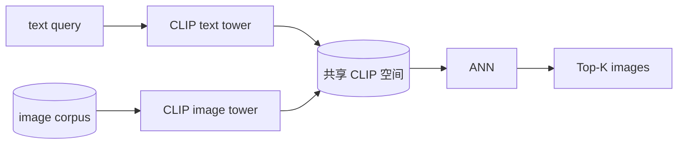
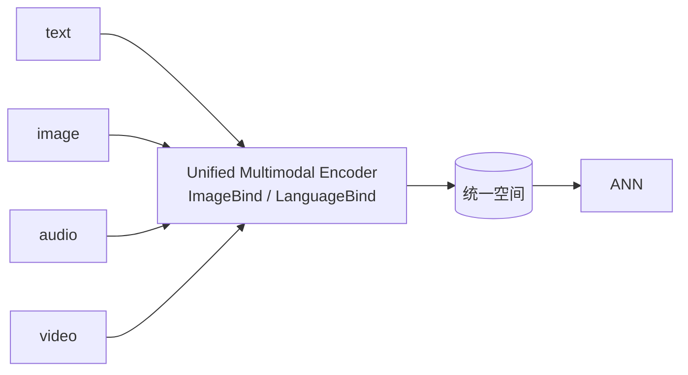
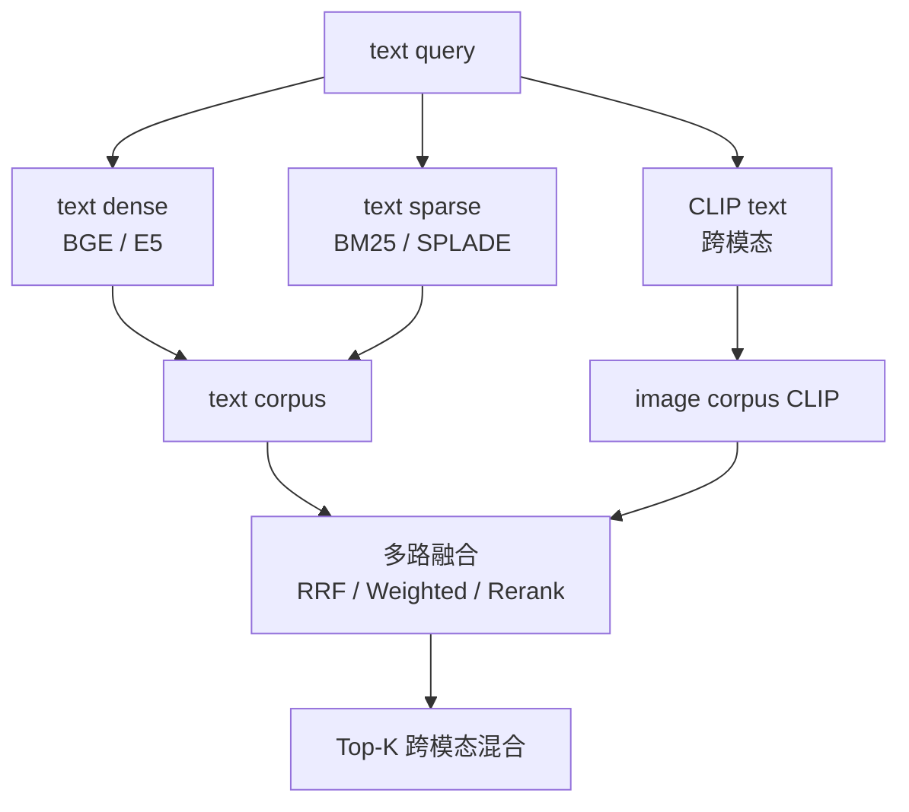
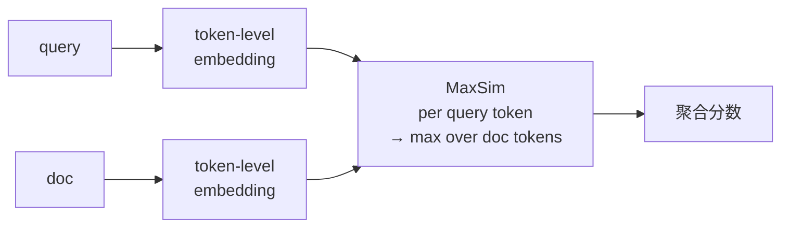

# 多模检索架构模式 · 端到端决策指南

!!! tip "一句话定位"
    本章其他页讲的是 "**向量检索本身**"（索引 · 距离 · 融合 · 量化 · 产品）——**这页讲"多模检索的端到端架构怎么拼"**。明确区分 **文本检索主线** vs **跨模态检索主线** · 避免把文本世界的方法直接平移到图像 / 音频 / 视频。

!!! info "和其他页的边界"
    - 本页 · **多模检索的端到端架构模式**（6 种典型 · 含多模融合策略）
    - [多模 Embedding](multimodal-embedding.md) · **跨模态 Embedding 模型**（CLIP / SigLIP / ImageBind 等）的原理 + 失败模式
    - [检索单元粒度](retrieval-granularity.md) · **retrieval unit / chunking** 多模检索的核心设计
    - [Hybrid Search](hybrid-search.md) · **文本检索内**的稀疏+稠密融合（**不是**跨模态融合）
    - [Rerank](rerank.md) · 两阶段的 reranking 模型

!!! abstract "TL;DR"
    - **关键警示**：**文本检索 ≠ 多模检索** · 文本 Hybrid (BM25+Dense) 不等于多模融合
    - **6 种架构模式**：A 同模态同语言 · B 跨模态文搜图 · C 多模态统一空间 · D 模态分治多路召回 · E 多向量细粒度 (ColBERT) · F 多阶段 Rerank 融合
    - **多模融合 ≠ 稀疏+稠密融合** · 至少 5 种典型策略（详见 §3）
    - **检索粒度**是多模独有的一等问题（见 [retrieval-granularity](retrieval-granularity.md)）
    - **评估外推风险** · MTEB/BEIR 文本 benchmark 的结论不能直接套多模（见 [evaluation](evaluation.md) 多模评估段）

## 1. 为什么需要"多模架构模式"

### 不是"统一向量空间"就解决

Agent 和读者常见的误解 · 把 CLIP / SigLIP 的"跨模态对齐"当成**多模检索的全部答案**：

```
文本 query  ──→  text encoder  ──┐
                                    ├──→  同一空间 → 余弦相似度  → Top-K
图像 query  ──→  image encoder ──┘
```

**现实问题**：
- CLIP 类模型的文本侧和图像侧对齐度**并不完全**——语义偏文本 · 细节偏图像
- 对**OCR 可读的图**（带文字海报 / 截图 / 文档图）· 文本 OCR + 文本检索常常**胜过图像 embedding**
- **音视频**的跨模态对齐（CLAP · VideoCLIP）**远弱于图文**
- **长文档 / 长视频**的单向量表示丢失细节——**多向量 / late interaction** 才能救

详见 [multimodal-embedding · 失败模式](multimodal-embedding.md)。

### 所以要区分架构模式

**文本检索**有成熟的 Hybrid + Rerank 两阶段主路径。**多模检索没有一条万能路径**——不同模态组合要选不同架构。

## 2. 6 种典型架构模式

```
同模态      同模态跨语言     跨模态文搜图    多模统一空间    模态分治多路     多向量 (ColBERT)    多阶段 Rerank 融合
A           A'               B              C              D                E                  F
```

### Pattern A · 同模态检索（基线）


**适用**：纯文搜文 · 纯图搜图 · 纯音搜音。

**不是多模** · 但是多模架构的**基本单元**——每条模态路径内部就是同模态检索。

### Pattern B · 跨模态 · 文搜图



**关键**：**文本和图像 encoder 用同一个对齐模型**（CLIP / SigLIP / BLIP）· embedding 落同一空间。

**适用**：文搜图 / 图搜文 · 纯语义 · 不依赖 OCR。

**限制**：
- 对 OCR 文字图像效果差（语义向量学不到具体文字）
- 图像里具体对象 / 细节 / 稀有概念召回质量参差
- **CLIP zero-shot 能力被过度泛化**——细分领域需要 fine-tune

### Pattern C · 多模态统一空间（野心方案）



**野心**：用 **ImageBind / LanguageBind / OneLLM** 类模型把**所有模态**映射到同一空间。

**现实**：
- **图文对齐成熟** · 音视频对齐**弱于图文**一个量级
- 模型大（几 GB）· 推理慢
- 研究价值 > 生产价值（截至 2026-Q2）

**适用场景**：早期探索 · 多模对齐研究 · **不推荐用作生产主路径**。

### Pattern D · 模态分治多路召回（生产常见）



**核心**：**每个模态独立检索路径** · 结果层融合。

**优势**：
- 每路独立优化 · 索引 · 模型 · 参数 都能调
- 对齐质量差的模态（音视频）**单独留 BM25 fallback**
- 失败模式隔离——某路退化不会整体崩

**这是 2024-2026 生产多模检索最常见的路径之一**——不是唯一正确答案 · 但**在未明确"场景特异化"时**它是稳妥的默认起点。

### Pattern E · 多向量细粒度 · Late Interaction（ColBERT / ColPali）

!!! note "范畴澄清"
    **ColBERT (SIGIR 2020)** 本身是**文本检索**的 late-interaction 方法 · 不是多模方法。Pattern E 讲的是**把 late-interaction 范式扩展到多模场景**——图像 patch · 视频 frame 等细粒度 embedding + MaxSim 聚合。**ColPali (2024-06)** 才是明确为文档图像 retrieval 设计的 late-interaction 模型。



**核心**：**一个对象不是一个向量 · 是多个向量**（token / patch / frame）· 匹配时做 **late interaction**（MaxSim）。

**代表**：
- **文本**：ColBERT / ColBERTv2（late interaction 起源 · SIGIR 2020）
- **文档图像**：**ColPali**（2024-06）· 文档页面 patch embedding + late interaction · 文档检索场景大放异彩
- **图像**：CLIP patch-level + late interaction（工程扩展 · 非原生方法）
- **视频**：frame-level embedding + temporal aggregation

**优势**：
- **长文档 / 长视频**召回质量远超单向量
- 细粒度匹配——query 的某个词能精准对应 doc 的某段

**代价**：
- **存储 10-100×**（每对象几十-几百向量）
- 索引复杂——需专门 ColBERT 支持的库
- 产品支持：**Vespa** 原生 · **Qdrant** 2024+ · 其他多数不支持

### Pattern F · 多阶段 Rerank 融合


**适用**：高质量要求 · 延迟可放松 · RAG / 推荐的精排层。

**多模 Rerank 的关键**：用**多模 Cross-Encoder**（不是纯文本 CE）· 如 **SigLIP / BLIP-2 作为 reranker**——能看懂图文组合的相关性。

## 3. 多模融合策略 · **不是** 稀疏+稠密

[Hybrid Search](hybrid-search.md) 讲的是**文本检索内**的稀疏+稠密融合。**多模融合是另一个问题**——至少 5 种典型：

| 策略 | 描述 | 适用 |
|---|---|---|
| **RRF (Reciprocal Rank Fusion)** | 各路 rank 倒数相加 · 不需要分数归一化 | 各路质量相当 · 多路召回默认 |
| **Weighted Sum** | $\text{score} = \sum w_i \cdot \text{score}_i$ · 需分数归一化 | 能估出各路权重的场景 |
| **Score Normalization + Sum** | Min-Max / Z-score 归一化后相加 | 各路分数范围不同（BM25 几十 · cosine 0-1）|
| **Query-aware Fusion** | 根据 query 类型动态调权（OCR-heavy 偏文字路径）| 有 query 分类器 · 成本高质量高 |
| **Rerank 融合**（推荐） | 不做分数融合 · 各路召回候选 · Cross-Encoder 统一打分 | 业务质量敏感 |

**选择建议**：
- **不知道怎么选 · 先 RRF · k=60 默认** · 工业级鲁棒
- **有 query 分类器 · 试 Query-aware fusion**
- **业务质量敏感 · 上 Rerank 融合** · 跳过分数融合

## 4. 多模检索的常见失败模式

**必读**：[multimodal-embedding · 失败模式](multimodal-embedding.md) 详细讲——此处只列骨架：

- **文本侧过强、视觉侧过弱** · 文字 match 驱动结果 · 图像语义其实没起作用
- **Caption shortcut** · 模型学会从图像预测 caption · 但不是真 understanding
- **模态召回不平衡** · 文本路 Top-10 都是文本对象 · 图像路 0 个——分数归一化掩盖质量问题
- **统一空间不等于统一质量** · 文本到图像对齐好 ≠ 文本到音频对齐也好
- **OCR 图像被当图像检索**（而非走 OCR + 文本路径）· 质量暴跌

## 5. 选型决策 · 4 步

**Step 1 · 模态组合**

| 组合 | 推荐模式 |
|---|---|
| 纯文本 | Pattern A + [Hybrid Search](hybrid-search.md) |
| 文 ↔ 图 | Pattern D（多路）· 或 Pattern B（CLIP 直接）|
| 文 ↔ 视频 | Pattern D · 视频用 ASR+BM25 + frame-level CLIP |
| 文 ↔ 音频 | Pattern D · ASR 转文本 + CLAP 音频 embedding |
| 全模态（图+视+音）| Pattern C（研究）或 Pattern D（生产）|
| 长文档 / 长视频 | Pattern E（多向量 ColBERT）+ 精排 |

**Step 2 · 规模 + 延迟**

- **规模 < 千万 + 实时** · Pattern D + HNSW · 延迟可控
- **亿级 + 高并发** · Pattern D + IVF-PQ / DiskANN · 注意多路并行
- **ColBERT 生产** · 存储预算 10× 起 · 索引选 Vespa / Qdrant

**Step 3 · 质量要求**

- 一般质量 · Pattern D 就够
- 高质量 · Pattern F 加 Cross-Encoder Rerank
- 极高 · Pattern E + F 叠加

**Step 4 · 运维预算**

- 小团队 · Pattern D 单向量多路 · 复用 Milvus/Qdrant 即可
- 大团队 / 专门检索平台 · 可上 Pattern E（多向量专用栈）

## 6. 反模式

- **把文本 Hybrid 直接平移多模** · BM25+Dense 只解决文本内问题
- **单一统一空间（Pattern C）当生产主路径** · 图文外对齐远弱
- **忘记模态失败模式** · 上线后发现某模态召回永远排最后
- **对齐好就当质量好** · CLIP 跨模态对齐度 ≠ 实际检索质量
- **盲目 ColBERT** · 存储爆炸但对短 query + 短 doc 提升不大

## 7. 相关

- [多模 Embedding](multimodal-embedding.md) · 跨模态对齐的原理 + 失败模式
- [检索单元粒度](retrieval-granularity.md) · 多模的 retrieval unit 一等问题
- [Hybrid Search](hybrid-search.md) · 文本检索内的融合（不是多模融合）
- [Rerank](rerank.md) · 多阶段精排
- [检索评估](evaluation.md) · 多模评估专段
- [pipelines/图像管线](../pipelines/image-pipeline.md) · 生成 embedding 的管线
- [ai-workloads/RAG](../ai-workloads/rag.md) · 多模 RAG 应用

## 8. 延伸阅读

- **[ColBERT v2](https://arxiv.org/abs/2112.01488)** · late interaction 经典
- **[SigLIP](https://arxiv.org/abs/2303.15343)** · 改进的 CLIP 对比学习
- **[ImageBind](https://arxiv.org/abs/2305.05665)** · Meta 统一多模
- **[CLAP](https://arxiv.org/abs/2206.04769)** · 音频 + 文本对齐
- **[VideoCLIP](https://arxiv.org/abs/2109.14084)** · 视频 + 文本对齐
