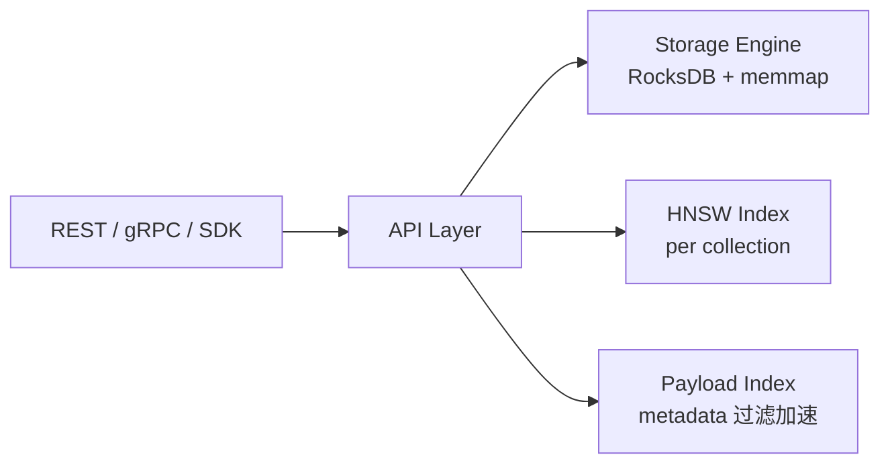

# Qdrant · Rust filter-aware 向量库

!!! tip "一句话定位"
    Rust 实现的向量数据库。**Filter-aware HNSW** 是 Qdrant 的差异化卖点——"向量相似 + 复杂 WHERE"组合查询在中等规模下延迟/精度双优。**2023+ 起领跑 filter-aware 实现**——Milvus / pgvector 随后跟进。

!!! abstract "TL;DR"
    - **甜区**：中规模（千万-亿级）+ **复杂结构化过滤**场景 + 多租户 SaaS
    - **差异化**：Filter-aware HNSW（详见 [filter-aware-search](filter-aware-search.md)）· Rust 性能 + 单二进制部署
    - **量化原生**：Scalar / Binary / Product Quantization 都支持（详见 [Quantization](quantization.md)）
    - **Hybrid Search**：dense + sparse 向量字段 + 文本过滤组合查
    - **Qdrant Cloud** 提供托管

## 1. 它解决什么

大多数向量库的过滤是 **post-filter**：先 ANN 召回 Top-K · 再按元数据条件过滤剩下多少是多少。问题：

- 严格条件（如 `WHERE tenant = X AND ts > Y`）可能过滤后只剩几个
- 要么扩大召回 K（慢）· 要么接受 recall 丢失

Qdrant 把**过滤条件编织进 HNSW 搜索本身**——图节点上带 metadata indicator · 搜索时跳过不符合条件的邻居 · 直接从符合条件的图部分走。**这是 2023 年的架构突破**（详见 [filter-aware-search](filter-aware-search.md) §2 In-filter 策略）。

## 2. 架构



- **单机或集群**（sharded collection + replication）
- **本地持久化**（RocksDB / memmap）或**云对象存储**（Qdrant Cloud）
- **Payload**：每个 vector 带任意 JSON 元数据
- **集群一致性**：基于 Raft 的 metadata 一致性 + 分片 quorum 写

## 3. 关键能力

### Filter-aware HNSW · 核心卖点

- 图遍历时**感知 metadata 过滤** · 不破坏图连通性
- 对 5-50% 选择性的过滤场景表现最好（详见 [filter-aware-search](filter-aware-search.md)）

### Quantization 全家桶

- **Scalar Quantization (SQ8)** · 4× 压缩 · 精度损失小
- **Binary Quantization** · 32× 压缩 · 配 rerank 恢复质量
- **Product Quantization** · 百倍压缩 · 大规模场景
- 详见 [Quantization](quantization.md)

### Hybrid Search

- **dense vector** · 标准 embedding
- **sparse vector** · BM25 / SPLADE 稀疏向量字段（Qdrant 2024+ 原生支持）
- **text filter** · 关键词过滤
- **三路融合**：Qdrant Query API 内置 RRF / Score-based fusion

### 多租户

- **Payload partitioning** · 按 tenant_id 字段隔离
- **Shard key** · 集群级分片 · 强物理隔离

## 4. 生产实践要点

### Payload 索引必须显式创建

**陷阱**：没建 payload index · 过滤会 fallback 到全扫 · 性能崩。

```python
client.create_payload_index(
    collection_name="docs",
    field_name="tenant_id",
    field_schema="keyword"  # 或 integer / float / geo / text 等
)
```

**诊断**：如果 filter 查询慢 · 先 check 目标字段是否有 payload index。

### Quantization 配合 Filter 的精度影响

Quantization 降低精度 · 叠加严格 filter 可能放大精度损失：

- **PQ + 严格过滤** · 召回可能剧降——验证 Recall@K 再决定
- **Binary Quantization + 过滤** · 通常需 rerank 二阶段兜底

### 集群一致性

- **metadata** 走 Raft（collection / schema 元数据）
- **写入**：分片级 quorum（配置可调）
- **读一致性**：可配置 Consistency level（默认 All · 可调 Majority）

## 5. 什么时候选 / 不选

**选 Qdrant**：

- 有**复杂结构化过滤** + 向量检索混合查询（典型 SaaS 多租户）
- 中等规模（千万-亿级）
- **Rust 栈** + 单二进制部署偏好
- 想要**最强 filter-aware** 语义

**不选 Qdrant**：

- **超大规模** (百亿级) → [Milvus](milvus.md)
- **湖原生** + 多模 → [LanceDB](lancedb.md)
- **已有 PG** → [pgvector](pgvector.md)
- **想要 Module 生态**（自动向量化 / 内置 rerank）→ [Weaviate](weaviate.md)

## 6. 陷阱

- **Payload 索引忘记创建** · 过滤全扫 · 最常见性能坑
- **集群模式** 相对新 · 生产案例不如 Milvus 多——小集群 OK · 超大规模谨慎
- **Quantization 精度损失**要评估 · 不是所有场景都能直接开 BQ
- **HNSW 参数 ef_search 设过大** · 精度涨不多但延迟飙
- **Shard key 选错** · 数据倾斜 · 热点分片 QPS 瓶颈
- **OSS 版运维监控不完整** · Qdrant Cloud 的 SLA / observability 更成熟

## 7. 相关

- [Filter-aware ANN](filter-aware-search.md) · **Qdrant 是领跑实现** · 详细算法
- [Quantization](quantization.md) · SQ/PQ/BQ 三种都支持
- [Hybrid Search](hybrid-search.md) · dense+sparse 融合
- [向量数据库](vector-database.md) · 通用定位
- [向量数据库对比](../compare/vector-db-comparison.md) · 详细横比

## 8. 延伸阅读

- **[Qdrant docs](https://qdrant.tech/documentation/)**
- **[Filterable HNSW 博客](https://qdrant.tech/articles/filtrable-hnsw/)** · 算法核心
- **[BM42 论文级博客](https://qdrant.tech/articles/bm42/)** · 稀疏检索新范式
- **[Qdrant Cloud](https://qdrant.tech/cloud/)** · 商业托管
