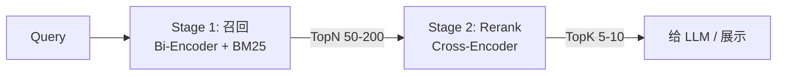

# Rerank · 重排

!!! tip "一句话理解"
    两阶段检索的**第二阶段**——把召回阶段的 Top 50/100 候选交给一个**更贵更准**的 Cross-Encoder 模型精排成 Top 5/10。工业 RAG / 语义搜索的**差异化关键**——**加 Rerank 通常 Recall/NDCG 涨 5-10 点**。

!!! abstract "TL;DR"
    - **架构差异**：召回用 Bi-Encoder（独立编码）、Rerank 用 Cross-Encoder（query+doc 联合编码）
    - **核心价值**：精度换代价——Rerank 比向量检索准**一大截**，但慢 100-1000 倍
    - **典型选型**：bge-reranker v2 / Cohere Rerank 3 / Jina Reranker v2
    - **应用位**：召回 Top 50 → Rerank → Top 5 给 LLM
    - **延迟预算**：10 个候选 50-100ms；100 个候选 200-500ms
    - **"不加 rerank"是 RAG 效果失败的最常见原因之一**

## 1. 业务痛点 · 为什么只有向量检索不够

### Bi-Encoder 的局限

向量检索用的是 **Bi-Encoder**：
- query 和 doc 各自独立编码成向量
- 相似度 = 内积 / 余弦
- 优点：doc 向量可以**离线预计算**，在线只算 query 一次

```
Query → q_vec
Doc_1 → d1_vec                 cos(q_vec, d_i_vec)
Doc_2 → d2_vec    → 分别计算 →     取 Top K
...
Doc_N → dN_vec
```

这个独立编码的设计决定了**上限**：q_vec 和 d_vec 是各自独立产生的，**没交互**。语义复杂的时候（比如"比较 A 和 B 的差异"），向量没法表达细粒度匹配。

### Cross-Encoder 的威力

Rerank 用 **Cross-Encoder**：
- **query + doc 拼成一个输入**，一起丢进 Transformer
- 全部注意力头交互，产出一个匹配分
- 精度高得多，但**每对 query-doc 都要独立跑一次模型**

```
[CLS] query [SEP] doc [SEP] → BERT → single score
```

**代价**：假设召回 100 个候选，Cross-Encoder 要跑 100 次模型。**比 Bi-Encoder 慢 100-1000 倍**。

### 量化差异（BEIR 数据集）

| 管线 | 平均 NDCG@10 |
|---|---|
| 纯 BM25 | 0.43 |
| 纯 Dense (Bi-Encoder) | 0.47 |
| Hybrid (BM25 + Dense) | 0.53 |
| Hybrid + **Rerank** | **0.60-0.62** |

加 Rerank **再涨 5-10 个点**——这在工业界是**差异化**级别的提升。

## 2. 原理深度

### 两阶段检索架构



**为什么要两阶段？**

| 阶段 | 范围 | 模型 | 延迟 |
|---|---|---|---|
| 召回 | 百万 - 千万候选 | Bi-Encoder（便宜）| 1-20ms |
| Rerank | 50-200 候选 | Cross-Encoder（贵） | 50-500ms |

直接用 Cross-Encoder 查 100 万 doc = 不可能（几小时延迟）。召回先降到 100 级，再 rerank 精排。

### Cross-Encoder 的模型结构

典型实现（bge-reranker）：

```
Input: [CLS] query_tokens [SEP] doc_tokens [SEP]
       ↓
    BERT (base / large / multilingual)
       ↓
    [CLS] embedding
       ↓
    Linear + Sigmoid
       ↓
    relevance_score ∈ [0, 1]
```

训练：对比学习。给 (query, positive_doc, negative_doc) 三元组，让 positive 分 > negative 分。

### 为什么 Cross-Encoder 更准

注意力机制在 query 和 doc 之间**全交互**。举例：

- Query: "HNSW 的 M 参数"
- Doc 1: "HNSW 是一种图索引，用于最近邻搜索"
- Doc 2: "HNSW 里 M 参数控制图的连通度，调优建议..."

Bi-Encoder：两个 doc 都和 query 语义接近，分数可能差不多。

Cross-Encoder：doc_2 里 "M 参数" 和 query 里 "M 参数" 有**显式 token 级对齐**，分数显著更高。

## 3. 关键机制 · 模型家族

### bge-reranker 系列（开源 SOTA · 团队推荐）

| 模型 | 参数量 | 语言 | 延迟 / doc（GPU）|
|---|---|---|---|
| `bge-reranker-base` | 110M | 中英 | 5ms |
| `bge-reranker-large` | 335M | 中英 | 15ms |
| `bge-reranker-v2-m3` | 560M | 100+ 语言 | 25ms |
| `bge-reranker-v2-gemma` | 2B | 多语 + 最高精度 | 80ms |

### Cohere Rerank

- **Rerank 3**：云 API，通用最强之一
- **Rerank 3 Multilingual**：100+ 语言
- 商业授权，**API $1 / 1000 searches**

### Jina Reranker

- **v2**：开源 + API 双版本
- 多语言、长文档（最多 8k tokens）
- 部署成本友好

### 其他

- **Voyage Rerank**
- **LLM-as-Reranker**（RankGPT / RankZephyr）
- **FlashRank**（轻量级本地，牺牲精度换速度）

### LLM-as-Reranker 与 LTR

- **LLM-as-Reranker**: 直接 Prompt LLM 给出相关性分；零样本好，延迟高
- **Learning-to-Rank (LTR)**: LambdaMART / XGBoost-Rank，输入 BM25/vector/freshness/CTR 等特征，工业搜索常用

## 4. 工程细节

### 延迟控制

**Rerank 是管线的延迟大头**。延迟取决于：

```
rerank_latency = N_candidates × model_forward_time
```

优化方向：
- **减少候选数**：召回精一点，给 rerank 少一点（从 200 → 50）
- **小模型**：bge-reranker-base 就够大多数场景
- **批处理**：一次性把 N 对 query-doc 送进 GPU
- **量化**：INT8 能减延迟 30-50%
- **并行**：多 GPU / 分布式推理

### 召回与 Rerank 的黄金比

经验数据：

| 召回 TopN | Rerank TopK | 场景 |
|---|---|---|
| 20-30 | 5 | 严格延迟（RAG 实时客服）|
| 50-100 | 10 | 标准 RAG |
| 100-200 | 10-20 | 精度优先（合规 / 法律）|
| 200-500 | 10 | 离线批分析 |

### 部署模式

| 模式 | 优 | 劣 |
|---|---|---|
| **独立 Rerank 服务** | 资源隔离、独立扩缩 | 多一跳网络 |
| **向量库内建**（Weaviate / Cohere）| 一次 API 搞定 | 绑定供应商 |
| **LLM Gateway 统一**（LiteLLM / Portkey）| 容易灰度 / 替换 | 中间层抖动 |

### 部署服务参考

- **[Triton Inference Server](https://github.com/triton-inference-server/server)** —— NVIDIA 推理服务
- **[TEI (Text Embedding Inference)](https://github.com/huggingface/text-embeddings-inference)** —— HF 官方 rerank + embed 服务
- **[vLLM](https://github.com/vllm-project/vllm)** —— 虽然主要是 LLM，也支持 rerank
- **[Infinity](https://github.com/michaelfeil/infinity)** —— 轻量高性能

## 5. 性能数字

### bge-reranker-large（GPU）

| 候选数 | 延迟（A100）| 延迟（T4）|
|---|---|---|
| 10 | 30ms | 80ms |
| 50 | 80ms | 300ms |
| 100 | 150ms | 600ms |

### Cohere Rerank 3（API）

| 候选数 | 延迟 | 成本 |
|---|---|---|
| 10 | 100-200ms | $0.001 |
| 50 | 200-400ms | $0.005 |
| 100 | 300-600ms | $0.01 |

### 精度（BEIR 子集平均）

| 模型 | NDCG@10（相对纯 Dense 提升） |
|---|---|
| BM25 + Dense + **bge-reranker-base** | +5 |
| BM25 + Dense + **bge-reranker-large** | +7 |
| BM25 + Dense + **Cohere Rerank 3** | +8 |
| BM25 + Dense + **bge-reranker-v2-gemma** | +9 |

## 6. 代码示例

### 使用 bge-reranker（HuggingFace）

```python
from FlagEmbedding import FlagReranker

reranker = FlagReranker('BAAI/bge-reranker-large', use_fp16=True)

query = "HNSW 的 M 参数如何调优"
candidates = [
    "HNSW 里 M 参数控制图的连通度...",
    "Flat 索引适合小规模向量...",
]

pairs = [[query, doc] for doc in candidates]
scores = reranker.compute_score(pairs)
ranked = sorted(zip(candidates, scores), key=lambda x: -x[1])
```

### 用 TEI (Text Embedding Inference) 部署

```bash
docker run --gpus all -p 8080:80 \
  -v $PWD/data:/data \
  ghcr.io/huggingface/text-embeddings-inference:latest \
  --model-id BAAI/bge-reranker-large \
  --revision main
```

```python
import requests

r = requests.post("http://localhost:8080/rerank", json={
    "query": query,
    "texts": candidates,
    "return_scores": True,
})
```

### Cohere Rerank API

```python
import cohere
co = cohere.Client("...")

results = co.rerank(
    model="rerank-3-multilingual",
    query=query,
    documents=candidates,
    top_n=10,
)
```

### 集成到 RAG 管线

```python
def rag_answer(query: str) -> str:
    candidates = hybrid_retrieve(query, k=50)                      # Stage 1: 召回
    pairs = [[query, c.content] for c in candidates]
    scores = reranker.compute_score(pairs)                          # Stage 2: Rerank
    top_k = sorted(zip(candidates, scores), key=lambda x: -x[1])[:10]
    context = "\n\n".join([c.content for c, _ in top_k])
    return llm.generate(f"Based on:\n{context}\n\nAnswer: {query}") # Stage 3: LLM
```

## 7. 陷阱与反模式

- **没加 Rerank**：RAG 效果上不去最常见原因；**先加 rerank 再调其他**
- **Rerank 但延迟没做预算**：100 个候选 × bge-large 轻松 500ms → 用户感觉慢
- **候选数固定不按场景调**：延迟严的场景用 30 候选，精度优先用 100+
- **模型中文用英文版**：bge-reranker 有中英双语版别用 fp16 本地 + 纯英文模型
- **Rerank 结果不截断**：Cross-Encoder 输出分绝对值没意义、**截断靠相对排名**
- **训练一个自定义 rerank**：多数时候直接用现成 SOTA 就够；自训练 ROI 低
- **忽视长文档**：Cross-Encoder 输入有 token 限制（通常 512），**长 doc 要截断或分段取最大**
- **批量不够**：一条一条跑 → GPU 利用率 10%；**batch=16-32 能到 90%**

## 8. 横向对比 · 延伸阅读

- [Hybrid Search](hybrid-search.md) · [向量数据库](vector-database.md) · [HNSW](hnsw.md)
- [Rerank 模型对比](../compare/rerank-models.md)（TODO R2.2）

### 权威阅读

- **[Sentence-BERT (Reimers & Gurevych, EMNLP 2019)](https://arxiv.org/abs/1908.10084)** —— Bi-Encoder 奠基
- **[ColBERT (Khattab & Zaharia, SIGIR 2020)](https://arxiv.org/abs/2004.12832)** —— Late interaction 思想
- **[bge-reranker 技术报告](https://huggingface.co/BAAI/bge-reranker-large)** —— 当前开源 SOTA
- **[Cohere Rerank 技术博客](https://txt.cohere.com/rerank/)**
- **[Jina Reranker v2](https://jina.ai/news/jina-reranker-v2/)**
- *Is ChatGPT Good at Search? Investigating LLMs as Re-Ranking Agents* (Sun et al., 2023)

## 相关

- [Hybrid Search](hybrid-search.md) · [向量数据库](vector-database.md) · [HNSW](hnsw.md)
- [RAG on Lake](../scenarios/rag-on-lake.md) · [RAG 评估](../ai-workloads/rag-evaluation.md)
