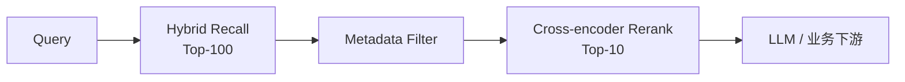

# Rerank（重排）

!!! tip "一句话理解"
    **两阶段检索的第二阶段**：第一阶段（向量 / BM25 / Hybrid）快速召回 Top-N 候选，第二阶段用更贵但更准的模型重新打分挑出 Top-K。**决定检索最终质量上限**。

## 为什么要两阶段

- **召回阶段**必须快（索引化、近似、毫秒级），代价是精度上限受限
- **精排阶段**只处理几十条候选，允许跑贵的模型（cross-encoder、LLM）
- 两阶段组合：**召回拉高 Recall，重排拉高 Precision @ top**

如果你只做召回、直接把 Top-10 塞给 LLM（RAG 场景），实测结果常常比 Top-50 再精排差——LLM 对前后顺序很敏感。

## 主流 Rerank 模型类型

### Cross-encoder

把 `(query, doc)` 拼在一起喂进模型，输出一个相关性分数。
- **优点**：精度高，query 和 doc 能充分交互
- **缺点**：贵，不能用 ANN 预先索引
- **代表**：BGE-reranker、Jina Reranker、Cohere Rerank v3

### LLM-as-Reranker

直接 Prompt 一个 LLM：「给出以下文档与问题的相关性（1–10 分）」。
- **优点**：在零样本场景下表现好
- **缺点**：延迟 / 成本高
- **代表**：RankGPT / RankZephyr / 自定义 prompt

### Learning-to-Rank（LTR）

传统 LambdaMART / XGBoost-rank，输入是大量特征（BM25、vector score、freshness、click-through），输出 rank。
- **优点**：可解释、低延迟
- **缺点**：需要标注数据 / 行为数据

## 在 RAG / 检索流水线里的位置

一般 **"召回 100 → 精排 10"** 是实用起点。更高质量可以做 "召回 200–500 → 精排 Top-N"。

## 工程要点

- **批处理**：cross-encoder 支持 batch 推理，集中打分能把延迟摊薄
- **延迟预算**：在线场景 p95 必须控制（50–150ms 批处理 50 候选）
- **模型语种**：中英场景选双语模型（BGE-reranker-v2-m3 / Jina m0 / Cohere）
- **置信度阈值**：分太低直接不返回，减少后链路噪音

## 陷阱与坑

- **不 rerank 直接用 top-10** —— 最常见的 RAG 质量坑
- **rerank 模型和 embedding 模型不匹配** —— 召回漏了的东西，rerank 也救不回来
- **忽略 metadata filter** —— 召回返回但被权限 / 合规过滤的条目，rerank 前就应剔除

## 相关概念

- [Hybrid Search](hybrid-search.md) —— rerank 的上游
- [RAG](../ai-workloads/rag.md) —— rerank 的头号消费者

## 延伸阅读

- BGE Reranker: <https://github.com/FlagOpen/FlagEmbedding>
- *Is ChatGPT Good at Search? Investigating Large Language Models as Re-Ranking Agents* (Sun et al., 2023)
- Cohere Rerank: <https://docs.cohere.com/docs/reranking>
