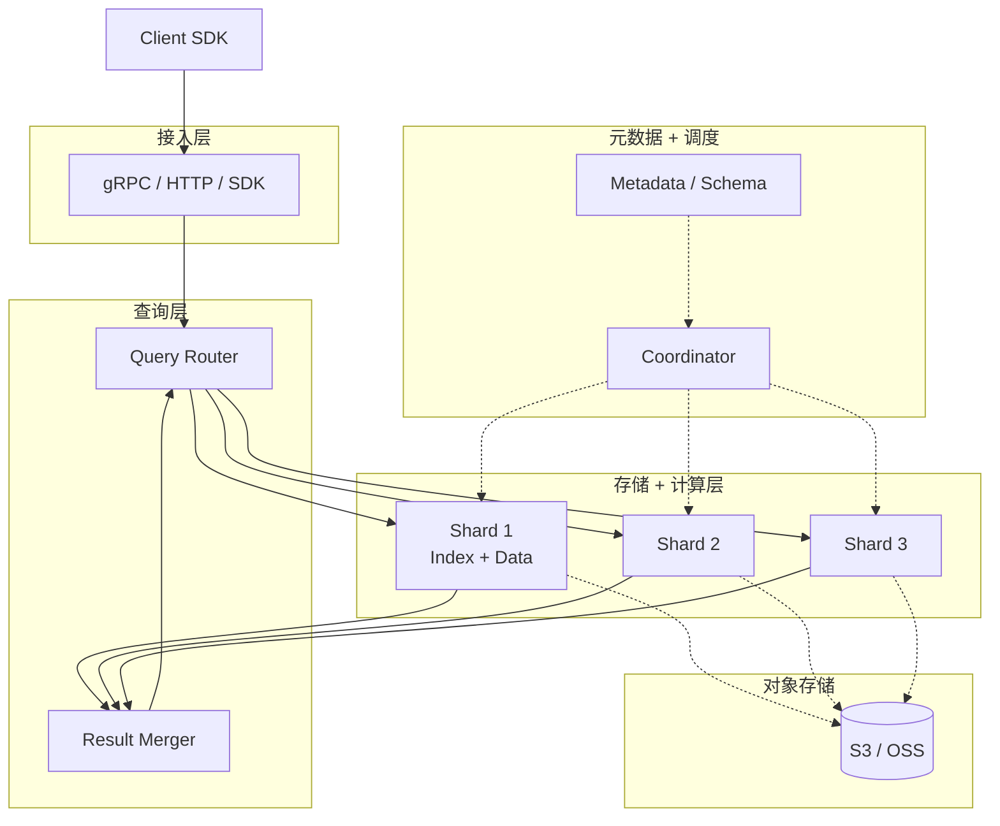

# 向量数据库 · Vector Database

!!! tip "一句话定位"
    **把"相似度检索"作为一等公民**的数据库。不是"加了向量索引的传统 DB"，而是**围绕高维向量的存储 / 索引 / 过滤 / 扩展伸缩**重新设计的系统。核心权衡：**召回 × 延迟 × 成本 × 灵活性** 四维极致平衡。

!!! abstract "TL;DR"
    - **核心能力**：向量存储 + ANN 索引 + metadata 过滤 + 分布式
    - **五大派别**：专用分布式（Milvus / Pinecone）· 嵌入式（LanceDB）· 搜索引擎扩展（Elasticsearch / OpenSearch / Vespa）· 传统 DB 扩展（pgvector / Mongo）· 湖原生（Iceberg + Puffin / Lance）
    - **选型关键**：**规模 · 过滤需求 · 运维偏好 · 与湖的集成方式**
    - **工业最大用量**是**推荐系统召回**（远大于 RAG），其次是语义搜索、多模检索
    - **不是银弹**：单纯向量检索不够，需要 hybrid（BM25 + 向量）+ rerank

## 1. 业务痛点 · 为什么需要向量数据库

### 传统 DB 装下向量就够了吗？

理论上可以：`CREATE TABLE docs (id BIGINT, vec DOUBLE[768])`。实际不够用：

| 问题 | 传统 DB | 向量 DB |
|---|---|---|
| 相似度计算 | 全表 scan × 余弦相似度 → O(N × d) | ANN 索引 → O(log N × d) |
| 召回延迟（1 亿）| 8 秒 brute force | 5-10 ms |
| 向量内存管理 | 没优化（Heap 分配）| SIMD / 量化 / 分片 |
| Metadata 过滤 | SQL 查询后再向量 | pre/in/post-filter 专门优化 |
| 分片 / 分布 | 按键范围 | 按向量空间 / 副本 |
| 更新 | 随时 | 受限（HNSW 删除难）|

### 没有向量库的时代（2018 前）

- Facebook / Google 各自造 FAISS / ScaNN 等**库**（不是 DB），要自己包运维
- 向量检索是**离线批处理**（每晚算一次 TopK 写到 Redis）
- 实时场景只能**行业内头部团队**能做（维护成本极高）

**2019 年后**，Milvus / Pinecone / Weaviate / Qdrant 把"向量检索 as a Service"产品化，中小团队也能做实时向量检索。

### 核心业务价值

| 场景 | 没有向量库 | 有向量库 |
|---|---|---|
| 推荐系统召回 | 维护大量规则 / 协同过滤 | 双塔 embedding + ANN 召回 |
| 语义搜索 | BM25 漏长尾 | 向量补充语义匹配 |
| 以图搜图 | 无解或上硬件 | CLIP embedding + ANN |
| RAG 知识检索 | 不可行 | 核心基础设施 |
| 去重 / 聚类 | 离线 Spark | 在线毫秒级 |

## 2. 架构深挖

一个现代向量库的典型构成：



### 核心子系统

| 子系统 | 职责 | 典型实现 |
|---|---|---|
| **索引（ANN）** | 加速最近邻查询 | HNSW / IVF-PQ / DiskANN |
| **Metadata / Payload** | 结构化字段过滤 | 行存 / 列存 / 倒排 |
| **Hybrid 检索** | 稠密 + 稀疏融合 | BM25 + dense + RRF |
| **分片 / 路由** | 水平扩展 | hash / 空间分区 |
| **持久化** | 容灾 / 重启恢复 | S3 segment + WAL |
| **副本** | 高可用 | leader-follower / quorum |
| **权限 / 多租户** | 隔离 + 限流 | RBAC + tenant isolation |

### 五大派别

!!! warning "先看清 · 这五类**不是同一层面的问题**"
    "向量数据库"是个宽概念 · 以下派别的**控制面 / 数据平面 / 事务语义 / 延迟目标**差异很大——**不要把它们当成"同类替代品"横比**：

    - **专用分布式**（Milvus · Pinecone · Vespa）· 独立系统 · 最终一致 · 集群运维重
    - **嵌入式 / 湖原生**（LanceDB · FAISS）· 嵌入库形态 · 无 server · snapshot 语义
    - **搜索引擎扩展**（ES / OpenSearch / Vespa）· Lucene 基础 · 有自家的事务模型 · 批近实时
    - **传统 DB 扩展**（pgvector / MongoDB / Redis）· 走主数据库的 ACID / 一致性 · 但规模受主 DB 限制
    - **湖仓侧索引**（Iceberg + Puffin · Lance）· 不是运行时服务 · 是湖表的扩展 · 靠外部引擎查询

    **选型时先问**："这层解决的是**我的什么问题**？"——不是"哪家分数高"。

| 派别 | 代表 | 特点 | 适合 |
|---|---|---|---|
| **专用分布式** | Milvus / Pinecone / Vespa | 为向量设计、规模最大 | 10M - 10B 向量 |
| **嵌入式 / 湖原生** | **LanceDB** / FAISS | 无 server、湖友好、低运维 | 数据在湖、中小规模 |
| **搜索引擎扩展** | Elasticsearch / OpenSearch / Vespa | 同时原生支持全文 + 向量 | Hybrid 需求强 |
| **传统 DB 扩展** | pgvector / Mongo / Redis | 融入已有 SQL 栈 | 小规模 + 低门槛 |
| **湖仓侧索引** | Iceberg + Puffin / 自研 | 索引和主表同源 | 湖原生极致 |

## 3. 关键机制

### 机制 1 · 分片策略

- **Hash 分片**：向量 ID hash 取模 → 简单但无 locality
- **随机分片**：每查询广播到所有 shard → 扇出大
- **空间分片**（k-means 中心）：类似 IVF，查询时只查最近的几个 shard → 扇出小但维护复杂
- **Pinecone "Pod"**：按业务命名空间隔离

### 机制 2 · 持久化与恢复

- 数据文件（segment / partition）**不可变**，后台合并
- 增量写入走 WAL → 达阈值 flush 成新 segment
- 重启时从最新 segment + WAL 恢复
- Milvus / LanceDB 等普遍把 **S3 作为真相源**，本地盘做缓存

### 机制 3 · 过滤与 hybrid

- **过滤**见 [HNSW filter-aware 三流派](hnsw.md)（见其 Filter-Aware 的三种流派段落）
- **Hybrid**：RRF / 加权融合 / LTR（详见 [Hybrid Search](hybrid-search.md)）

### 机制 4 · 副本与一致性

| 一致性 | 含义 | 典型 |
|---|---|---|
| **Strong** | 写后立即可见 | Pinecone、Qdrant（可配） |
| **Eventual** | 几秒延迟 | Milvus（默认） |
| **Session** | 同一 session 内强 | 多数系统可选 |

向量业务多能接受 eventual（推荐、搜索）。**风控这类敏感场景**才需要强一致。

### 机制 5 · 多租户

- **schema 隔离**（每租户一个 collection / namespace）
- **partition 隔离**（同 collection 不同 partition）
- **物理隔离**（独立 shard 集群）
- **Quota / rate limit** 防吵闹邻居

## 4. 工程细节

### 选型检查清单

1. **规模**：总向量数？维度？写入速率？
2. **查询 pattern**：纯 ANN？需要过滤？需要 hybrid？
3. **更新频率**：只读 / 低频 / 高频？
4. **延迟 SLO**：p99 < 10ms / 50ms / 200ms？
5. **运维预算**：自建 vs 托管？
6. **与湖的关系**：数据在湖上？向量用来做什么？

### 典型部署

| 规模 | 推荐 |
|---|---|
| < 1M 向量、嵌入业务 | **pgvector**（已有 Postgres）或 **LanceDB**（湖原生） |
| 1M - 100M、高召回 | **Qdrant** 单机或**LanceDB** |
| 100M - 10B、分布式 | **Milvus** 或 **Vespa** 或 **Pinecone（托管）** |
| 已有 Elasticsearch | **Elasticsearch** 扩展向量 |
| 需要 Git-like 数据版本 | **LanceDB** + Iceberg |

### 成本估算（100M 向量 × 768 维）

| 方案 | 存储 | 内存 | 规模感 |
|---|---|---|---|
| HNSW in-memory | 300GB | 300GB | 单机内存/分布式 |
| IVF-PQ | 300GB | 30-60GB | 量化后省内存 |
| DiskANN | 300GB on SSD | 10-20GB | 磁盘友好 |
| Lance + ANN on S3 | 300GB on S3 | 按需加载 | **成本最低** |

## 5. 性能数字

典型 [VectorDBBench](https://github.com/zilliztech/VectorDBBench) / ANN-Benchmarks 结果：

| 规模 | HNSW p99 | IVF-PQ p99 | Brute Force |
|---|---|---|---|
| 1M × 768d | 1-3 ms | 5-10 ms | 200ms |
| 10M × 768d | 3-8 ms | 10-20 ms | 2s |
| 100M × 768d | 10-50 ms | 30-100 ms | 20s |
| 1B × 768d | 需 DiskANN | 50-200 ms | 不可行 |

**单实例 QPS**：
- Milvus 单节点 HNSW：5k-20k
- LanceDB 嵌入式：取决于进程内存，通常 10k+
- pgvector：1k-5k（受 PG 影响）

## 6. 代码示例

### LanceDB（湖原生、零运维起步）

```python
import lancedb
import pandas as pd

db = lancedb.connect("s3://my-lake/lancedb")

df = pd.DataFrame({
    "id": [1, 2, 3],
    "text": ["apple", "banana", "cherry"],
    "embedding": [[0.1]*768, [0.2]*768, [0.3]*768]
})
table = db.create_table("fruits", df)
table.create_index(metric="cosine", num_partitions=256, num_sub_vectors=96)

results = (table.search([0.15]*768)
                .where("LENGTH(text) > 5")
                .limit(10)
                .to_pandas())
```

### Milvus

```python
from pymilvus import connections, Collection, FieldSchema, CollectionSchema, DataType

connections.connect(host="milvus.local")

schema = CollectionSchema([
    FieldSchema("id", DataType.INT64, is_primary=True),
    FieldSchema("vec", DataType.FLOAT_VECTOR, dim=768),
    FieldSchema("visibility", DataType.VARCHAR, max_length=32),
])
coll = Collection("docs", schema)

coll.create_index("vec", {
    "index_type": "HNSW",
    "metric_type": "IP",
    "params": {"M": 32, "efConstruction": 400}
})

coll.load()
results = coll.search(
    data=[query_vec], anns_field="vec",
    param={"ef": 100}, limit=10,
    expr='visibility == "public"'
)
```

### pgvector

```sql
CREATE EXTENSION IF NOT EXISTS vector;

CREATE TABLE docs (
  id BIGINT PRIMARY KEY,
  content TEXT,
  embedding vector(768)
);

CREATE INDEX ON docs USING hnsw (embedding vector_cosine_ops);

SELECT id, 1 - (embedding <=> $1) AS score
FROM docs
ORDER BY embedding <=> $1
LIMIT 10;
```

## 7. 多引擎 SQL 语法对照

不同向量库 / SQL 引擎向量查询语法差异大 · 本节汇总**距离函数 + 代表语法** · 迁移或跨系统对比用。

### 距离函数对照

| 引擎 | Cosine | L2 | Inner Product |
|---|---|---|---|
| **pgvector** | `<=>` | `<->` | `<#>`（取反） |
| **LanceDB** | `cosine_distance(a, b)` | `l2_distance(a, b)` | `dot(a, b)` |
| **Milvus** | `COSINE` | `L2` | `IP` |
| **Qdrant** | `Cosine` | `Euclidean` | `Dot` |
| **Weaviate** | `nearVector` + distance | `distance` | — |
| **DuckDB VSS** | `array_cosine_similarity` | `array_distance` | `array_inner_product` |
| **ClickHouse** | `cosineDistance` | `L2Distance` | `dotProduct` |

### pgvector

```sql
CREATE TABLE docs (id BIGINT, embedding VECTOR(1024));
CREATE INDEX ON docs USING hnsw (embedding vector_cosine_ops);

SELECT id, title
FROM docs
WHERE tenant_id = 42
ORDER BY embedding <=> '[0.1, 0.2, ...]'::vector
LIMIT 10;
```

### LanceDB（Python）

```python
import lancedb
db = lancedb.connect("s3://warehouse/")
tbl = db.open_table("docs")

results = (
  tbl.search([0.1, 0.2, ...])
     .where("tenant_id = 42 AND kind = 'policy'")
     .limit(10)
     .select(["id", "title"])
     .to_pandas()
)
```

### Milvus · 含 Hybrid Search

```python
from pymilvus import MilvusClient, AnnSearchRequest, WeightedRanker

# 单向量
client.search(
  collection_name="docs",
  data=[[0.1, 0.2, ...]],
  filter='tenant_id == 42 and kind == "policy"',
  output_fields=["id", "title"],
  limit=10,
  anns_field="embedding",
  search_params={"metric_type": "COSINE", "params": {"ef": 128}},
)

# Hybrid Search · dense + sparse + rerank
dense_req = AnnSearchRequest(
  data=[dense_vec], anns_field="dense_vec",
  param={"metric_type": "COSINE"}, limit=100,
)
sparse_req = AnnSearchRequest(
  data=[sparse_vec], anns_field="sparse_vec",
  param={"metric_type": "IP"}, limit=100,
)
client.hybrid_search(
  collection_name="docs", reqs=[dense_req, sparse_req],
  rerank=WeightedRanker(0.7, 0.3), limit=10,
)
```

### Qdrant

```python
client.search(
  collection_name="docs",
  query_vector=[0.1, 0.2, ...],
  query_filter=Filter(must=[
    FieldCondition(key="tenant_id", match=MatchValue(value=42)),
  ]),
  limit=10,
)
```

### Weaviate（GraphQL）

```graphql
{
  Get {
    Doc(
      nearVector: {vector: [0.1, 0.2, ...]}
      where: {path: ["tenant_id"], operator: Equal, valueInt: 42}
      limit: 10
    ) { id title _additional { distance } }
  }
}
```

### DuckDB VSS

```sql
INSTALL vss;
LOAD vss;

CREATE TABLE docs (id BIGINT, embedding FLOAT[1024]);
CREATE INDEX idx ON docs USING HNSW (embedding) WITH (metric = 'cosine');

SELECT id, array_cosine_similarity(embedding, ?::FLOAT[1024]) AS sim
FROM docs
WHERE tenant_id = 42
ORDER BY sim DESC
LIMIT 10;
```

### ClickHouse

```sql
CREATE TABLE docs (
  id UInt64,
  embedding Array(Float32),
  INDEX v embedding TYPE annoy('cosineDistance') GRANULARITY 1
) ENGINE = MergeTree ORDER BY id;

SELECT id, cosineDistance(embedding, [0.1, 0.2, ...]) AS d
FROM docs
WHERE tenant_id = 42
ORDER BY d
LIMIT 10;
```

### 归一化惯例

- **入库前**做 L2 归一化（`v / ||v||`）· 入库后用 **cosine** 距离
- 所有引擎的 Inner Product / Cosine 都等价 · 存储 / 内存更一致

### 跨引擎陷阱

- **维度类型不匹配**（FLOAT[1024] vs DECIMAL[1024]）
- **ORDER BY DESC 忘改**（cosine distance 越小越近 · similarity 越大越近）
- **跨语言客户端 tensor dtype 不一致**（numpy float64 vs float32）
- **索引未建就全扫**（慢得想杀程序）

## 8. 陷阱与反模式

- **把向量库当主 DB**：它只做向量检索——源数据该在 OLTP / 湖上
- **只看召回不看业务指标**：recall@10 = 0.99 但业务转化率不涨，可能是 rerank 或 LLM 问题
- **数据 double write**（湖 + 向量库）没对账：经常漂移，**最好让向量库以湖为源**（增量同步）
- **没做 metadata filter 测试**：pre-filter 选择性极高时召回崩
- **以为选型=选库**：真正关键是**整体 pipeline**（embedding 模型 / 索引参数 / hybrid / rerank）
- **忽视 embedding 版本**：模型升级 → 索引要重建 → 业务要双写 → 切流量
- **规模估错**：1M 以内瞎选都行；10M+ 开始选错系统就推倒重来
- **分布式多 shard 但副本未 tune**：副本少 → 挂一个就雪崩；副本多 → 成本爆

## 9. 横向对比 · 延伸阅读

- **[向量数据库对比](../compare/vector-db-comparison.md)** —— Milvus / LanceDB / Qdrant / Weaviate / pgvector 详细对比
- [ANN 索引对比](../compare/ann-index-comparison.md) —— HNSW / IVF-PQ / DiskANN / Flat
- [Puffin vs Lance](../compare/puffin-vs-lance.md) —— 湖原生向量的两条路

### 权威阅读

- **[VectorDBBench](https://github.com/zilliztech/VectorDBBench)** —— Zilliz 跨系统 benchmark
- **[ANN-Benchmarks](https://ann-benchmarks.com/)** —— 算法层面 benchmark
- **[Pinecone Learn](https://www.pinecone.io/learn/)** —— 向量检索科普
- **[Milvus Book](https://milvus.io/docs)** · **[LanceDB Blog](https://blog.lancedb.com/)**
- *Designing Data-Intensive Applications* (Kleppmann) 第 3 章 —— 索引结构原理

## 相关

- [HNSW](hnsw.md) · [IVF-PQ](ivf-pq.md) · [DiskANN](diskann.md) · [Hybrid Search](hybrid-search.md) · [Rerank](rerank.md)
- [Embedding](embedding.md) · [多模 Embedding](multimodal-embedding.md)
- [RAG on Lake](../scenarios/rag-on-lake.md) · [推荐系统](../scenarios/recommender-systems.md)
- [一体化架构](../unified/lake-plus-vector.md)
