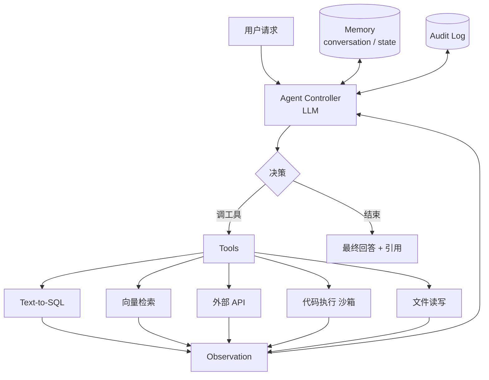

# Agentic 工作流 · 自动化

!!! tip "一句话理解"
    **LLM + 工具 + 控制循环** 自主完成多步任务——不是"问答一次"，是"执行一段工作"。真正能用的 Agent 系统 = **强工具抽象 + 评估机制 + 成本控制 + 沙箱安全** 四位一体。演示很酷，工业化落地非常难。

!!! abstract "TL;DR"
    - Agent ≠ LLM。Agent = LLM + **tools** + **控制循环** + **状态 / 记忆**
    - 三种**复杂度级别**：assistant（单步工具调用）< workflow（多步编排）< agent（自主循环）
    - 企业场景典型：**客服自动化 / 数据分析 / DevOps / 内部工单 / 代码助手**
    - 关键工程点：**tool 设计质量 > 模型选型**；**评估最难**；**成本可爆炸**
    - Benchmark 活跃期：**SWE-bench · τ-bench · WebArena · AgentBench · GAIA**

## 概念梯度

不是所有"LLM + X"都叫 Agent。三个级别：

| 级别 | 定义 | 例子 |
| --- | --- | --- |
| **L1 · Assistant** | LLM + 单次工具调用 | "查下我订单" → 调一个 API → 回答 |
| **L2 · Workflow** | 人类定义的多步编排，LLM 填其中某些节点 | "客户投诉 → LLM 识别类型 → 路由到对应部门" |
| **L3 · Agent** | LLM **自主**决定调用哪些工具、什么顺序、何时停止 | "帮我搞定报税" → LLM 自己决定看文档 / 算数字 / 填表 / 提交 |

**工业落地目前集中在 L2**。L3 能跑 demo，但失败模式太多，难以可靠部署。

## 典型业务场景

| 场景 | 内容 |
| --- | --- |
| **客服自动化** | 用户问题 → 查 FAQ → 查订单 → 回答 + 工单记录 |
| **数据分析 (chat-to-insight)** | 用户自然语言 → Text-to-SQL → 查询 → 解释 → 图表 |
| **内部 DevOps** | 报警 → Agent 查日志 → 推测根因 → 调用工具修复 / 建议 |
| **代码助手** | 改需求 → 读代码 → 写/修改代码 → 跑测试 → 提 PR |
| **工单处理** | JIRA ticket → 分类 → 分流 → 跟进 → 关闭 |
| **研究 / 答疑** | 问题 → 检索多源资料 → 综合 → 引用 → 产出 |
| **浏览器自动化** | 填表 / 爬虫 / 对账 / 采购下单 |

## 核心架构



## 存储诉求

### 对话 / 任务状态表

```sql
CREATE TABLE agent_conversations (
  conv_id     STRING,
  user_id     STRING,
  turn_idx    INT,
  role        STRING,        -- user / assistant / tool
  content     STRING,
  tool_name   STRING,
  tool_args   STRING,        -- JSON
  tool_result STRING,
  tokens_in   INT,
  tokens_out  INT,
  latency_ms  INT,
  ts          TIMESTAMP
) USING iceberg
PARTITIONED BY (days(ts), bucket(16, conv_id));
```

**为什么用湖表**：
- 审计合规（多轮推理过程要能复现）
- 做离线评估 / 迭代 prompt 质量
- 分析失败模式

### Tool Registry

Tool 定义本身是**资产**，应该纳入 [Catalog](../catalog/index.md)：

```yaml
tools:
  - name: query_sales
    description: "查询销售数据"
    schema: { natural_question: str }
    returns: markdown table
    owner: data-platform
    scope: [finance, marketing]
    rate_limit: 10/min
    cost_tier: medium
```

### 知识库

Agent 的"长期记忆"常常是 RAG 库，见 [RAG](../ai-workloads/rag.md)。

## 计算诉求

### 控制循环

- LLM 推理**多次调用**（每个决策一次）
- 单次任务：**5-20 次 LLM 调用**不稀奇
- 上下文每次都要重建（或用 KV cache）

### Tool 执行

- Text-to-SQL → 调 Trino / DuckDB
- 向量检索 → LanceDB / Milvus
- 代码执行 → **沙箱**（Docker / gVisor / WebAssembly）
- 外部 API → 规范化 wrapper

### 监控 / 审计

- 每步都记 log
- 成本 (tokens × 价格)
- 延迟 / 失败率 / 重试
- Tool 调用频率 / 分布

## Tool 设计（做好 Agent 的关键）

> 80% 的 Agent 质量取决于 Tool 设计，20% 是模型。

### 好的 Tool 长什么样

```python
@tool
def query_sales(natural_question: str) -> str:
    """
    用中文自然语言问销售数据。例如：
    - '上个月华北区 iPhone 销量'
    - '本周增长最快的类目'
    
    只能查询 sales 领域的表（orders, products, users）。
    不能做 DDL / DML。
    结果最多返回 100 行。
    """
    ...
```

**要点**：

- **狭窄范围**：不给"万能 SQL 工具"，给"只能查 sales 的工具"
- **文档即契约**：描述 = LLM 选择该工具的依据
- **参数严格 schema**：用 JSON Schema / Pydantic
- **返回结构化**：Markdown 表格或 JSON，让 LLM 能继续处理
- **内置边界**：rate limit / row limit / cost cap
- **幂等**：相同输入同输出（至少近似）

### 不好的 Tool

- "execute_arbitrary_sql" —— 太广，LLM 乱用
- 返回"自然语言描述"—— LLM 难接
- 无错误处理 —— 失败消息也要设计
- 不记日志 —— 出问题无法 debug

## 控制循环模式

### ReAct (Reason + Act)

经典循环：
```
Thought: 我需要先查销售数据
Action: query_sales("上月销量")
Observation: <结果>
Thought: 数据有了，计算增长
Action: query_sales("前月销量")
Observation: <结果>
Thought: 可以算了
Final: 增长 23%
```

### Plan-and-Execute

先让 LLM 列出完整计划，再逐步执行。适合**任务复杂度高**但**步骤可预测**时。

### Reflexion / Self-correction

失败后 LLM 反思 + 重试。

### Function Calling（现代默认）

OpenAI / Claude / Gemini 的 structured tool use API。比纯文本解析稳。**生产首选**。

## 评估（最难的一件事）

### 层级评估

- **每步工具调用是否合理**（Tool Call Accuracy）
- **最终任务是否成功**（Task Success Rate）— 常常需要人工
- **平均步数**（Step Efficiency）
- **平均成本**（Tokens per Task $）
- **失败模式分布**（卡死 / 重复 / 错误工具 / LLM 乱答）

### Benchmark 参考

| Benchmark | 内容 |
| --- | --- |
| **SWE-bench** | 真实 GitHub issue → 修复代码 |
| **τ-bench** (Tau-bench) | 工具使用 + 多轮 |
| **WebArena** | 浏览器自动化 |
| **AgentBench** | 全面 Agent 能力测评 |
| **GAIA** | 研究助理能力 |
| **MMLU / HumanEval** | 模型本身（非 Agent 特化）|

## 成本控制（被低估）

Agent 成本可能是普通 LLM 调用的 **10–50 倍**（多步 + 长上下文）。防爆招数：

- **硬性 step cap**（比如 20 步）
- **Budget guard**（每个任务预算 token 上限）
- **便宜模型先行**（GPT-4o mini 做 routing，GPT-4o 做关键决策）
- **缓存**（相同 query + state → 复用）
- **投机执行 / 并行 tool call**

## 安全 / 权限

Agent 最大风险：**自主执行错误动作**。

- **Tool 权限分级**：
  - 只读工具 → LLM 可自主调
  - 写工具 / 副作用工具 → **人工确认**或低 throttle
  - 破坏性工具 → 禁止或明确授权
- **沙箱执行**：Agent 生成的代码 / SQL 必须在沙箱跑
- **Prompt injection 防御**：工具返回数据**不可信**，不能直接影响 Agent 控制流
- **Audit 日志**：每次 tool 调用都记
- **权限穿透**：Agent 代表用户执行，不能越权

## 和湖仓的接口

Agent 访问湖仓通常通过：

### 1. Text-to-SQL

自然语言 → SQL → 执行 → 返回。详见 [Compute Pushdown](../unified/compute-pushdown.md)。

**湖仓侧要配合**：
- Catalog 层提供表 schema + 业务描述给 LLM 做"schema retrieval"
- 统一 SQL dialect（Trino SQL 是好选择）
- 强权限下推（行列级 policy 自动生效）

### 2. 语义检索

- 问题 → embed → LanceDB → 文档 chunks
- 详见 [RAG](../ai-workloads/rag.md)

### 3. 事件驱动

- Agent 订阅湖表 changelog（Paimon 流读）
- 触发式自动化（数据到达 → agent 分析 → 通知）

## 可部署参考

### 开发框架

- **[LangChain](https://www.langchain.com/)** / **[LangGraph](https://www.langchain.com/langgraph)** — Python，流程图式
- **[LlamaIndex Agents](https://docs.llamaindex.ai/en/stable/module_guides/deploying/agents/)**
- **[AutoGen](https://microsoft.github.io/autogen/)** — Microsoft，multi-agent 强
- **[CrewAI](https://www.crewai.io/)** — 角色协作
- **[Dify](https://github.com/langgenius/dify)** — 开源 Agent 构建平台

### 代码 Agent

- **Cursor / Copilot** — 商业
- **[Aider](https://github.com/paul-gauthier/aider)** — 开源代码 Agent
- **[Claude Code](https://www.anthropic.com/claude-code)** — 官方代码 Agent

### 观测 / 评估

- **[Langfuse](https://langfuse.com/)** — trace + eval + cost 一站式
- **[Weave (W&B)](https://weave-docs.wandb.ai/)**
- **[Phoenix (Arize)](https://github.com/Arize-ai/phoenix)** — 开源 observability

### Demo 可跑

- **LangGraph 官方 example**（客服 / 数据分析 agent）
- **AutoGen 官方 scenarios**
- **SWE-bench 参考解**（看顶级 agent 怎么做代码任务）

## 陷阱

- **上来就做 L3 Agent**：失败率高，改 L2 workflow 落地快
- **Tool 太多**：LLM 选不准（> 10 个就开始乱）
- **Tool 描述不精准**：LLM 误用
- **无沙箱运行代码 / SQL**：一次坏决策毁库
- **不限 step / budget**：任务跑飞成本爆
- **用户权限不透传**：Agent 代用户 A 查 B 的数据 → 合规事故
- **没评估集**：以为效果好，上线全靠感觉
- **Tool 失败返回不优雅**：LLM 看到 500 error 直接 panic

## 相关

- [Agents on Lakehouse](../ai-workloads/agents-on-lakehouse.md) —— Agent 概念 + 湖上工具
- [Compute Pushdown](../unified/compute-pushdown.md) —— 把计算 / 模型推下沉到湖
- [RAG](../ai-workloads/rag.md) · [RAG 评估](../ai-workloads/rag-evaluation.md)
- [Prompt 管理](../ai-workloads/prompt-management.md)
- [业务场景全景](business-scenarios.md)

## 延伸阅读

- *SWE-bench* 论文 · Princeton
- *τ-bench* (Tau-bench, Sierra AI) — tool use in realistic settings
- Anthropic *Building Effective Agents*（2024 年指导博客）
- OpenAI *Practices for Agents*
- *The Agent Stack* 综述系列博客
