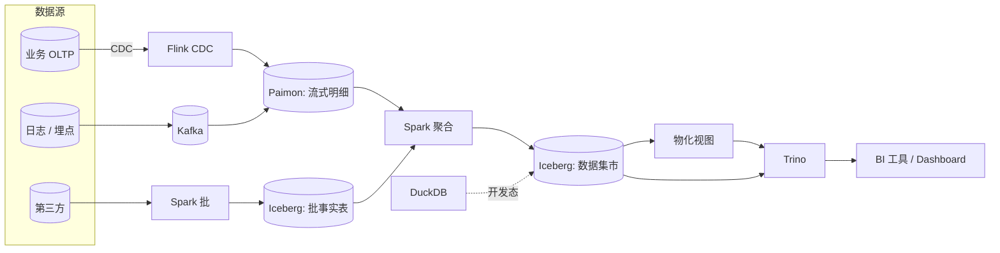

# BI on Lake

!!! tip "一句话场景"
    把传统数仓的 BI 负载（仪表盘、即席查询、报表）搬到湖仓之上 —— **湖就是数仓**，不再有独立的数仓层。

## 场景输入与输出

- **输入**：
    - 业务库 CDC / 日志 / 埋点 / 第三方数据
    - BI 工具（Superset / Metabase / Tableau / 内部 Dashboard）的查询
- **输出**：
    - 仪表盘 / 报表 / 即席分析
- **SLO 典型值**：
    - 仪表盘查询 p95 **< 3s**
    - 数据新鲜度：小时级（批）或分钟级（流）
    - 并发：数百到数千同时在线

## 架构总览

## 数据流拆解

### 1. 入湖分层

- **ODS / 明细层** —— Paimon（流 + CDC 原生）或 Iceberg（纯批场景）
- **DWD / DWS 汇总层** —— Iceberg，批 Spark 生成
- **ADS / 数据集市** —— Iceberg，进一步汇总，直接给 BI 工具用

一句话：**越往下游越汇总、越宽、越"为查询优化"**。

### 2. 查询加速

- **Iceberg 物化视图** —— 高频查询预聚合（Trino / Spark 都能生成与消费）
- **Zone Maps / Liquid Clustering** —— 列级 min/max 让 Trino 谓词下推跳过大片数据
- **Caching 层**（Alluxio / 本地 SSD）—— 热 Parquet 块缓存
- **一定程度的"加速副本"**：StarRocks / ClickHouse 作为 BI 前置层（非强制）

### 3. 查询引擎选择

| 查询类型 | 推荐 |
| --- | --- |
| 仪表盘 / 交互式 | **Trino** |
| 大规模 ETL / 数据集市构建 | **Spark** |
| 探索 / 单机分析 / 开发态 | **DuckDB** |
| 极致低延迟（<1s）| **StarRocks / ClickHouse**（加速副本） |

## SLO 怎么打

- **p95 < 3s** 是挑战目标。先做：
    - 数据集市层（ADS）而不是直查明细
    - 配合物化视图
    - 分区 / clustering 合理（按查询 where 的列）
    - 查询引擎的 resource group 隔离仪表盘和探索
- 如果还是达不到：加速副本层（StarRocks / ClickHouse）针对 Top 10 热查询做增量同步

## 失败模式与兜底

- **某张热表查不动** —— 看是否分区设计与查询 pattern 对不上；加物化视图或加速副本
- **dashboard 同时开启 100 张查询引擎爆** —— Trino resource group 做硬隔离
- **数据延迟** —— Paimon 流式 changelog 的 latency 监控；`_etl_ts` 字段让 BI 显示数据新鲜度
- **Schema Evolution 导致 BI 报错** —— 引入 Iceberg Schema Evolution 协议（列 ID）+ 对下游保证字段名不变

## 不要做的事

- **直接让 BI 工具连 OLTP**（除非业务量极小）
- **同一张明细表承担 BI 和 AI 两种优化目标** —— 分离数据集市层（面向 BI）与训练集 / 检索语料（面向 AI）
- **把加速副本当原始数据源** —— 加速层是镜像，不是真相来源

## 相关

- 底座：[湖表](../lakehouse/lake-table.md) · [Iceberg](../lakehouse/iceberg.md) · [Paimon](../lakehouse/paimon.md)
- 引擎：[Trino](../query-engines/trino.md) · [Spark](../query-engines/spark.md) · [DuckDB](../query-engines/duckdb.md)
- 和 [RAG on Lake](rag-on-lake.md) 可以共底座

## 延伸阅读

- *Lakehouse: A New Generation of Open Platforms* (CIDR 2021)
- Netflix / Airbnb / Pinterest 公开的湖仓 BI blueprint
