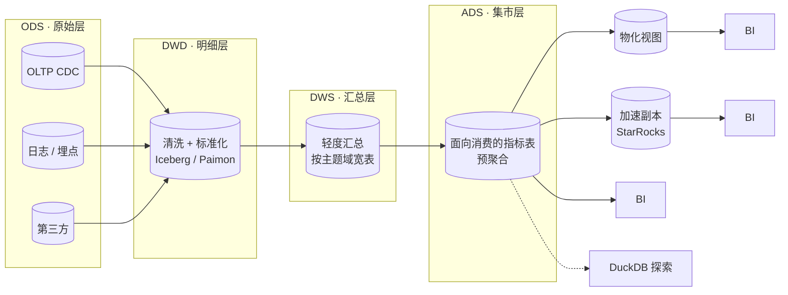
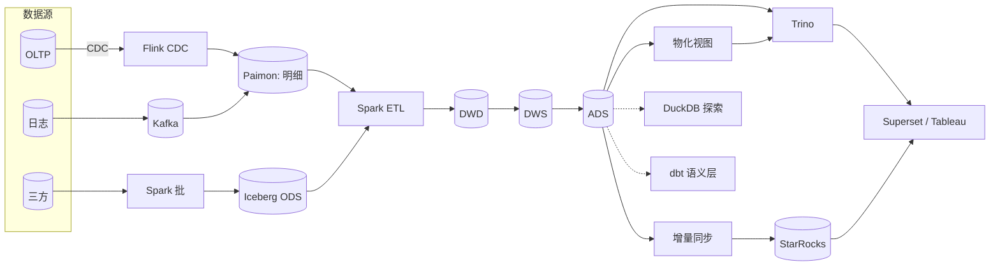

# BI on Lake · 湖上分析与仪表盘

!!! info "机制深挖"
    [BI 负载章](../bi-workloads/index.md)：[OLAP 建模](../bi-workloads/olap-modeling.md) · [物化视图](../bi-workloads/materialized-view.md) · [查询加速](../bi-workloads/query-acceleration.md) · [语义层](../bi-workloads/semantic-layer.md) · [仪表盘 SLO](../bi-workloads/dashboard-slo.md) · [BI × LLM](../bi-workloads/bi-plus-llm.md)。

!!! tip "一句话理解"
    **湖就是数仓**——传统 BI 负载（月报、仪表盘、即席查询）直接跑在 Iceberg/Paimon 之上，不再搬到独立的数仓层。核心收益：**一份数据多引擎消费、历史可追溯、AI + BI 共底座**；核心挑战：**查询性能** + **并发隔离** + **数据建模**。

!!! abstract "TL;DR"
    - **Medallion 架构**：ODS → DWD → DWS → ADS 四层，每层 SLA / 更新频率不同
    - **查询引擎分工**：Trino 交互 / Spark 批 / DuckDB 探索 / StarRocks 加速副本
    - **SLO 典型值**：仪表盘 p95 < 3s · 数据新鲜度 小时或分钟 · 数百-千并发
    - **命中率 > 95% 的三板斧**：分区 + Clustering + 物化视图
    - **别把 Iceberg 当行存打**：行级高频更新应该用 Paimon 主键表或推到副本
    - **语义层（dbt / Semantic Layer）** 是让 BI 好用的关键

## 业务图景

BI 下的典型子场景：

| 子场景 | 数据新鲜度 | 查询模式 | 并发 | 代表工具 |
|---|---|---|---|---|
| **定期报表** | T+1 | 批查询固定 SQL | 低 | Tableau 调度 |
| **仪表盘** | 小时 / 分钟 | 结构化查询（预聚合） | 中-高 | Superset / Tableau |
| **即席探索** | 现有最新 | 任意 SQL | 低但要求快 | DuckDB / Jupyter |
| **运营监控** | 分钟 | 实时聚合 + 告警 | 中 | Grafana / 自研大屏 |
| **财务 / 审计** | T+1 | 历史追溯 | 低 | 专用系统 + Iceberg Time Travel |
| **指标中台** | 混合 | 指标 API | 高 | dbt + Cube.js |

---

## Medallion 架构（分层建模）



### 各层职责

| 层 | 表内容 | 更新频率 | 存储 | 谁消费 |
|---|---|---|---|---|
| **ODS** | 原始明细 / CDC / 日志 | 实时 / 小时 | Paimon（主键表）· Iceberg（追加） | 下游 ETL |
| **DWD** | 清洗后明细，一事一表 | 小时 / 天 | Iceberg | 数据工程 |
| **DWS** | 按主题域汇总宽表 | 小时 / 天 | Iceberg | 分析师、下游集市 |
| **ADS** | 面向报表的指标表 | 小时 / 天 | Iceberg + MV | BI 工具 |

### 分层原则

- **越下游越汇总、越宽、越为查询优化**
- **ODS 做原则上不修改**（只追加），保证溯源
- **DWS / ADS 是"为 BI 优化"的表**，分区、排序、clustering 都按查询模式打
- **一张表一个业务口径**——别让一张表同时做 BI 和训练特征

### Kimball / Inmon / Data Vault 选哪个？

| 建模范式 | 适合 | 不适合 |
|---|---|---|
| **Kimball（星型 / 雪花）** | 报表场景主流、BI 工具友好 | 跨域共享维度需治理 |
| **Inmon（三范式）** | 企业数仓、金融合规 | 查询复杂、BI 需要再建数据集市 |
| **Data Vault 2.0** | 大型企业、审计严格 | 学习曲线陡、BI 仍需建集市 |
| **One Big Table** | 埋点、日志、探索 | 维护差，多表关联成本 |

**实务**：ADS 层用 **星型**（事实 + 维度），DWS 用**宽表**；两者并存。

---

## 查询引擎分工

### 四引擎矩阵

| 场景 | 推荐 | 原因 | 备选 |
|---|---|---|---|
| **仪表盘 / BI 交互** | **Trino** | 低延迟、多租户 | StarRocks（加速） |
| **大规模 ETL / 集市构建** | **Spark** | 吞吐、生态 | Flink（流批一体） |
| **即席探索 / 单机 / Notebook** | **DuckDB** | 零配置、快 | Polars、Trino |
| **流处理 / 增量物化** | **Flink / Paimon** | 原生流 | Spark Streaming |
| **极致低延迟仪表盘（< 1s）** | **StarRocks / Doris** | 本地列存 + 向量化 | ClickHouse |

详见 [计算引擎对比](../compare/compute-engines.md)。

### Trino 的调优要点

- **资源组（Resource Groups）**：仪表盘 / 探索 / ETL 分开，避免长查询吃满
- **Spill-to-disk**：大 shuffle 溢出本地盘，避免 OOM
- **Dynamic Filtering**：维度小表自动下推 filter 到事实表扫描
- **Metadata Cache**：Iceberg manifest 缓存，减少小查询开销
- **Reuse Exchange**：相同子查询并发时重用结果

### Spark 批处理要点

- **AQE (Adaptive Query Execution)**：运行时自适应 shuffle
- **Bloom Filter Join**：大表 join 大表的神器
- **Iceberg Snapshot ID** 锁定训练可复现
- **Z-Order / Liquid Clustering** 在 DWS / ADS 层落
- **`OPTIMIZE` / `VACUUM`** 定期跑（合并小文件、清理旧版本）

---

## 查询加速三板斧

### 1. 分区 · 让引擎跳过大部分数据

```sql
-- Iceberg hidden partitioning（推荐）
CREATE TABLE sales (
  sale_id BIGINT, shop_id INT, region STRING, amount DECIMAL, ts TIMESTAMP
) USING iceberg
PARTITIONED BY (days(ts), bucket(16, shop_id));
```

- **Hidden partitioning**：SQL 里直接 `WHERE ts >= '...'` 自动走分区
- **bucket** 打散避免数据倾斜
- **千万别过度分区**：每个分区 1GB+ 比较健康；太小会有"小文件问题"

### 2. Clustering · 物理排序让谓词下推

- **Iceberg Liquid Clustering**（Databricks 推动的演进版 Z-Order）
- **Paimon Order / Zorder** 物理排序
- 让 min/max 统计对 where 条件有效
- 经验：按**最常 filter 的列**排序；通常 2–3 列足够

### 3. 物化视图 · 预聚合

```sql
-- StarRocks 增量物化视图
CREATE MATERIALIZED VIEW dashboard_daily_shop_gmv
REFRESH ASYNC EVERY (INTERVAL 10 MINUTE)
AS SELECT dt, shop_id, sum(amount) AS gmv FROM sales GROUP BY dt, shop_id;
```

- **Trino 和 Iceberg 都支持物化视图**（Iceberg MV spec 截至 2026-04 **仍 incubating** · 未合入 format spec · 单引擎内 Trino 480+ / AWS Glue 2025-11 / Spark 3.5.6+ 可用 · 跨引擎共享不现实 · 详见 [物化视图](../bi-workloads/materialized-view.md)）
- **StarRocks 的增量 MV** 最成熟（自动路由、rewrite）
- Top 10 热查询打 MV → 剩下走原表
- **不要 MV 一切**——维护成本高，覆盖率低于 70% 就要考虑合并

### 其它手段

- **Caching 层**：Alluxio · 本地 SSD 缓存热 Parquet 块
- **加速副本**（下文详述）
- **Columnar Stats 收集**：建表后 `ANALYZE` 让 CBO 准

---

## 加速副本（StarRocks / ClickHouse / Doris）

**什么时候要加速副本？**

- 仪表盘 p95 硬性要求 **< 1s**
- 并发 > 500 QPS
- 频繁 TopN / 精确去重（COUNT DISTINCT）

**架构**：

```
Iceberg / Paimon (真相源)
    │
    │ (增量 / 全量同步)
    ↓
StarRocks / ClickHouse (加速层)
    │
    ↓
BI Dashboard
```

**同步方式**：
- **StarRocks** 可以**原生读 Iceberg 外表** + **增量物化视图** 同步到本地列存
- **ClickHouse** 常用方式：Flink / 自研同步器把热数据持续写入 MergeTree
- **Apache Doris** 类似 StarRocks，生态较新

### 选型对比

| 引擎 | 强项 | 弱项 | 社区 |
|---|---|---|---|
| **StarRocks** | 物化视图 + 湖联邦最成熟 | 国内社区为主 | 活跃 |
| **ClickHouse** | 极致单表 TPS / 聚合 | Join 弱 | Yandex + 社区 |
| **Apache Doris** | 国产、兼容 MySQL | 生态比 StarRocks 小 | 活跃 |
| **Druid** | 实时 + OLAP | 运维重、Schema 改动成本高 | 稳定 |
| **Pinot** | LinkedIn 出品、实时强 | 中文资料少 | 稳定 |

详见 [OLAP 加速副本对比](../compare/olap-accelerator-comparison.md)。

### 陷阱

- **加速副本当真相源**：一定记住这是**镜像**，挂了能重建
- **全量导 ClickHouse**：不区分冷热成本爆 → **只同步热 30 天**
- **同步延迟没监控**：副本 lag 2 小时还在跑 → 看板数据过时

---

## 语义层（Semantic Layer）

BI 里最头疼的事：**同一个指标**（比如 GMV），不同报表定义不同（含不含退款？税前税后？）。

**解决方案**：把**指标定义** + **关系定义**集中到一个地方，所有 BI 工具共用。

### 两个主流方案

| 工具 | 定位 | 特点 |
|---|---|---|
| **dbt** | 数据转换 + 语义 | SQL-first · 在 Transformation 层采用最广的选项之一 |
| **Cube** | 独立语义层 / API | 多前端消费、权限模型强 |
| **Looker (LookML)** | BI 自带语义层 | 闭源、绑定 Looker |
| **MetricFlow** | 开源语义层 | Transform 收购，与 dbt 融合中 |

### dbt 最佳实践

```yaml
# models/marts/sales.yml
metrics:
  - name: gmv
    label: "GMV (含退款)"
    calculation_method: sum
    expression: amount
    timestamp: ts
    time_grains: [day, week, month]
    dimensions: [region, shop_id]
```

然后 Superset / Tableau / Metabase 都从这里拉定义，口径统一。

---

## 并发与隔离

仪表盘同时 **100+ 用户刷新**时，长查询可以拖垮整个引擎。

### 硬隔离手段

- **Trino Resource Groups**：按租户 / 查询类型分资源池
- **Cluster 层面隔离**：不同业务不同 Trino 集群（小代价换可用性）
- **查询 timeout + memory 上限**：单查询不能吃死集群
- **AdmissionControl**：超并发直接排队拒绝

### 用户友好

- **Query 可取消**：用户不耐烦 → 他关闭浏览器后后端也立即取消
- **Partial Result**：超大查询先给前 1000 行
- **Query History UI**：分析师能看自己的查询、杀自己的查询

---

## 数据新鲜度 SLA

### 批 T+1（传统）

- Spark 每天凌晨跑 ETL → 早上看板
- **关键**：失败告警（Airflow / DolphinScheduler）+ 重跑机制

### 小时级

- 增量 CDC + 小时物化视图刷新
- 成本比 T+1 增加不大，体验提升明显

### 分钟级（准实时）

- Paimon 主键表 + Flink 持续消费 → StarRocks 增量 MV
- 详见 [Real-time Lakehouse](real-time-lakehouse.md)
- **关键**：watermark、迟到事件处理

### 秒级（实时大屏）

- 用 StarRocks / ClickHouse 直接消费 Kafka
- 湖表作为归档（非查询路径）
- 延迟成本显著增加，只在必要场景用

---

## 完整 SLO 打法

仪表盘 p95 < 3s 的实现路径：

```
1. ADS 层建模，别直查 DWD
2. 分区打到查询 where 列
3. Clustering 物理排序 top 2 维度
4. Trino 资源组隔离仪表盘
5. Top 10 热查询打物化视图
6. 若还达不到：StarRocks 加速副本
7. 监控 + 告警：p95、命中率、慢查询
```

### 关键监控

- **查询 p50 / p95 / p99**
- **失败率 / 排队率**
- **MV 命中率**（没命中的查询才是优化对象）
- **小文件数**（每分区 > 100 需要合并）
- **Snapshot 延迟**（ETL 是否准时完成）

---

## 完整组件链路



---

## Benchmark · Dataset

- **[TPC-DS](https://www.tpc.org/tpcds/)** —— 数仓黄金 benchmark（99 个查询，多种 join）
- **[TPC-H](https://www.tpc.org/tpch/)** —— 更经典、更简单
- **[SSB](https://www.cs.umb.edu/~poneil/StarSchemaB.PDF)** —— Star Schema Benchmark
- **[ClickBench](https://benchmark.clickhouse.com/)** —— 单表聚合，ClickHouse 家族擅长
- **[NYC Taxi](https://www.nyc.gov/site/tlc/about/tlc-trip-record-data.page)** —— 真实数据练手
- **[Brazilian E-commerce (Olist)](https://www.kaggle.com/datasets/olistbr/brazilian-ecommerce)** —— 完整电商链路

---

## 可部署参考

- **[Superset + Trino + Iceberg docker-compose](https://github.com/apache/superset)** —— 官方 recipe
- **[Apache Superset 演示](https://superset.apache.org/)**
- **[dbt + DuckDB](https://duckdb.org/docs/guides/python/using_pandas)** —— 本地零成本全流程
- **[Metabase + Trino + Iceberg](https://github.com/metabase/metabase)**
- **[Databricks Lakehouse Tutorial](https://docs.databricks.com/en/lakehouse-architecture/index.html)** —— 商业参考
- **[StarRocks + Iceberg Tutorial](https://docs.starrocks.io/docs/data_source/catalog/iceberg_catalog/)**

---

## 工业案例 · BI 场景深度切面

### Databricks · Lakehouse BI（Photon + DBSQL + Genie）

**为什么值得学**：Databricks 2022+ 推 DBSQL · 是"**从 ML 平台扩张到 BI**"的商业化典范。**全栈视角见 [cases/databricks](../cases/databricks.md)**。

**BI 场景独特做法**：

1. **Photon 向量化执行引擎**：
   - C++ 重写 Spark 执行层 · SIMD / 列批 / 编译技术
   - **商业版独家 · 不开源** · 是 Databricks BI 侧的**商业护城河**
   - 让 DBSQL 能和 Snowflake 竞争性能

2. **DBSQL · 对标 Snowflake 的交互 SQL**（2022+）：
   - Serverless 计算（弹性扩缩）
   - SQL 智能补全 / Dashboard 内建
   - 2022+ 商业化重要支柱

3. **Genie · Text-to-SQL + BI 融合**（2024+）：
   - 自然语言问 BI 问题
   - 后端融合 UC Schema + AI Functions
   - 核心差异化："**UC 治理 + AI 原生**"

4. **UC 作 BI + ML 一套 RBAC**：
   - 行列级 + Tag 策略 + 血缘
   - BI 侧治理做到行业顶级

**规模** `[量级参考]`：全客户合计 EB 级。DBSQL 2024+ 客户规模快速增长。

**踩坑**：Delta 生态相对 Iceberg 偏窄（2024 UniForm 缓解）· UC OSS 2024 才捐 LF AI · 抢标准晚。

### Snowflake · Data Cloud BI（数仓老牌 + 向量/AI 扩展）

**为什么值得学**：Snowflake 是**云数仓 BI 开创者**（2012 创立）· BI 场景积累最深。**全栈视角见 [cases/snowflake](../cases/snowflake.md)**。

**BI 场景独特做法**：

1. **Virtual Warehouse · 存算分离典范**（2012）：
   - 领先业界 5-10 年 · 被 Databricks / BigQuery 复刻
   - 不同 BI 负载用不同 VW · **物理隔离** · 互不影响
   - BI 报表 / Ad-hoc 分析 / ETL 可独立付费和扩容

2. **Native Apps Framework · 数据产品市场**（2024+）：
   - 第三方在 Snowflake 上发布 BI 应用
   - 客户订阅 · 数据不出 Snowflake

3. **Iceberg 外部表支持**（2023+）：
   - "**封闭计算 + 开放格式**"混合模式
   - BI 客户用 Iceberg 保数据主权 · 同时用 Snowflake 计算

4. **Cortex Agents · BI + AI 融合**（2025+）：
   - Text-to-SQL 自然语言问 BI
   - 对抗 Databricks Genie · SQL-first 路线

**规模** `[量级参考]`：10000+ 客户 · 每日数十亿查询级。

**Snowflake BI 独特性**：
- **"数据不出 Snowflake"的合规锚点**（金融 / 医疗首选）
- **跨云能力**（AWS / Azure / GCP）· 不被单云绑死
- SQL-first 哲学 · BI 分析师体验好

**踩坑**：Unistore（OLTP+OLAP）接受度低 · ML 起步晚（2023 年 Snowpark ML 才发力）。

### Netflix · Iceberg + Trino BI（OSS 路径代表）

**为什么值得学**：Netflix 作为 Iceberg 诞生地 · BI 侧**走纯开源路径**（Trino + Iceberg + Tableau）· 和商业平台对比鲜明。**全栈视角见 [cases/netflix](../cases/netflix.md)**。

**BI 场景独特做法**：

1. **Trino / Presto 主交互引擎**：
   - 2015+ Presto 早期大用户 · 现在主力 Trino（自建 fork）
   - 规模：**3M+ 查询 / 日** `[量级参考]`

2. **Iceberg 10 万+ 表 · 和 BI 深度集成**：
   - 所有 BI 报表底层表**都是 Iceberg**
   - Schema Evolution · Time Travel 作常规 debug 工具
   - Tableau / Looker 直接连 Trino · 查 Iceberg

3. **Metacat 联邦 Catalog**：
   - BI 侧数据发现 / 血缘走 Metacat
   - **不统一 Catalog · 多源联邦** · 和商业平台的"统一 Catalog"路线相反

**Netflix BI vs 商业平台的路线对比**：
- ✅ 开源栈完全可行（Iceberg + Trino + Tableau）· 无商业锁定
- ⚠️ 治理能力需要自建（Metacat 不如 UC 多模完整）
- ⚠️ 纯开源的"**工程团队能力要求**"远高于商业平台

### 跨案例对比 · BI 路线

| 维度 | Databricks | Snowflake | Netflix（OSS） |
|---|---|---|---|
| **BI 引擎** | DBSQL + Photon | Snowflake SQL + VW | Trino · 自建 fork |
| **表格式** | Delta + UniForm | FDN 内部 + Iceberg 外部 | Iceberg（自创） |
| **Catalog** | UC（多模全包） | Polaris + Horizon | Metacat（联邦） |
| **Text-to-SQL** | **Genie** | **Cortex Analyst** | 外部 / 自研 |
| **跨云** | ✅ | ✅ | AWS 为主 |
| **OSS 路径难度** | 中（Delta OSS） | 中（Polaris OSS） | 低（全栈 OSS） |
| **合规强度** | 中高 | **高**（数据不出栈） | 看自主实施 |

**BI 场景共同规律**（事实观察）：
- **Photon / VW / Trino 都追向量化 C++ 执行**（SIMD + 列批 + 编译）· BI 性能核心
- **Text-to-SQL + LLM 融合**成为 2024-2026 BI 新入口（Genie / Cortex Analyst）
- **Catalog 治理**是 BI 的隐性基础设施 · 权限 / 血缘 / 质量决定企业 BI 落地
- **跨云能力**让客户不被单云绑死 · 成为商业差异化

**对中国团队的启示**（事实观察 · 非推荐）：
- Databricks / Snowflake **商业锁定成本高** · 自主可控需求建议开源栈
- Text-to-SQL 是**下一代 BI 入口** · 评估开源路径（Vanna AI / 自建 schema RAG + LLM）

---

## 陷阱

- **直接让 BI 连 OLTP**：业务量一大两边都崩；**一定**走湖
- **一张明细表又做 BI 又做训练特征**：优化目标冲突；拆开
- **把加速副本当真相源**：它崩了就找不到数据；Iceberg 才是真相
- **MV 建了不维护**：ETL 改了 MV 没刷 → 数据不一致
- **不收集统计信息**：CBO 选烂计划；**记得 `ANALYZE`**
- **分区过度**：每个分区几 MB → 小文件灾难 → `OPTIMIZE`
- **没有资源隔离**：一个大查询吃满集群，仪表盘全崩
- **dbt 不分 staging / marts**：所有逻辑堆一起 → 不可维护
- **语义层缺失**：每个报表自己算 GMV，十个报表十种结果

---

## 和其他场景的关系

- **vs [Real-time Lakehouse](real-time-lakehouse.md)**：RT 是 BI 的**加速版**；同一底座
- **vs [CDP / 用户分群](cdp-segmentation.md)**：CDP 是面向用户的 BI；共享 Trino / StarRocks
- **vs [RAG on Lake](rag-on-lake.md)**：共享底座不同查询链路；BI 看数字、RAG 看文档
- **vs [即席探索 / Notebook](business-scenarios.md)**：DuckDB 零成本版的 BI

---

## 相关

- 底座：[湖表](../lakehouse/lake-table.md) · [Iceberg](../lakehouse/iceberg.md) · [Paimon](../lakehouse/paimon.md)
- 引擎：[Trino](../query-engines/trino.md) · [Spark](../query-engines/spark.md) · [DuckDB](../query-engines/duckdb.md)
- 对比：[计算引擎对比](../compare/compute-engines.md) · [OLAP 加速副本对比](../compare/olap-accelerator-comparison.md)
- 机制章节：[BI 负载](../bi-workloads/index.md) · [OLAP 建模](../bi-workloads/olap-modeling.md) · [语义层](../bi-workloads/semantic-layer.md) · [物化视图](../bi-workloads/materialized-view.md) · [查询加速](../bi-workloads/query-acceleration.md) · [仪表盘 SLO](../bi-workloads/dashboard-slo.md) · [BI × LLM](../bi-workloads/bi-plus-llm.md)
- 业务：[业务场景全景](business-scenarios.md) · [CDP / 用户分群](cdp-segmentation.md)

## 数据来源

工业案例规模数字标 `[量级参考]`· 来源：
- Databricks：公司 2024-2026 财报 / 技术大会 / DBSQL 产品披露
- Snowflake：公司 2024-2026 财报 / Summit 披露
- Netflix：Netflix Tech Blog（Iceberg / Trino 系列）

数字为公开披露范围内 · 未独立验证 · 仅作规模量级的参考。

## 延伸阅读

- *The Data Warehouse Toolkit* (Ralph Kimball) — Kimball 建模圣经
- *Lakehouse: A New Generation of Open Platforms* (CIDR 2021, Databricks)
- *Building a Modern Data Stack* — Chip Huyen / dbt Labs 博客合集
- Netflix / Airbnb / Pinterest / Uber 的 Lakehouse BI 技术博客
- Databricks / Snowflake / StarRocks 官方 BI 案例
