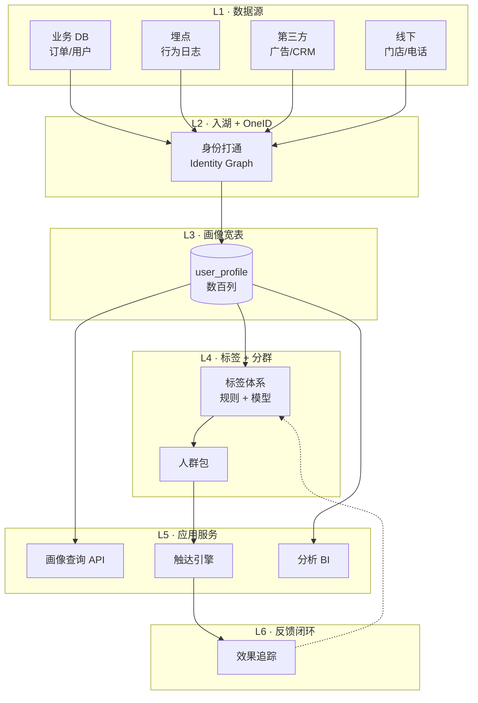
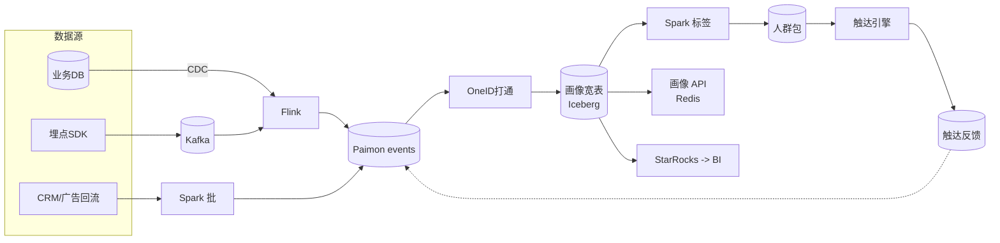

# CDP · 用户分群 · 精细化运营

!!! tip "一句话理解"
    **CDP = Customer Data Platform**。把散落在各业务系统的用户数据统一到一个**以用户为中心**的视图上，算出标签和分群，推给营销 / 增长 / 客服系统做**精细化触达**。最难的从来不是建模，而是**ID 打通**和**口径治理**。

!!! abstract "TL;DR"
    - 核心产物：**OneID + 画像宽表 + 标签体系 + 人群包**
    - 四类主流分群：**RFM / 生命周期 / 行为路径 / 预测型**（流失 / LTV / 倾向）
    - 典型栈：**Iceberg/Paimon 事实表 → Spark + dbt → 画像宽表 → Trino/StarRocks → 营销系统**
    - **准实时分群**（5–15 分钟）是行业主流趋势，T+1 已不够用
    - ID 打通是项目成败分水岭——身份图 (Identity Graph) 必修
    - 标签数量不是越多越好，**100 个精准 > 500 个模糊**

## 业务图景

CDP 服务的典型下游：

| 下游场景 | 用分群做什么 | 触达速度诉求 |
|---|---|---|
| **站内个性化** | 首页楼层 / Banner 不同群看不同版本 | 秒级 |
| **Push / SMS** | 针对流失用户发唤醒券 | 分钟级 |
| **EDM / 企业微信** | 分层营销邮件 | 小时级 |
| **广告投放** | 人群包推给巨量 / 腾讯广告 | 小时级 |
| **客服 / 坐席** | 坐席看到用户画像卡片 | 秒级 |
| **产品决策** | 看群体留存 / 漏斗 | 天级 |

---

## CDP 的六层逻辑架构



---

## L1–L2 · 数据入湖 + ID 打通（最容易低估）

### 数据源类型

- **结构化**：订单、用户注册表、会员体系
- **半结构化**：埋点（SDK 上报的 JSON）、日志
- **非结构化**：客服对话、评论文本（进 LLM 抽标签）
- **外部**：广告平台回流、CRM、第三方数据

### OneID · 身份图（Identity Graph）

用户可能同时有：`user_id`、`device_id`、`phone_hash`、`openid`、`unionid`、`email`、`idfa`…

**目标**：把这些 ID 串成**同一个自然人**。

```
graph LR
  u1[user_id: 12345] --- d1[device: iPhone-A]
  d1 --- p1[phone: 138****]
  p1 --- u2[user_id: 67890]
  u2 --- d2[device: iPhone-B]
  p1 --- e1[email: x@y.com]
```

- **实现**：
  - 简单：多账户 + 同手机 → 同人
  - 复杂：图数据库 + 连通分量算法（Spark GraphFrames `connectedComponents()`）
- **产出**：稳定的 **canonical user key**（通常是 `person_id`）
- **挑战**：
  - 同设备多账户（家庭共用）—— **不能**粗暴合并
  - Cookie/IDFA 过期
  - 隐私合规（PDPA/GDPR）→ Hash 后存

### 入湖表结构

```sql
-- 统一事件流
CREATE TABLE user_events (
  event_id     STRING,
  person_id    BIGINT,        -- OneID 打通后
  user_id      STRING,
  device_id    STRING,
  event_name   STRING,         -- view / click / add_cart / buy / …
  props        MAP<STRING,STRING>,
  ts           TIMESTAMP
) USING paimon
PARTITIONED BY (days(ts), event_name);

-- 业务实体快照（SCD Type 2）
CREATE TABLE user_dim (
  person_id    BIGINT,
  attr_...,
  valid_from   TIMESTAMP,
  valid_to     TIMESTAMP
) USING iceberg;
```

---

## L3 · 画像宽表（Profile）

**一行一个人，几百列属性 + 派生特征**。

### 列分组

| 组 | 示例 | 更新频率 |
|---|---|---|
| 人口属性 | age / gender / city | 注册时一次 |
| 账户状态 | vip_level / balance | 实时 |
| 近期行为 | last_login / last_buy / 7d_visits | 分钟–小时 |
| 交易历史 | total_orders / total_gmv / avg_ticket | 小时–天 |
| 偏好 | top_category / top_brand | 天 |
| 预测 | churn_prob / ltv_pred / ctr | 天–周 |
| 标签 | tags ARRAY<STRING> | 规则 / 模型 |
| 人群归属 | segments ARRAY<STRING> | 计算触发 |

### 建模：宽表 vs 实体表 + JOIN

- **大多数实践选宽表**（Iceberg / Paimon）
  - 原因：下游查询简单、成本可控
  - 代价：Schema 改动影响面大 → Column-Level Lineage 必要
- **替代**：实体表 + view（逻辑宽表）；查询稍慢但灵活

### 更新策略

- **快特征**（登录 / 浏览）：Flink 流式 upsert 到 Paimon 主键表
- **慢特征**（分类、偏好）：Spark 天级重跑
- **模型特征**（预测）：ML pipeline daily 回写

### Point-in-Time 一致性

一个常被忽视的点：**做留存分析时**，用户 2024-01 的属性不能被 2024-06 的属性覆盖。解决方式：
- Iceberg **Snapshot** 锁定历史时刻
- 或画像表用 **SCD Type 2**（valid_from / valid_to）

---

## L4 · 标签 + 分群体系

### 标签分层（业务常见三层）

```
原子标签           统计标签              预测标签
(是否注册)   →    (RFM / 7d活跃)   →   (流失概率/LTV)
规则即可         Spark SQL           机器学习
```

### 四类主流分群

#### 1. RFM · 最经典

- **R**ecency（最近购买距今）
- **F**requency（购买频次）
- **M**onetary（消费金额）

```sql
SELECT
  person_id,
  DATEDIFF(NOW(), MAX(order_ts)) AS recency,
  COUNT(*)                      AS frequency,
  SUM(amount)                   AS monetary,
  CASE
    WHEN recency <= 30 AND frequency >= 10 AND monetary >= 5000 THEN 'VIP'
    WHEN recency <= 30 AND frequency >= 3                       THEN '活跃'
    WHEN recency > 180                                          THEN '流失'
    ELSE '一般'
  END AS rfm_segment
FROM orders
GROUP BY person_id;
```

#### 2. 生命周期分群

- **新客** → **初次购买** → **复购活跃** → **忠诚** → **流失预警** → **流失**
- 每个阶段触达策略不同（新客送优惠券 vs 忠诚客推会员权益）

#### 3. 行为路径 / 漏斗

- 进入 App → 搜索 → 加入购物车 → 下单 → 支付
- 每一步的**放弃率**是营销切入点
- 工具：**Neo4j 路径分析** · **DuckDB window function** · **自研漏斗引擎**

#### 4. 预测型分群（ML）

| 模型 | 用途 | 常用算法 |
|---|---|---|
| 流失预测 | 识别流失风险 | XGBoost / LightGBM |
| LTV 预测 | 预测客户生命周期价值 | 回归 / 生存分析 |
| 倾向打分 | 对促销 / 品类的响应概率 | Uplift Modeling |
| 聚类 | 无监督发现群体 | K-Means / HDBSCAN |

### 人群包（Segment）

- 一个 `segment` = 一组 `person_id` + 定义 SQL + 刷新策略
- 两种产出方式：
  - **规则**：SQL 定义 → Spark 跑 → 落表
  - **自助**：分析师在 UI 拖拽筛选条件 → 系统翻译成 SQL
- 常见规模：从几千（VIP 精排）到几亿（全量活跃）

---

## L5 · 应用层

### 画像查询 API

- 客服 / 坐席拉某个用户全画像 → **毫秒级**
- 方案：**画像宽表 + Redis / HBase 做在线副本**
- 离线宽表每日同步 + 流式覆盖快特征

### 触达引擎

```
人群包 → 触达任务
           ├── 选渠道（Push / SMS / 企微 / EDM）
           ├── 选文案（A/B / 个性化）
           ├── 频控（同一用户 24h 内不超过 N 条）
           ├── 时机（静默时段避开）
           └── 转化回流
```

- 开源参考：**[Mautic](https://www.mautic.org/)** · **[Apache Unomi](https://unomi.apache.org/)**（CDP 标准实现）

### BI / 分析

- **Trino** 或 **StarRocks**（加速副本）
- 常见查询：群体规模、留存曲线、转化漏斗
- 工具：**Superset** · **Metabase** · **DataHub 血缘**

---

## 准实时分群（趋势）

T+1 够不够用？看场景：

- **VIP 运营、用户分层**：T+1 够
- **流失唤醒、复购提醒**：**5–15 分钟**能显著提升转化
- **风控联动、客诉介入**：**秒级**

### 准实时栈

```
Kafka → Flink → Paimon changelog → 物化视图 → StarRocks
                                      ↓
                                  触达引擎
```

- Flink 维护**滚动聚合**（近 1h 访问数等）
- Paimon changelog 下游消费最新快特征
- StarRocks 物化视图**持续增量刷新**

### 实施要点

- **ID 打通在流里做**：否则分群不准
- **幂等**：同一条事件进来多次不能重复计数（Flink exactly-once）
- **时序保证**：迟到事件用 watermark 处理

---

## 组件链路（典型电商）



---

## Benchmark · Dataset

CDP 没有标准 benchmark，用公开数据跑全流程：

- **[Brazilian E-commerce (Olist)](https://www.kaggle.com/datasets/olistbr/brazilian-ecommerce)** —— 订单 / 物流 / 评价全链路，CDP 练手首选
- **[Online Retail II (UCI)](https://archive.ics.uci.edu/dataset/502/online+retail+ii)** —— 英国电商 2 年交易流水，经典 RFM 数据集
- **[Retailrocket E-commerce Dataset](https://www.kaggle.com/datasets/retailrocket/ecommerce-dataset)** —— 行为事件流（view / addtocart / transaction）
- **[Criteo Sponsored Search Conversion Logs](https://ailab.criteo.com/criteo-sponsored-search-conversion-log-dataset/)** —— 倾向打分练手
- **[KKBox Music Churn (Kaggle)](https://www.kaggle.com/c/kkbox-churn-prediction-challenge)** —— 流失预测经典

---

## 可部署参考

- **最小全栈闭环**：
  - 数据：Olist + Iceberg
  - 计算：Spark + dbt
  - 标签：SQL + Scikit-learn
  - BI：Superset
  - 触达：mock Push API
- **开源 CDP**：
  - **[Apache Unomi](https://unomi.apache.org/)** —— 标准 CDP 实现
  - **[RudderStack](https://github.com/rudderlabs/rudder-server)** —— 开源 Segment 替代（偏 CDP 入口）
  - **[Jitsu](https://github.com/jitsucom/jitsu)** —— 事件采集管道
- **商业参考**：Segment · mParticle · Tealium · 神策 · GrowingIO · Kwai DataWorks

---

## 工业案例 · CDP 场景切面

!!! note
    CDP 公开资料相对少（商业敏感）· 以阿里为主 · LinkedIn 为合理推断。

### 阿里巴巴 · 电商 CDP（大规模画像 + 双 11 实时触达）

**为什么值得学**：阿里电商 CDP **规模极限**（数亿用户 + 数亿商品 + 双 11 实时触达）· 是中国工业 CDP 代表。**全栈视角见 [cases/alibaba](../cases/alibaba.md)**。

**CDP 场景独特做法**：

1. **OneID + 跨域身份**：
   - 淘宝 · 天猫 · 菜鸟 · 阿里云 · 饿了么 · 高德 等跨域身份打通
   - **阿里妈妈**作商业化身份中枢
   - 难度：不同业务 ID 体系 + 隐私合规

2. **画像宽表 + 标签体系**：
   - 行为标签（浏览 / 加购 / 下单等千维度）
   - 人口学标签 + 偏好标签（兴趣 / 风格 / 价格带）
   - **实时**（近 N 秒行为）+ **长期**（历史画像）双层

3. **实时触达（双 11 实战）**：
   - Paimon 实时行为表 → Flink CDC → 实时特征 → Hologres（HSAP）→ 实时分群
   - **分钟级触达**（促销 push / 红包 / 补贴）
   - 规模：**数百万 QPS** 大屏 + 数十亿人次触达

4. **Hologres HSAP 在 CDP 的作用**：
   - OLAP 分群查询 + 轻量 OLTP 标签更新
   - 商家后台实时看画像 / 标签 / 触达效果

**规模** `[量级参考]`：
- 画像宽表**数百列** · 亿级行
- 标签**数千维度**
- 实时大屏 QPS **数百万**

**踩坑**（来自 [cases/alibaba §9](../cases/alibaba.md)）：
- MaxCompute 闭源 + 开源栈**早期互读困难** · CDP 跨栈 ETL 成本高
- Hologres 向量能力 2024 才 GA · **向量画像（embedding-based 分群）晚追**

**对照与复用**：
- ✅ OneID + 画像宽表 + 标签体系 + 触达回流闭环 · 完全对齐
- ✅ **Paimon + Flink CDC** 组合对中型电商团队最可复制
- ⚠️ 双 11 规模**过度** · 中型团队 T+1 + 小时级已足够

### LinkedIn · 用户分群（推断 · 公开有限）

!!! warning "以下为合理推断 · LinkedIn CDP 具体方案公开较少"
    - **数据底座**：Kafka + Iceberg（2023+ 迁移）
    - **特征在线 store**：Venice（见 [cases/linkedin](../cases/linkedin.md)）
    - **分群场景**：LinkedIn Ads 需要企业 / 职能 / 兴趣多维度分群
    - **假设做法**：Feathr 统一特征 + DataHub 血缘 + Pinot 实时查询

### 对中型团队的启示（事实观察）

- **OneID 是 CDP 起点**· 不是标签。身份不通做什么都白搭
- **T+1 足够起步** · 实时画像是锦上添花（不是所有业务需要）
- **标签数量限制** · 500+ 标签是**治理灾难** · 强治理（owner / SLA / 废弃）
- **向量画像**（embedding-based 分群）是 2024+ 方向 · 可和 LLM / 多模结合

---

## 陷阱

- **OneID 打不通就上标签**：标签全部基于散落的 ID，分群重复 / 漏 / 错 → 先把身份图做扎实
- **标签爆炸到 500+**：业务消费不动、口径乱 → 强治理：归属人、SLA、废弃流程
- **只有 T+1**：流失用户 24 小时后才唤醒，效果打骨折
- **宽表无限加列**：一个宽表 800 列 → 查询慢 + 改动危险 → 分域宽表
- **没有效果追踪**：推了 100 万条 Push，转化多少、ROI 多少不知道 → **触达回流 → 事件表**闭环
- **预测模型太学术**：AUC 0.85 但业务拿不来 → 用 **Uplift** 而不是单纯响应概率（回答"推给谁有增量"）
- **隐私合规忽视**：未脱敏 PII 进入下游 → PDPA / GDPR / 个保法风险
- **把 CDP 和 DMP 混为一谈**：CDP 是**已知用户**（有 PII）、DMP 是**匿名受众**（Cookie/IDFA）；合规要求完全不同

---

## 和其他场景的关系

- **vs [推荐系统](recommender-systems.md)**：推荐看**个人偏好**、CDP 看**群体属性**；共享画像宽表但消费方式不同
- **vs [BI on Lake](bi-on-lake.md)**：CDP 是更"以用户为中心"的 BI；共享引擎（Trino / StarRocks）和底座
- **vs [欺诈检测](fraud-detection.md)**：共用画像宽表；CDP 用于营销、欺诈看异常

---

## 相关

- [BI on Lake](bi-on-lake.md) · [Real-time Lakehouse](real-time-lakehouse.md) · [欺诈检测](fraud-detection.md)
- [推荐系统](recommender-systems.md) · [离线训练数据流水线](offline-training-pipeline.md)
- [业务场景全景](business-scenarios.md)

## 数据来源

工业案例的规模量级标 `[量级参考]`· 主要来源：
- 阿里 CDP：阿里云官方技术博客 · 双 11 历年战报（数字为公开披露范围内 · 未独立验证）
- LinkedIn：本节为**合理推断**· 具体分群方案公开有限

## 延伸阅读

- *Hooked: How to Build Habit-Forming Products* (Nir Eyal) — 留存产品视角
- *Growth Hacker Marketing* (Ryan Holiday) — 增长心法
- Segment / mParticle / Tealium 的 CDP 技术博客
- 神策 / GrowingIO / Kwai DataWorks 的中文案例
- Gartner CDP Magic Quadrant（了解行业图景）
