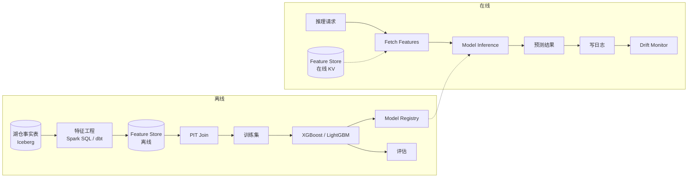

# 经典 ML 预测 · 分类 / 回归 / 时序

!!! tip "一句话理解"
    不是推荐、不是 RAG、不是 LLM——而是**业务场景里最大的 ML 存量**：**用户流失预测、信贷额度、商品销量预测、CTR 预估、保险定价**。2025 年**XGBoost / LightGBM / CatBoost 在表格数据上仍然是事实王者**，DL 不是灵丹妙药。

!!! abstract "TL;DR"
    - **四大子场景**：分类（流失/违约）· 回归（销量/LTV）· 时序（需求/库存）· 排序（LTR）
    - **模型**：**GBDT 家族**（XGBoost / LightGBM / CatBoost）统治表格数据
    - **DL 的位置**：图像 / 文本 / 序列必选；**纯表格数据 GBDT 通常更好**
    - **关键**：**特征工程 + Feature Store + PIT** 而非模型
    - **典型延迟**：离线训练 30min-8h · 在线推理 < 10ms
    - **规模**：亿级样本 × 千级特征是行业主流

## 1. 业务图景 · 四大子场景

| 子场景 | 业务例 | 模型 | 延迟诉求 |
|---|---|---|---|
| **二分类 / 多分类** | 流失预测、欺诈、点击率预估 | XGBoost / LightGBM / DNN | 线上 < 20ms |
| **回归** | 销量预测、LTV、房价估值 | GBDT / 线性 / DNN | 线上 < 20ms |
| **时序** | 需求预测、库存、容量规划 | Prophet / ARIMA / LSTM / GBDT | 离线为主 |
| **Learning-to-Rank** | 搜索排序、推荐精排 | LambdaMART / XGBoost-Rank | 线上 < 20ms |

### 和其他 ML 场景的区别

| | 经典 ML | 推荐系统 | RAG |
|---|---|---|---|
| 数据 | 表格为主 | 行为 + 特征 + item | 文档 |
| 模型 | GBDT / 小 DL | GBDT + DNN + Embedding | LLM |
| 底座 | Feature Store + 湖 | Feature Store + 向量 + 湖 | 向量 + 湖 |
| 延迟 | < 20ms | < 100ms 端到端 | < 1.5s |

## 2. 典型管线



## 3. 核心选型 · 为什么 GBDT 仍是王者

### GBDT 的三个优势

1. **表格数据表现**：几乎所有公开 benchmark（Kaggle / 工业数据集）GBDT 稳稳强过 DL
2. **工程友好**：
   - 训练快（CPU 几分钟到几小时）
   - 可解释（feature importance + SHAP）
   - 对缺失 / 类别 / 异常值鲁棒
3. **部署简单**：模型小（MB 级）、推理快（< 1ms）

### 三大 GBDT 库对比

| 库 | 特点 | 适合 |
|---|---|---|
| **XGBoost** | 生态最全、GPU 支持 | 通用首选 |
| **LightGBM** | 训练速度最快、内存友好 | 大数据量 |
| **CatBoost** | 类别特征自动处理、偏差小 | 类别多 |

**实务**：90% 场景三者效果相差 < 1 个点，选**团队熟悉**的。

### 什么时候用 DL？

- **图像 / 文本 / 音频**：必选（CNN / Transformer）
- **序列特征超长**（用户行为序列几百步）：DNN + Attention 有优势
- **Embedding 需求**：end-to-end 学表征
- **多任务学习**：共享底层

**避免**：
- 纯表格数据硬上 TabNet / DL → 收益边际、维护成本高
- 用 DL 替代 GBDT 求"先进" → 通常事与愿违

## 4. 关键环节

### 环节 1 · 特征工程（最重要）

**80% 的模型效果差异来自特征工程**。常见 pattern：

| 类型 | 例子 |
|---|---|
| **基础统计** | count / sum / avg / max / min 滚动窗口 |
| **时间** | 距今多久、周几、节假日 |
| **交叉** | user × item / user × category |
| **embedding** | user_emb / item_emb |
| **外部** | 天气、经济指标、节日 |
| **目标编码** | 按目标值均值编码类别 |

工具：
- **Spark SQL + dbt**（主流）
- **Feature Store**（Feast）统一定义

### 环节 2 · PIT Join（防泄露）

详见 [Feature Store](../ml-infra/feature-store.md)（Point-in-Time Join 段落）。

**经典错误**：训练 2024-06 样本用了 2024-06 之后的 `user_total_gmv`——未来信息泄露 → AUC 飙 → 线上崩。

### 环节 3 · 样本不平衡

二分类场景正负 1:100、1:1000 常见：

- **下采样**（欠采样）：保留 5-10% 负样本
- **加权**（class_weight）
- **SMOTE**（过采样合成）
- **Focal Loss** / 自定义损失

**关键**：**评估不看 AUC 看 Precision@K / Recall@K / PR-AUC**。

### 环节 4 · 模型评估

| 任务 | 指标 |
|---|---|
| 二分类 | AUC / PR-AUC / Precision@K / Recall@K / F1 |
| 多分类 | Macro / Weighted F1 |
| 回归 | MAE / RMSE / MAPE |
| 时序 | MAE / MAPE / SMAPE |
| 排序 | NDCG / MRR |

**不止离线指标**：业务模拟 → A/B 测试 → 影子流量。

### 环节 5 · 可解释性

- **Feature Importance**（模型级）
- **SHAP 值**（样本级）—— 必备，特别合规场景

```python
import shap
explainer = shap.TreeExplainer(model)
shap_values = explainer.shap_values(X_test)
shap.summary_plot(shap_values, X_test)
```

### 环节 6 · 部署 + 监控

- Pickle / ONNX / treelite → serving
- 延迟 < 10ms 常见（GBDT 模型小）
- **Feature Drift 监控**（PSI）
- **预测分布漂移监控**

详见 [MLOps 生命周期](../ml-infra/mlops-lifecycle.md)。

## 5. 性能数字

### XGBoost 训练基线

| 数据规模 | 硬件 | 时间 |
|---|---|---|
| 100k × 100 | CPU | < 1 分钟 |
| 1M × 100 | CPU | 3-10 分钟 |
| 10M × 100 | CPU 或 GPU | 30-60 分钟 |
| 100M × 1000 | GPU | 2-4 小时 |
| 1B+（分布式） | 多机 | 4-12 小时 |

### LightGBM 通常比 XGBoost 快 2-5×。

### 在线推理

- **GBDT（100 树）**：< 1ms
- **GBDT（1000 树）**：< 5ms
- **DNN（小模型）**：5-20ms
- **批推理**：数万 QPS / 节点

### 实际业务数据

- **某广告 CTR** 10B 样本、1000 特征、LightGBM、AUC 0.78
- **某金融风控** 1M 样本、500 特征、XGBoost、Precision@1% = 0.85
- **某电商销量预测** 时序 GBDT、MAPE 8-15%

## 6. 代码示例

### 端到端 XGBoost（从湖 + FS 训练）

```python
from feast import FeatureStore
import xgboost as xgb
from sklearn.model_selection import train_test_split
from sklearn.metrics import roc_auc_score
import mlflow

store = FeatureStore(repo_path="feature_repo/")

# 1. 标签数据（事件）
entity_df = spark.sql("""
SELECT user_id, event_ts, 
       CASE WHEN next_30d_churn THEN 1 ELSE 0 END AS label
FROM iceberg.ml.churn_training_events
VERSION AS OF 1234567890
""").toPandas()

# 2. PIT Join 拉特征
train_df = store.get_historical_features(
    entity_df=entity_df,
    features=[
        "user_features:avg_7d_gmv",
        "user_features:purchase_7d",
        "user_features:days_since_last_login",
        "user_features:vip_level",
    ],
).to_df()

X = train_df.drop(["user_id", "event_ts", "label"], axis=1)
y = train_df["label"]

# 3. 训练
X_train, X_test, y_train, y_test = train_test_split(X, y, stratify=y, test_size=0.2)

with mlflow.start_run():
    mlflow.log_param("snapshot_id", "1234567890")
    mlflow.log_param("feature_view_version", "v3")

    model = xgb.XGBClassifier(
        n_estimators=500,
        max_depth=8,
        learning_rate=0.05,
        scale_pos_weight=len(y_train[y_train==0]) / len(y_train[y_train==1]),
        eval_metric='aucpr',
        tree_method='hist',
    )
    model.fit(X_train, y_train, eval_set=[(X_test, y_test)], verbose=50)

    auc = roc_auc_score(y_test, model.predict_proba(X_test)[:, 1])
    mlflow.log_metric("auc", auc)
    mlflow.xgboost.log_model(model, "model", registered_model_name="churn_v3")
```

### 时序预测（Prophet）

```python
from prophet import Prophet

# 格式要求：ds（date）, y
df = pd.read_parquet("s3://lake/sales_daily.parquet")

m = Prophet(yearly_seasonality=True, weekly_seasonality=True)
m.add_country_holidays(country_name='CN')
m.fit(df)

future = m.make_future_dataframe(periods=30)
forecast = m.predict(future)
m.plot(forecast)
```

### 在线推理（FastAPI + Feature Store）

```python
from fastapi import FastAPI
from feast import FeatureStore
import joblib

app = FastAPI()
store = FeatureStore(repo_path="feature_repo/")
model = joblib.load("model.pkl")

@app.post("/predict/churn")
def predict(user_id: int):
    features = store.get_online_features(
        features=["user_features:avg_7d_gmv", ...],
        entity_rows=[{"user_id": user_id}]
    ).to_dict()
    X = prepare_features(features)
    prob = model.predict_proba(X)[0, 1]
    return {"churn_prob": float(prob)}
```

## 7. 陷阱与反模式

- **特征泄露**（PIT 没做）：离线 AUC 0.95 → 线上崩；用 Feature Store
- **试 10 个 DL 超越 GBDT**：大多数表格场景浪费时间
- **只看 AUC**：不平衡场景看 Precision@K / PR-AUC
- **Train-Serve Skew**：一个月后模型神奇退化 → 特征计算两套
- **类别特征 one-hot 到爆**：用 target encoding / CatBoost
- **缺失值硬 fillna(0)**：让 GBDT 自己学（XGBoost 原生支持）
- **超参乱调不 CV**：Optuna / Ray Tune 自动化
- **模型不 snapshot**：明天改代码、旧实验重跑不了
- **DL on 小数据**：< 10k 样本硬上 DL 稳定过拟合

## 8. 可部署参考

- **[Kaggle 各比赛](https://www.kaggle.com/competitions)** —— 最佳学习资源
- **[scikit-learn + MLflow 示例](https://mlflow.org/docs/latest/tutorials-and-examples/tutorial.html)**
- **[XGBoost Distributed (Dask / Spark)](https://xgboost.readthedocs.io/en/stable/tutorials/dask.html)**
- **[Optuna 自动调参](https://optuna.org/)**
- **[Ray Train for XGBoost/LightGBM](https://docs.ray.io/en/latest/train/train.html)**

## 9. 和其他场景的关系

- **vs [推荐系统](recommender-systems.md)**：推荐是特殊 ML（双塔 + LTR），经典 ML 是更广义的预测
- **vs [欺诈检测](fraud-detection.md)**：欺诈是经典 ML 的子集（二分类 + 图）
- **vs [即席探索](ad-hoc-exploration.md)**：探索常是 ML 的前置环节

## 延伸阅读

- **[Kaggle Winning Solutions](https://www.kaggle.com/discussions/)** —— 实战智慧
- **[*Hands-On Machine Learning* (Géron, 3rd 2022)](https://www.oreilly.com/library/view/hands-on-machine-learning/9781098125967/)**
- **[XGBoost Paper](https://arxiv.org/abs/1603.02754)** · **[LightGBM Paper](https://papers.nips.cc/paper/6907-lightgbm-a-highly-efficient-gradient-boosting-decision-tree.pdf)**
- **[SHAP paper](https://arxiv.org/abs/1705.07874)**
- *The Elements of Statistical Learning* (Hastie et al.) —— 经典教材

## 相关

- [MLOps 生命周期](../ml-infra/mlops-lifecycle.md) · [Feature Store](../ml-infra/feature-store.md)
- [离线训练数据流水线](offline-training-pipeline.md) · [Feature Serving](feature-serving.md)
- [推荐系统](recommender-systems.md) · [欺诈检测](fraud-detection.md) · [业务场景全景](business-scenarios.md)
