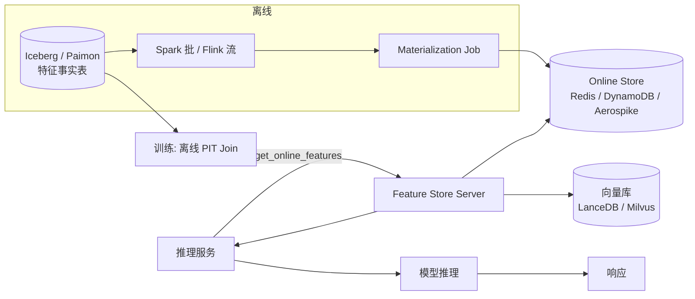

# Feature Serving

!!! tip "一句话场景"
    在线推理时**毫秒级**拿到模型需要的所有特征。输入是 `user_id` 或上下文，输出是特征向量；背后是"离线湖 + 在线 KV + Feature Store"的协同。

## 场景输入与输出

- **输入**：推理请求（user_id、商品 id、query 等）
- **输出**：一组特征值（标量 + 向量 + embedding），供模型推理使用
- **SLO 典型**：
    - p99 延迟 **< 20ms**（整个特征拉取）
    - 可用性 **99.99%**
    - 离线与在线一致（train-serve skew ≤ 千分之一）

## 架构总览



## 两个世界必须对齐

离线训练与在线推理**看似用同一个特征**，实际常常不一致。三大来源：

1. **计算逻辑不同** —— SQL 写的特征 vs Java 实时算
2. **数据不新鲜** —— 离线是 T-1，在线是 T-real-time
3. **特征值不稳定** —— 定义变了但没通知到在线系统

Feature Store 的全部价值就在于**统一一份定义**，由平台负责双发：

```python
# 统一定义
user_feature = FeatureView(
  name="user_activity_7d",
  entity=["user_id"],
  compute=SQL("SELECT user_id, count(*) AS click_7d FROM clicks WHERE ts > ts - 7d"),
  ttl="24h"
)

# 离线：批物化
feast apply
feast materialize ...

# 在线：推理时拉
features = fs.get_online_features(
  features=["user_activity_7d:click_7d"],
  entity_rows=[{"user_id": 42}]
)
```

## 三层存储

- **Source（湖）**：Iceberg / Paimon 事实表；权威来源
- **Offline Store**：训练读的 materialized snapshot；通常就是湖表本身
- **Online Store**：低延迟 KV；Redis / DynamoDB / Aerospike / Cassandra

同步策略：
- **批**：离线计算 → periodic push 到 Online
- **流**：Flink 流式计算 + 双写离线表和 Online

## 向量特征的特殊处理

推理时要**同时**拿：
- 标量特征（user_activity_7d、lifetime_value）
- 向量特征（user_last_clip_vec）
- 可能还要做**向量近邻检索**（推荐相似 items）

这意味着 **Feature Serving 要能同时调 KV + 向量库**，延迟预算压力很大。主流做法：

- 向量特征也放 Online KV（当数量可控）
- 或 KV 只存 `vector_id`，用时去向量库取

## 延迟预算

假设端到端模型推理预算 100ms：

| 阶段 | 预算 |
| --- | --- |
| 前置 IO（特征）| 10–20ms |
| 模型推理 | 50–70ms |
| 后处理 + rerank | 10–20ms |
| 网络 | 10ms |

特征侧 10–20ms 要拉回几十个特征 —— 必须批量 + 并发 + Online KV 的 multi-get。

## 推荐技术栈

| 节点 | 首选 | 备选 |
| --- | --- | --- |
| Feature 定义 | Feast / Tecton | 自研 YAML |
| Online Store | Redis Cluster | DynamoDB / Aerospike |
| 向量 Online | LanceDB / Milvus | Redis + RediSearch |
| Materialization | Spark（批）+ Flink（流） | Ray Data |
| Serving Server | Feast Server / 自研 gRPC | Tecton Serving |

## 失败模式与兜底

- **Online store 缺数据** —— 没来得及同步 / 某 key 漏 materialize。**兜底**：返回模型的 fallback 特征（零向量 / 默认值）+ 监控缺失率
- **延迟抖动** —— Redis 单节点 CPU 打满。**兜底**：多副本 + client-side retry + 降级为简化特征
- **离线在线漂移** —— 定义更新没同步到某条路径。**兜底**：定期抽样对比 `(离线值, 在线值)` 的一致性，告警
- **冷启动** —— 新用户 / 新商品没 KV 缓存。**兜底**：给 fallback KV + 实时算简单特征

## 监控

- p99 延迟（按特征类别拆）
- 缺失率 / fallback 率
- 离线在线一致性（每日抽样对比）
- Online Store 命中率 / 内存占用
- Materialization 延迟（上游湖 snapshot 到 Online KV 的时间差）

## 相关

- [Feature Store](../ai-workloads/feature-store.md)
- [离线训练数据流水线](offline-training-pipeline.md)
- [Semantic Cache](../ai-workloads/semantic-cache.md) —— 相邻思想
- 底层：[湖表](../lakehouse/lake-table.md)

## 延伸阅读

- Feast online/offline 对齐文档
- *Feature Stores for ML* (Tecton 白皮书)
- *Serving Machine Learning Models* (O'Reilly)
