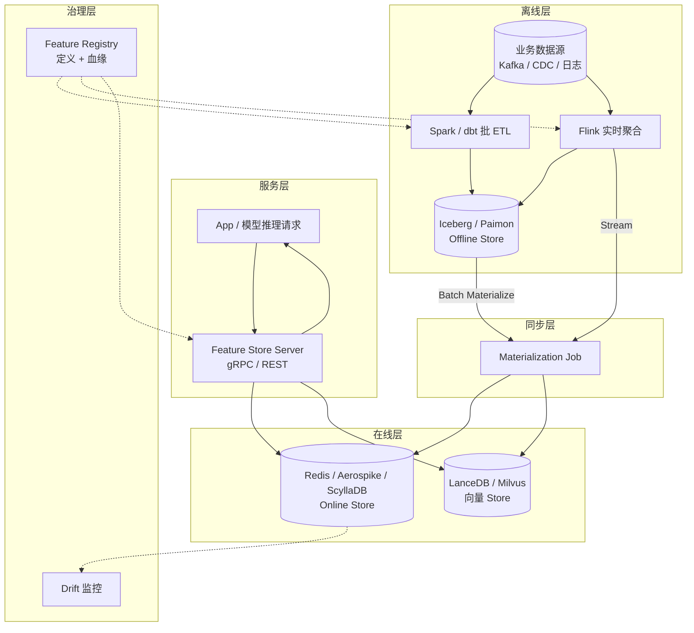

# Feature Serving · 在线特征服务

!!! tip "一句话场景"
    在线推理时**毫秒级**拿到模型需要的所有特征。看似简单的"查 Redis"，实际是**离线湖 + 在线 KV + Feature Store 三层协同**的工程系统。**和离线训练的一致性**是生死线——Train-Serve Skew 是工业 ML #1 事故来源。

!!! abstract "TL;DR"
    - **核心 SLO**：p99 < 20ms（特征拉取）· 可用性 99.99% · 离线在线一致性 < 千分之一
    - **关键架构**：Offline Store（湖）+ Online Store（KV）+ 统一定义层
    - **同步两条路**：批 materialize（定时）· 流 materialize（实时）
    - **陷阱 #1**：Train-Serve Skew（离线在线特征值不一致）
    - **推荐栈**：Feast + Redis Cluster + Spark/Flink materialize
    - **延迟控制**：批量 multi-get + 并发 + 本地缓存

## 1. 业务痛点 · 没有 Feature Serving 的生活

### 典型事故

1. **在线推理代码和离线训练代码两套**：
   - 离线 Spark SQL：`AVG(amount) OVER (PARTITION BY user_id ORDER BY ts RANGE 7 DAYS)`
   - 在线 Java：分钟级聚合自己实现
   - 两套代码在**时区 / null 处理 / 边界**处差异 → 离线 AUC 0.92 / 线上 0.74

2. **特征计算开销爆**：每次推理请求都从头算 7 天滚动 → 500ms 延迟

3. **特征不新鲜**：T+1 更新的特征，实际推理时用户行为 1 小时前就变了

4. **模型升级与特征升级不同步**：新版模型要新特征，但上线没配套 materialize

### Feature Serving 的解法

```
统一的特征定义 (dbt / Feast / Tecton YAML)
         ↓
┌────────┴────────┐
│                 │
↓                 ↓
离线 Store        在线 Store
(Iceberg 湖)     (Redis / KV)
│                 │
↓                 ↓
训练管线         推理服务
```

一份定义、两端执行、对账一致。

## 2. 架构深挖



### 三层存储的职责

| 层 | 存储 | 职责 | 读写特征 |
|---|---|---|---|
| **Offline Store** | Iceberg / Paimon | 历史特征、PIT Join 训练样本 | 批读为主 |
| **Online Store** | Redis / Aerospike / ScyllaDB | 毫秒级点查、最新特征值 | 高并发读 + 批写 |
| **Stream Source** | Kafka / Flink State | 实时特征中间状态 | 流读 |

### 关键决策 · 单 Key 还是 Feature View

**单 Key 设计**：
```
key: user:12345
value: {"avg_7d_gmv": 120.5, "vip_level": 2, "last_login": 1735200000}
```
- 一次 GET 取所有 user 特征
- 代价：某个特征改需要读+改+写整条

**Feature View 设计**：
```
key: user:12345:avg_7d_gmv → 120.5
key: user:12345:vip_level → 2
```
- 每特征独立 key
- MGET / Pipeline 批取
- 代价：key 数量暴涨

**实务**：Feast 用 Hash 结构，本质是前者；Tecton 更灵活；自建多走前者。

## 3. 离线在线一致性 · 生死线

### 三大不一致来源

| 来源 | 症状 | 解法 |
|---|---|---|
| **计算逻辑两套** | SQL vs Java 漂移 | **一处 YAML 定义 + 自动 codegen** |
| **数据不新鲜** | T+1 离线 vs 实时在线 | Stream materialize 补实时 |
| **边界 case 不一致** | NULL / 空 / 超界 | 严格统一 handling + 单元测试 |

### 一致性检验（必须做）

每日抽样对比：

```python
# 抽 1000 个 user_id
users = sample_users(1000)

for user_id in users:
    offline = offline_store.get_features(user_id, ["avg_7d_gmv"])
    online = online_store.get_features(user_id, ["avg_7d_gmv"])
    
    if abs(offline - online) / offline > 0.001:
        alert("skew detected", user_id, offline, online)
```

### 常见数据点

成熟 FS 实践的 skew 率：
- **非常好**：< 0.1%
- **可接受**：0.1% - 0.5%
- **警戒**：> 1%（模型开始漂移）
- **事故**：> 5%（线上效果崩）

## 4. 延迟预算分解

端到端模型推理预算 100ms 的典型分解：

```
0ms   用户请求到达
  ↓
5ms   身份验证 + 路由
  ↓
20ms  Feature 拉取（批量 multi-get 50 个特征）
  ├── 本地 cache hit: 0ms
  ├── Redis Cluster: 5-15ms
  └── 向量库: 10-20ms（若有向量特征）
  ↓
60ms  模型推理（依模型大小）
  ↓
85ms  Rerank / 业务规则
  ↓
95ms  后处理 + 序列化
  ↓
100ms 响应返回
```

**压缩特征侧延迟的手段**：
- **批量 multi-get**（一次 GET 50 个 key）
- **本地 cache**（L1 = Caffeine / Guava）
- **并发 fetch**（Online KV + Vector 并发）
- **Online Store 连接池**优化
- **预热热 user**（Top 10k 长期保留）

## 5. 向量特征的特殊处理

推荐 / 搜索场景的特征常有向量部分：
- 用户 embedding
- Item embedding
- 历史行为序列 embedding

### 两种存储模式

**模式 A · 向量直接放 Online KV**：
```
key: user:12345:embedding → [128 维 float32 二进制]
```
- 简单、延迟好
- 代价：向量大 + 更新频繁时成本高

**模式 B · Online KV 存 pointer + 向量库取**：
```
key: user:12345:embedding_id → "v_98765"
向量库: v_98765 → [128 维 float32]
```
- 节省 KV 存储
- 多一跳网络

**实务**：
- 单向量 < 1KB + QPS 不极致 → 模式 A
- 大向量 / 高 QPS → 模式 B
- 向量还要做 ANN 检索 → 必然走向量库（模式 B）

## 6. 主流实现对比

### Feast + Redis Cluster（开源首选）

```python
feast_store.get_online_features(
    features=[
        "user_stats:avg_7d_gmv",
        "user_stats:vip_level",
        "item_stats:avg_rating",
    ],
    entity_rows=[
        {"user_id": 12345, "item_id": 67890}
    ]
).to_dict()
```

**优**：开源、生态全
**劣**：大规模需自调优

### Tecton（商业 SaaS）

**优**：端到端托管、SLA
**劣**：贵、锁定

### Hopsworks

**优**：带完整 MLOps
**劣**：学习曲线

### 自建 Iceberg + Redis + dbt

```python
# 最小实现
def get_online_features(user_id, feature_names):
    with redis_pool.get() as r:
        raw = r.hmget(f"user:{user_id}", feature_names)
    return dict(zip(feature_names, [deserialize(v) for v in raw]))

# 批量同步
spark.read.table("iceberg.features.user_stats") \
     .foreachPartition(lambda p: bulk_write_redis(p))
```

**优**：零授权费、完全可控
**劣**：治理 / 监控 / 血缘全自己搭

## 7. 高可用与降级

### 副本策略

- **Redis Cluster**：主从 + 分片
- **至少 3 副本**
- **跨 AZ 部署**
- 读走副本、写走主

### 降级策略（Fallback）

| 失败模式 | Fallback |
|---|---|
| Online Store 不可用 | Local cache + 默认值 |
| 某 key 未 materialize | 默认值 + 监控告警 |
| 某特征缺失 | 全局均值 / 人口属性均值 |
| 网络抖动 | Circuit breaker + 本地降级 |
| 完全不可用 | 模型用退化特征集推理 |

**关键**：模型必须对"部分特征缺失"鲁棒——训练时**随机 mask 特征**是常见做法。

## 8. 监控指标

### 延迟

- p50 / p95 / p99 per-feature-view
- Online Store 连接数 / 线程池
- Network RTT

### 可用性

- 请求成功率
- Fallback 触发率
- 缺失率（应该 < 0.1%）

### 一致性

- 离线在线 skew 抽样率
- Materialization 延迟（湖 → Online 的时间差）

### 成本

- Online Store 内存占用
- Materialization 吞吐
- Fetch QPS

## 9. 性能数字 · 典型规模

| 指标 | 基线 |
|---|---|
| 单 entity feature get | 2-10ms |
| 批 100 entity multi-get | 20-50ms |
| Redis Cluster QPS | 几十万 / 集群 |
| Aerospike QPS | 几百万 / 集群 |
| Online Store 规模 | TB 级内存 |
| Materialization 吞吐 | 10k - 100k rows/s |
| 日活 Materialize 频率 | 热特征分钟、冷特征小时 |

### 工业案例（数据时效说明）

- **Uber Michelangelo Palette**：3000+ 特征 · p99 < 15ms · 引自 [Uber Engineering Blog · 2022](https://www.uber.com/blog/michelangelo-machine-learning-platform/)（2024+ 规模未公开）
- **LinkedIn Venice**：数百万 QPS · p99 < 5ms · 引自 [LinkedIn Engineering · 2022](https://engineering.linkedin.com/blog/topic/venice)
- "某电商推荐：500 个在线特征 · p99 20ms 端到端" —— **工程经验估算**，不是特定公开来源 · 具体规模依业务差异极大

## 10. 可部署参考

- **[Feast + Redis Cluster Tutorial](https://docs.feast.dev/)**
- **[Tecton 白皮书](https://www.tecton.ai/resources/)**
- **[Uber Palette](https://eng.uber.com/feature-store/)** —— 工业级参考
- **[LinkedIn Venice](https://github.com/linkedin/venice)** —— 开源
- 自建 Iceberg + Redis playbook（规划中，路径 `tutorials/feature-store-setup.md`）

## 10.5 工业案例 · Feature Serving 场景切面

### LinkedIn · Venice（在线 Feature Store 工业标杆）

**Venice 独特设计**（见 [cases/linkedin §5.3](../cases/linkedin.md)）：
- **写路径走 Kafka push**（不是客户端直写）· 解决写 QPS 失控
- **批量加载 + 实时增量**一等支持
- **Read-optimized 存储** · ML feature 读负载极致优化
- 规模：**百万级 QPS · ms 级 p99** `[量级参考]`

**对 Feature Serving 的启示**：
- 写路径**通过 Kafka 统一**比客户端直写更可控
- **批量 bulk load + 实时 stream 增量** 是在线 FS 的正确抽象（通用 KV 做不好）
- Read-optimized 独特存储比通用 Cassandra / DynamoDB 好

### Uber · Palette / Genoa（Michelangelo 的在线 store）

**独特做法**（见 [cases/uber §5.3](../cases/uber.md)）：
- **训推一致性**（离线批特征 · 在线实时特征 · 同算逻辑）
- **Palette 2022**（Feature Store 独立子产品）→ **Genoa 2024+**（重构 · 流式特征强化）
- ms 级推理时间 · 欺诈 / ETA / 匹配场景

### 共同规律（事实观察）

- **在线 Feature Store ≠ 通用 KV** · 需要专门设计（Venice 设计哲学）
- **训推一致**是 Feature Store 的核心价值（Michelangelo 鼻祖）
- **批 + 流混合加载**是工业刚需
- 详见 [ml-infra/feature-store](../ml-infra/feature-store.md)

---

## 11. 陷阱与反模式

- **离线在线不对账**：事故温床
- **TTL 不设** → Redis 内存爆
- **单点 Online Store** → 一挂全崩
- **Materialize 频率太快**：冷特征每分钟跑浪费
- **Materialize 频率太慢**：特征过时、用户体验差
- **特征数量无限**：500+ 特征谁在用 / 谁 owner / 废弃流程 → 必须治理
- **推理侧抓取串行**：串行 10 个 feature view → 延迟爆
- **Schema 演化不管**：加列删列不通知下游 → 推理代码崩
- **没 fallback** ：Online Store 抖一下业务崩
- **全在一个 Redis namespace**：混乱 · 权限粗 · 删错风险

## 12. 和其他场景的关系

- **vs [推荐系统](recommender-systems.md)**：Feature Serving 是推荐系统的一个核心组件
- **vs [欺诈检测](fraud-detection.md)**：共用 Online Store，但欺诈场景延迟要求更严
- **vs [离线训练数据流水线](offline-training-pipeline.md)**：对齐 PIT Join 与 in-flight 特征

## 13. 数据来源

工业案例规模数字标 `[量级参考]`· 来源：LinkedIn Engineering Blog（Venice 系列）· Uber Engineering Blog（Palette / Genoa 系列）。数字为公开披露范围内 · 未独立验证 · 仅作规模量级的参考。

## 14. 相关 · 延伸阅读

- [Feature Store](../ml-infra/feature-store.md) · [Feature Store 横比](../compare/feature-store-comparison.md)
- [离线训练数据流水线](offline-training-pipeline.md)
- [MLOps 生命周期](../ml-infra/mlops-lifecycle.md)
- [推荐系统](recommender-systems.md) · [欺诈检测](fraud-detection.md)

### 权威阅读

- **[Feast docs](https://docs.feast.dev/)** · **[Tecton 技术博客](https://www.tecton.ai/blog/)**
- **[Uber Michelangelo Palette](https://eng.uber.com/michelangelo-palette/)**
- **[LinkedIn Venice on-boarding](https://engineering.linkedin.com/blog/topic/venice)**
- *Designing Machine Learning Systems* (Chip Huyen) 第 7 章
- *Serving Machine Learning Models* (O'Reilly)
