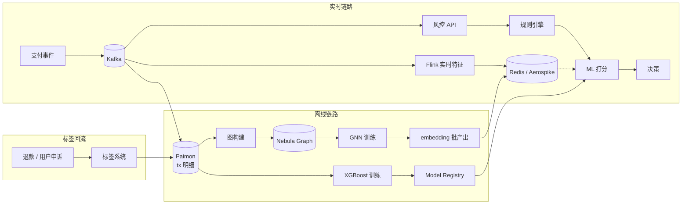

# 欺诈检测 · 风险控制

!!! tip "一句话理解"
    在**一笔交易发生的百毫秒内**，判断它是正常 / 需复核 / 拒绝。核心不是"找更牛的模型"，而是**"新鲜特征 + 多层拦截"**：规则兜底 → 机器学习打分 → 图神经网络识别团伙，每层都要能独立解释。

!!! abstract "TL;DR"
    - **四层拦截**：黑白名单 → 规则引擎 → ML 打分 → GNN / 图分析
    - **延迟预算**：单笔交易端到端 p99 **< 100ms**（支付场景更严）
    - **特征鲜度比模型 AUC 更重要**——近 5 分钟行为特征的价值 > 离线大模型
    - **正负样本极不平衡**（1:1000 甚至 1:10000），标签有**长尾延迟**（退款几周后才知道是欺诈）
    - **可解释性是硬约束**：监管 + 客诉 + 误杀申诉都要能复盘"为什么拒绝这笔"
    - 图神经网络（GNN）是**识别团伙**的关键武器——单笔看不出，团伙一目了然

## 业务图景

按行业分三类，延迟和复杂度不同：

| 子场景 | 典型业务 | 延迟预算 | 规模特征 |
|---|---|---|---|
| **支付欺诈** | 盗卡、套现、伪冒交易 | p99 < 50ms | 千-万 TPS |
| **账号安全** | 盗号、薅羊毛、虚假注册 | p99 < 200ms | 持续事件流 |
| **信贷 / 授信** | 贷款申请、额度、逾期预测 | 秒-分钟可接受 | 较低 QPS |
| **反洗钱（AML）** | 资金链路识别 | 离线批 + 近实时 | 亿级关系 |
| **内容风控** | 垃圾评论、诈骗信息 | p99 < 500ms | 百-千 QPS |

---

## 四层拦截架构

```mermaid
flowchart LR
  tx[交易 / 事件] --> l1[L1 黑白名单<br/>Redis Bloom]
  l1 -->|通过| l2[L2 规则引擎<br/>Drools / 自研 DSL]
  l2 -->|通过| l3[L3 ML 打分<br/>XGBoost / DNN]
  l3 -->|可疑| l4[L4 图分析<br/>GNN / 社区]
  l4 --> decide{决策}
  decide -->|pass| ok[放行]
  decide -->|review| human[人工审核]
  decide -->|reject| deny[拒绝 + 封号]

  fs[(Feature Store<br/>online KV)] -.-> l3
  graph[(图数据库<br/>Nebula / Neo4j)] -.-> l4
  rules[(规则配置)] -.-> l2
```

### L1 · 黑白名单（< 5ms）

- 设备指纹、IP、银行卡号、手机号 Hash
- **Redis Bloom Filter** 或 RoaringBitmap 做秒级命中
- 名单来源：监管下发、历史案件、行业共享

### L2 · 规则引擎（< 20ms）

- 业务人员直接写的 if-else（"单日同卡超过 3 次拒付"）
- 优势：**可解释、随时改**、不需要训练
- 风险：规则无限膨胀 → 需治理（过期规则清理、冲突检测）
- 工具：Drools · Easy Rules · 自研 DSL

### L3 · ML 打分（< 50ms）

- XGBoost / LightGBM 在工业占主导（高维稀疏特征友好、可解释 SHAP）
- DNN / DeepFM 用于复杂特征交叉
- **输入特征 = 实时特征 + 历史画像 + 规则命中信号**
- 输出：风险概率 [0, 1]

### L4 · 图分析 / GNN（可异步）

- **识别团伙**：10 个账号集中在同一设备、资金流形成闭环
- 图算法：社区发现（Louvain）· PageRank · Motif counting
- GNN：GraphSAGE · GAT · HinSAGE 识别异质图
- 通常不走在线链路（延迟不够），而是**离线识别团伙** → 标签回写到在线黑名单

---

## 存储诉求

### 交易明细（事实表）

```sql
CREATE TABLE payment_tx (
  tx_id         STRING,
  user_id       BIGINT,
  merchant_id   BIGINT,
  amount        DECIMAL(18,2),
  currency      STRING,
  device_id     STRING,
  ip            STRING,
  geo           STRUCT<country, city, lat, lng>,
  risk_signals  ARRAY<STRING>,        -- L1/L2 命中的规则
  risk_score    FLOAT,                -- L3 打分
  decision      STRING,               -- pass / review / reject
  label         STRING,               -- 事后标签 (fraud / normal / unknown)
  label_ts      TIMESTAMP,            -- 标签回写时间（可能晚于交易几天/几周）
  ts            TIMESTAMP
) USING paimon
PARTITIONED BY (days(ts))
TBLPROPERTIES (
  'primary-key' = 'tx_id',
  'changelog-producer' = 'input'
);
```

- **主键表**：Paimon 支持 `label` 字段后续 upsert，不用重写分区
- 分区：按天；千亿行/年很常见
- 副本：双活（查询 + 训练），防止训练 scan 影响在线

### 用户画像 / 设备画像

- 静态属性（注册信息）+ 动态聚合（近 1h / 24h / 7d 交易数、金额、商家多样性）
- **慢特征天级更新，快特征流式更新**（详见 [Feature Store](../ml-infra/feature-store.md)）

### 图数据（关系）

- 账户 ↔ 设备 ↔ 卡 ↔ IP ↔ 商家的**异质图**
- 边：登录、支付、转账、分享
- **规模**：亿级节点、百亿级边在头部企业常见
- 存储选型：
  - **Nebula Graph**（分布式、写吞吐高）— 国内互联网首选
  - **Neo4j**（生态成熟）— 中小规模
  - **TigerGraph**（并行图计算）— 金融常见
  - **JanusGraph**（Apache 开源）— 与 HBase/Cassandra 集成

### 规则 / 配置表

- 规则版本化（每次上下线留审计）
- 放 Iceberg 纯粹为审计；在线用 Redis / ZooKeeper 热读

---

## 计算诉求

### 实时特征（分钟级）

```
支付事件 (Kafka) → Flink → 滚动窗口聚合
                              ├── 近 5min 交易次数
                              ├── 近 1h 金额累计
                              ├── 近 24h 独立商家数
                              └── 设备绑定变更频率
                                   ↓
                          Feature Store online KV
```

- **Flink State** 存窗口聚合，**双写 Iceberg** 做训练对齐
- **物化**到 Redis / Aerospike / ScyllaDB 供在线拉取
- 关键：**离线重放要能复现同样的特征值**（详见 [PIT Join](offline-training-pipeline.md)）

### 离线训练

- Spark 批生成训练样本：`WHERE label_ts IS NOT NULL AND label_ts - tx_ts < 30 days`
- 采样策略：
  - **负样本下采样**（保留 5–10% 正常样本即够）
  - 正样本**不能**过采样到 1:1，会让模型校准偏移
  - **时间感知 K 折**：不能简单随机分 train/test
- 模型：XGBoost / LightGBM 首选；DNN 在大数据量下再上

### 图计算

- **离线**：Spark GraphX / GraphFrames 跑社区发现
- **增量**：Flink CEP 识别近期可疑子图
- **GNN 训练**：PyG / DGL，通常批式跑，产出 embedding → 回写到 online KV
- 一个常见模式：**GNN embedding 当作 ML 模型的特征**（两阶段融合）

### 在线推理

- 模型 serving：TorchServe / Triton / 自研 Go 服务
- 延迟：p99 < 50ms（含特征拉取 20ms + 打分 20ms + 序列化 10ms）
- **模型版本 + 特征版本必须一起**：不能新模型 + 旧特征（容易崩）

---

## 端到端组件链路



---

## 样本不平衡 · 标签延迟（最难的点）

### 正负样本 1:1000

- **下采样 + 加权**：对负样本采 5%，训练时给正样本 weight=1.0，负样本 weight=20
- **AUC 欺骗性**：极度不平衡下 AUC = 0.99 也可能无用 → 看 **Precision@K**、**Recall@K**
- **业务指标**："拒绝前 1% 打分里真欺诈占比"比 AUC 直接

### 标签延迟（最致命）

- 信用卡欺诈标签可能**30-90 天后**才回传（客户发现盗刷申诉）
- 意味着：今天训练用的样本，`label` 列对近 30 天的交易**必然缺失**
- **对策**：
  - 只取 `tx_ts < now - 90 days` 的样本训练
  - 用 **延迟标签建模**（e.g., [DCM: Delayed Conversion Model](https://arxiv.org/abs/1809.03683)）
  - **模型 daily 重训**，尽快吸收新标签

### 冷启动（新场景 / 新模式）

- 新欺诈模式模型没见过 → 规则引擎兜底 + 人工审核扩大
- 有监督学习撑不住 → 加**异常检测**（Isolation Forest · AutoEncoder）作为补充信号

---

## 图神经网络 · 识别团伙

单笔交易看正常，团伙一目了然：

```
用户 A ──支付──> 商家 X
用户 B ──支付──> 商家 X
用户 C ──支付──> 商家 X   (商家 X 注册 3 天、金额都是 9999)
共用设备指纹 D789
```

### 落地路径

1. **图构建**：Iceberg 明细 → Spark 建点边 → Nebula / Neo4j
2. **社区发现**：Louvain / LPA 找异常聚集
3. **GNN 训练**（有监督）：GraphSAGE 用已知欺诈团伙做 seed，传播标签
4. **embedding 产出**：每个用户一个向量，代表"在图里的风险位置"
5. **回写 online**：向量作为 ML 模型的额外特征 / 单独聚类打分

### GNN 在生产落地的坑

- **在线延迟不够**：GNN 推理 100-500ms → 通常做**离线 embedding**，不做实时 GNN 推理
- **图数据新鲜度**：一天前的图对欺诈来说可能**已经过时**
- **异质图难**：用户 / 设备 / 商家节点类型不同，普通 GCN 不够 → R-GCN / HinSAGE

---

## 评估 / 监控

### 离线评估

- **Precision @ Top 1%**（拒绝量固定下的准确率）
- **Recall @ 业务误杀率 = 0.1%**
- **KS 值**（金融常用，正负分布分离度）

### 在线监控

- **实时决策延迟** p50/p95/p99
- **拒绝率**：突然涨 2× → 可能模型崩或数据漂移
- **误杀率**：用户客诉转化为标签回流
- **特征分布漂移**：PSI（Population Stability Index）每日告警
- **规则命中率**：规则库治理

### 必须的业务监控

- **每日欺诈金额 / 误杀金额 / 人工审核量**
- **新欺诈模式发现时间**（从发生到规则上线）
- **申诉响应 SLA**

---

## Benchmark · Dataset

- **[IEEE-CIS Fraud Detection (Kaggle)](https://www.kaggle.com/c/ieee-fraud-detection)** —— 工业界最常用，Vesta 真实匿名数据
- **[PaySim](https://www.kaggle.com/datasets/ealaxi/paysim1)** —— 模拟金融交易，结构接近真实
- **[Credit Card Fraud Detection (ULB)](https://www.kaggle.com/mlg-ulb/creditcardfraud)** —— 经典入门数据集（28 个 PCA 特征）
- **[Elliptic Bitcoin Transactions](https://www.kaggle.com/ellipticco/elliptic-data-set)** —— 图数据集，比特币交易网络
- **[TabFormer (IBM)](https://github.com/IBM/TabFormer)** —— 合成信用卡数据，含时序
- **[DGraphFin](https://dgraph.xinye.com/dataset)** —— 阿里金融异质图，GNN benchmark

---

## 可部署参考

- **最小闭环**：Feast + Spark + XGBoost + Flask serving
- **图方向**：PyG / DGL 用 DGraphFin 跑通 GNN → 输出 embedding 验证
- **开源项目**：
  - **[Apache Flink CEP](https://nightlies.apache.org/flink/flink-docs-stable/docs/libs/cep/)** —— 复杂事件模式匹配
  - **[Feathr (LinkedIn)](https://github.com/feathr-ai/feathr)** —— 特征平台，含欺诈用例
  - **[Antifraud（开源示例）](https://github.com/safe-graph/DGFraud)** —— 图欺诈检测合集
- **商业参考**：FICO Falcon · SAS Fraud · 同盾 / 百融

---

## 陷阱

- **只看 AUC 不看业务指标**：正负不平衡下 AUC 0.99 可能业务不可用
- **实时特征和离线特征两套代码**：必然漂移 → Feature Store 强制统一
- **模型一劳永逸**：欺诈模式 2–4 周迭代一次；不重训 = 迅速失效
- **过度依赖 ML，规则裸奔**：规则是兜底，ML 崩了规则还能拦；别砍规则
- **GNN 当万能药**：延迟、图新鲜度、异质图都是硬问题；先把规则 + ML 做扎实
- **没有申诉通道**：误杀没法修正 → 用户流失 + 没法持续优化标签
- **没做审计日志**：监管查账查不到"为什么拒绝" → 严重合规风险
- **图库做在线推理**：单跳查询可以，多跳图遍历上在线链路一定崩

---

## 与其他场景的关系

- **vs [推荐系统](recommender-systems.md)**：技术栈相似（Feature Store · 实时特征），但**延迟更紧、可解释更硬、标签更延迟**
- **vs [Real-time Lakehouse](real-time-lakehouse.md)**：Paimon changelog 是共底座；风控消费上游流
- **vs [CDP / 用户分群](cdp-segmentation.md)**：共用画像宽表，但风控更关注**异常信号**而非**业务分群**

---

## 相关

- [Feature Store](../ml-infra/feature-store.md) · [Feature Serving](feature-serving.md) · [离线训练数据流水线](offline-training-pipeline.md)
- [Watermark / 事件时间](../pipelines/event-time-watermark.md)（实时特征正确性的基石）
- [Real-time Lakehouse](real-time-lakehouse.md)（底座）
- [业务场景全景](business-scenarios.md)

## 延伸阅读

- *Fraud Analytics Using Descriptive, Predictive, and Social Network Techniques* (Baesens et al.)
- 阿里 AntFraud · 腾讯 FinEye · PayPal Risk 公开技术博客
- *Graph Representation Learning* (William Hamilton) — GNN 系统讲解
- Visa / Mastercard 的 fraud 白皮书
