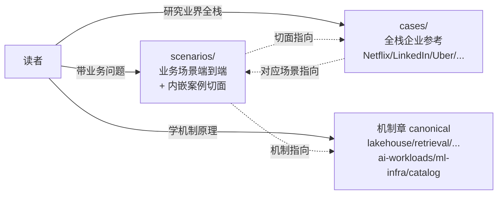

# 场景指南

!!! info "本章是场景视角 · 不复述机制"
    `scenarios/` 讲**业务场景的端到端编排** —— 多个机制如何拼成一个业务方案 · 含真实数字 / 选型陷阱 / 跨团队协同 / **工业案例切面分析**。
    
    **机制原理**（湖表 / 检索 / 引擎 / BI 负载 / AI 负载 / Catalog）**不在本章** · 请移步对应技术栈章：[lakehouse/](../lakehouse/index.md) · [retrieval/](../retrieval/index.md) · [query-engines/](../query-engines/index.md) · [bi-workloads/](../bi-workloads/index.md) · [ai-workloads/](../ai-workloads/index.md) · [catalog/](../catalog/index.md) · [pipelines/](../pipelines/index.md)。参见 [ADR 0006 canonical source 原则](../adr/0006-chapter-structure-dimensions.md)。

!!! success "S33 重要 · 场景+案例强配对"
    2026-Q2 S33 建立**场景-案例强配对**：
    
    - **scenarios/ 业务页** = 业务视角 + **内嵌工业案例切面**（每页 §工业案例节 · 150-300 行）· 含 2-4 家在**该场景下**的独特做法 / 关键数字 / 踩坑 / 和本推荐路径对比
    - **[cases/](../cases/index.md) 全栈企业视角** = 每家公司的全平台历史 / 取舍 / 失败 / 启示
    - **两章配对阅读**：读 scenarios/X 看"怎么做 X + 业界怎么做 X" · 深度全栈跳 cases/X
    
    反向索引（从场景找案例）· 见 [cases/studies.md §5.6](../cases/studies.md)。

!!! tip "怎么用"
    - **带着业务问题进来** → 从 [E2E 业务场景全景](business-scenarios.md) 开始
    - **想深挖某个业务** → 直接看下面"业务深挖"
    - **要搭架构 / 流水线** → 看"架构视角的端到端场景"
    - **要学工业案例** → 从业务页 §工业案例节切入 + 回 [cases/](../cases/index.md) 看全栈

## 三角关系 · 场景 / 案例 / 机制

## 从业务找入口 · 强烈推荐先读

- ⭐ [**E2E 业务场景全景**](business-scenarios.md) —— 业务视角的分类框架 + Top 10 主流场景 + 前沿方向 + 决策矩阵 + Benchmark 索引。**新同事带着业务问题进来，这里是第一站**。

## 业务视角深挖（S33 · 每页内嵌工业案例切面）

**从业务问题出发的完整解决方案** · 每页含：业务图景 + 组件链路 + Benchmark + **工业案例深度切面**（2-4 家）+ 陷阱。

| 场景页 | 主要内嵌案例 | 案例内容量 |
|---|---|---:|
| [**推荐系统 · 搜索 · 发现**](recommender-systems.md) ⭐ | Pinterest · 阿里 · LinkedIn | ~200 行 |
| [**RAG on Lake · 企业知识库问答**](rag-on-lake.md) ⭐ | Databricks · Snowflake · Netflix（推断） | ~180 行 |
| [**BI on Lake · 湖上分析与仪表盘**](bi-on-lake.md) ⭐ | Databricks · Snowflake · Netflix | ~180 行 |
| [**欺诈检测 · 风险控制**](fraud-detection.md) | Uber · LinkedIn（推断） | ~120 行 |
| [**CDP · 用户分群**](cdp-segmentation.md) | 阿里 · LinkedIn（推断） | ~100 行 |
| [**Agentic 工作流 · 自动化**](agentic-workflows.md) | Databricks Genie · Snowflake Cortex · Anthropic | ~130 行 |
| [**Text-to-SQL 平台**](text-to-sql-platform.md) | Databricks Genie · Snowflake Cortex Analyst · 阿里（推断） | ~130 行 |
| [**多模检索流水线**](multimodal-search-pipeline.md) | Pinterest · 阿里 · Databricks | ~180 行 |

## 架构视角的端到端场景

**从架构组件出发的流水线模板** —— 适合要搭建某条链路时参考。每页含"相关工业案例"短节 · 深度去 cases/ 全栈页。

- [**流式入湖**](streaming-ingestion.md) —— CDC + 事件流持续入湖 · 案例：LinkedIn Kafka · 阿里 Flink CDC
- [**Real-time Lakehouse**](real-time-lakehouse.md) —— 端到端分钟级一体化 · 案例：阿里 Paimon · Uber Hudi
- [**离线训练数据流水线**](offline-training-pipeline.md) —— 可复现 + PIT 的训练集生成 · 案例：Uber Michelangelo · Netflix Metaflow
- [**Feature Serving**](feature-serving.md) —— 在线推理的毫秒级特征拉取 · 案例：LinkedIn Venice · Uber Palette/Genoa

## 按问题找场景 · 反向索引

**"我要做 X · 先看哪页"**：

| 我的问题 | 优先读 | 配对案例 |
|---|---|---|
| 做电商 / 内容推荐 | [recommender-systems](recommender-systems.md) | Pinterest · 阿里 · LinkedIn |
| 做企业知识库 / 客服 RAG | [rag-on-lake](rag-on-lake.md) | Databricks · Snowflake |
| 做 BI 分析仪表盘 | [bi-on-lake](bi-on-lake.md) | Databricks · Snowflake · Netflix |
| 做风控 / 反欺诈 | [fraud-detection](fraud-detection.md) | Uber |
| 做用户分群 / 画像 | [cdp-segmentation](cdp-segmentation.md) | 阿里 |
| 做 Agent / 自动化 | [agentic-workflows](agentic-workflows.md) | Databricks Genie · Snowflake Cortex Agents |
| 做自然语言 BI | [text-to-sql-platform](text-to-sql-platform.md) | Databricks Genie · Snowflake Cortex Analyst |
| 做图文 / 视频检索 | [multimodal-search-pipeline](multimodal-search-pipeline.md) | Pinterest · 阿里 |
| 做 Feature Store 选型 | [feature-serving](feature-serving.md) + [ml-infra/feature-store](../ml-infra/feature-store.md) | LinkedIn Venice · Uber Palette |
| 做训练数据 PIT Join | [offline-training-pipeline](offline-training-pipeline.md) | Uber Michelangelo |
| 做流式湖仓 | [real-time-lakehouse](real-time-lakehouse.md) | 阿里 Paimon · Uber Hudi |
| 做 Kafka 入湖 | [streaming-ingestion](streaming-ingestion.md) | LinkedIn Kafka |

## 不同读者的阅读建议

### 新同事 · 带业务问题进来

1. 先读 [business-scenarios](business-scenarios.md) 建立业务全景
2. 按上面"反向索引"挑一页业务深挖
3. 读业务页前半（业务 + 架构 + 组件）
4. 读 §工业案例节（本页最独特价值）
5. 想深度看某家公司 → 跳 [cases/](../cases/index.md)

### 资深架构师 · 做选型决策

1. 先读对应业务场景深挖页 §工业案例节（多家对比）
2. 看 [cases/studies.md](../cases/studies.md) 7 家横比矩阵
3. 读 [unified/index §5 团队路线主张](../unified/index.md)
4. 综合做决策

### 平台工程师 · 要搭架构

1. 读"架构视角"4 页（streaming / real-time / offline-training / feature-serving）
2. 配对对应机制章 canonical（ml-infra · ai-workloads · lakehouse · retrieval）
3. 参考 cases/ 工业规模和取舍

### 中国团队特别建议

- **推荐 / 电商场景**：重点读阿里切面 · 配对 [cases/alibaba](../cases/alibaba.md)
- **流式湖仓**：[real-time-lakehouse](real-time-lakehouse.md) + Paimon · 中国团队最可复制
- **国内工业实践**：目前 cases/ 只有阿里 · 后续补字节 / 腾讯 / 美团

## 章节边界（再声明）

| 章 | 定位 | 和本章的关系 |
|---|---|---|
| **scenarios/**（本章）| 业务场景 + 内嵌案例切面 + 端到端架构 | — |
| [cases/](../cases/index.md) | 全栈企业参考 · 历史 / 取舍 / 失败 / 启示 | 配对阅读 |
| [unified/](../unified/index.md) | 跨章组合架构 + 团队路线主张 | 战略决策回这里 |
| [机制章](../lakehouse/index.md) 等 | 机制原理 canonical | 本章 link 它们 · 不复述 |
| [compare/](../compare/index.md) | 横向对比 · 选型决策树 | 技术选型时配合读 |
| [frontier/vendor-landscape](../frontier/vendor-landscape.md) | 厂商选型商业视角 | 商业决策时配合 |

## 和其他资源

- [ADR](../adr/index.md) · 团队技术决策
- [FAQ](../faq.md) · 常见问题速答
- [Learning Paths](../learning-paths/week-1-newcomer.md) · 角色学习路径
