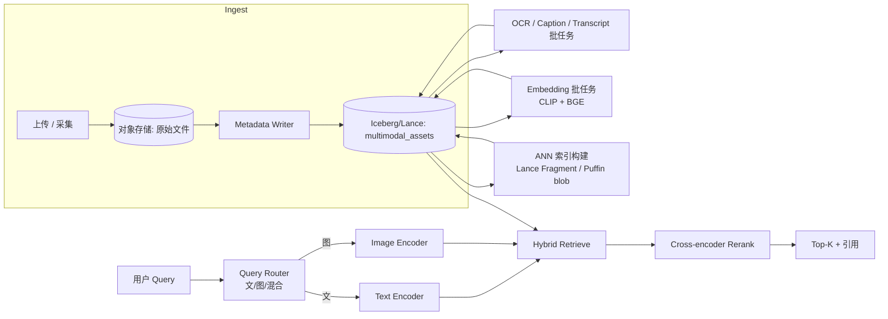

# 多模检索流水线

!!! info "机制深挖"
    [多模 Embedding](../retrieval/multimodal-embedding.md)（CLIP / SigLIP / Jina CLIP v2 等模型矩阵）· [多模检索模式](../retrieval/multimodal-retrieval-patterns.md)（5 种 pattern 含 ColBERT / Late Interaction）· [Hybrid Search](../retrieval/hybrid-search.md)（dense+sparse 融合）· [向量数据库](../retrieval/vector-database.md)。

!!! tip "一句话场景"
    给定"文本查询、图像查询或文 + 图混合查询"，在一张**包含图 / 文 / 音 / 视资产**的湖表上返回 Top-K 最相关结果。

## 场景输入与输出

- **输入**：
    - 查询：文本 / 图片 / 图文混合
    - 可选元数据过滤（`kind`、`visibility`、`ts` 范围、`tags`…）
- **输出**：Top-K 资产 + 相关性分 + 原始 URI + 引用元数据
- **SLO 示例**：
    - p95 延迟：< 400ms
    - Recall@10：> 0.85（以人工标注或 golden set 评估）
    - 语料新鲜度：≤ 小时级

## 架构总览

{ loading=lazy }
{ loading=lazy }

Mermaid 文本版本（便于 diff 数据流）

## 数据流拆解

### 1. 入湖（Ingest）

- 原始文件（图/音/视）落对象存储，URI 写入 `multimodal_assets` 表（[多模数据建模](../unified/multimodal-data-modeling.md)）
- 元数据（来源、权限、标签）同行写入
- 入湖越早打好 `kind` / `visibility`，下游越省事

### 2. 内容扩展（Enrichment）

- **OCR** —— 图片转文字（含版式信息）
- **Caption / Dense Caption** —— 模型生成的视觉描述
- **ASR** —— 音频 / 视频转写
- **语言检测 / 主题分类 / 人脸检测 Tag**

这些结果回写同一张表，可以用 Paimon 流式 upsert 或 Spark 批回填。

### 3. Embedding

- 多模通用向量：**CLIP / SigLIP**，支持文 / 图一致空间
- 长文精细向量：**BGE / E5**，覆盖 caption / OCR / transcript
- 音频向量（如果场景需要）：**CLAP**

写入 `clip_vec` / `text_vec` / `audio_vec` 等分列，保留 `embedding_model_version`。

### 4. 索引构建

- Lance format 的 fragment 自带索引；新 fragment 触发增量索引
- 如用 Iceberg，索引以 [Puffin](../lakehouse/puffin.md) blob 形式写入
- 如用独立向量库（Milvus），通过 CDC / 定时任务同步

### 5. 在线查询

- **Query Router** 判断查询类型（纯文 / 纯图 / 图文混合）
- 文查询走 text_encoder，图查询走 image_encoder；两侧都能编码到同一多模空间
- 结构化过滤（`WHERE kind = 'video' AND ts > ...`）**前置**，不要 post-filter
- Hybrid：多模向量分 + 稀疏（SPLADE / BM25）分 → RRF / 加权融合
- Rerank：Top-100 → Top-10 精排
- 返回结果附上原始 URI 与 metadata，便于前端展示 + 审计

## 推荐技术栈

| 节点 | 首选 | 备选 |
| --- | --- | --- |
| 表格式 | Iceberg + Lance | 纯 Lance / Paimon（流式场景） |
| Embedding 模型 | SigLIP / Jina-CLIP（多模）+ BGE-v2-m3（文） | OpenAI CLIP + OpenAI text-embed-3 |
| 向量库 | LanceDB（嵌入式） | Milvus（分布式） |
| 计算 | Spark 批 embedding / Flink 流 | DuckDB 开发态 |
| Rerank | BGE-reranker-v2-m3 | Jina Reranker / Cohere Rerank |
| 在线服务 | 自研 API Gateway + Python Server | 云托管 |

## 失败模式与兜底

- **Caption / OCR 质量差** —— 直接影响文侧召回。**兜底**：用人工抽检 + 定期对比不同模型在小样本上的差异
- **Query Router 判断错** —— 用户输入图像路径但被当文本。**兜底**：前置强规则 + 明确的 API 字段
- **向量索引损坏或未及时构建** —— 检索结果质量骤降。**兜底**：监控"新 fragment → 索引就绪"延迟；未就绪时只返回已索引数据并标明
- **隐私 / 权限越权** —— `visibility` 过滤没下推。**兜底**：Catalog 层强制 row-level policy，不信任应用层
- **多模对齐漂移** —— 模型升级后老向量和新向量不共空间。**兜底**：`embedding_model_version` 字段 + 增量回填 + 过渡期双索引

## SLO 预算详细拆解

多模检索 p95 < 400ms 端到端分解（典型经验 · 依模型和规模差异大）：

| 阶段 | 预算 |
|---|---|
| Query 解析 + Router | < 10ms |
| Query Embedding（CLIP / BGE） | 30-80ms |
| 结构化过滤（前置） | < 20ms |
| 向量召回（ANN · Top 100-500） | 30-80ms |
| Hybrid 融合（稀疏 + 稠密 RRF） | 10-30ms |
| Rerank（cross-encoder · Top 10-20） | 80-150ms |
| 元数据查询 + URI 构造 | < 30ms |
| **端到端 p95** | **< 400ms** |

**性能优化杠杆**：
- **Query embedding 缓存**（热门 query 跳过 encode · 见 [ai-workloads/semantic-cache](../ai-workloads/semantic-cache.md)）
- **ANN 参数**（HNSW M/ef · IVF-PQ 中心数）· [retrieval/hnsw](../retrieval/hnsw.md) · [retrieval/ivf-pq](../retrieval/ivf-pq.md)
- **Rerank 轻量化**（小 reranker · 或 Rerank 只做 Top 10 而非 Top 100）
- **Filter-aware ANN**（Qdrant / Milvus 2.4+ · LanceDB · 见 [retrieval/filter-aware-search](../retrieval/filter-aware-search.md)）

## 评估与监控

**离线评估**：
- **Recall@K**（K=10 · 20 · 50）· 以人工标注 golden set 为准
- **MRR / NDCG**（考虑排序质量）
- **跨模态对齐**：图检查询文 / 文检索图 · 分模式评估
- **Benchmark**：MS-COCO · Flickr30K · LAION subset 等

**在线监控**：
- p99 延迟 / p99 Recall（在线估计 · 用 click-through proxy）
- **CTR 代理**（用户点击 Top 10 的哪个 · 位置越靠前越好）
- **Cache 命中率**（semantic cache / query embedding cache）
- **向量索引延迟**（新数据到可检索）
- **模型版本一致性**（query encoder / index encoder / rerank 三方版本对齐）

## 多租户 / 权限

**Catalog 层强制 row-level policy**（不要指望应用层）：
- `visibility = 'internal'` 只对内部用户可见
- `owner = $user OR shared_with LIKE ...`
- 详见 [catalog/strategy](../catalog/strategy.md) §治理 + [ops/security-permissions](../ops/security-permissions.md)

**向量库侧强制元数据过滤**：
- 别让应用层过滤 Top 100 后用户看到不该看的
- Filter-aware ANN 直接在图搜索过程中裁剪
- 详见 [retrieval/filter-aware-search](../retrieval/filter-aware-search.md)

## 工业案例 · 多模检索场景切面

### Pinterest · 多模推荐 + 搜索（PinSage + Pixie + 多模 embedding）

**为什么值得学**：Pinterest 业务本质是**图片发现 + 兴趣组织** · 多模推荐是**核心业务场景**而非附加能力。**全栈视角见 [cases/pinterest](../cases/pinterest.md)**。

**多模检索场景独特做法**：

1. **多模 embedding 独立产线**：
   - 图像 embedding（自研 VLM · CLIP 风格 · 专门 Pin 场景调优）
   - 文本 embedding（Pin 标题 + 描述 + 评论）
   - 用户 embedding（行为 + 社交）
   - 图结构 embedding（PinSage GNN）
   - **每种独立训练 + 独立 ANN 索引** · 召回时多 index 并行查询

2. **Pixie 实时 random walk 做多模召回**：
   - in-memory 图（Pin × User × Board · 10+ TB）
   - ms 级实时召回 · 处理新鲜度和冷启动
   - 和 PinSage GNN（深度相关性）互补

3. **自研 ANN**：
   - 规模决定（数十亿级候选）· 通用向量库不够
   - **过滤感知 ANN** 在推荐场景关键
   - 规模：Homefeed p95 < 300ms · 每请求处理数十亿候选

**对照与复用**：
- ✅ 多 embedding 分列（CLIP / BGE / audio）对齐 Pinterest 经验
- ⚠️ 自研 ANN 对中小团队过度 · 通用向量库（LanceDB / Milvus）千万级候选够用
- ⚠️ GNN 召回训练成本高 · 本章架构的 dense + sparse + rerank 三段式对多数团队更友好

### 阿里巴巴 · 电商多模搜索（OpenSearch 向量 + Flink + Hologres）

**为什么值得学**：阿里电商搜索是**中国工业多模检索代表**（图搜图 · 同款识别 · 以图搜商品）。**全栈视角见 [cases/alibaba](../cases/alibaba.md)**。

**多模场景独特做法**：

1. **图搜图 / 以图搜商品**：
   - 商家上传商品图 → 图像 embedding → 入湖（Paimon / Lance）
   - 用户拍照搜款式 → 图像 embedding → ANN 召回 + 结构化过滤（类目 / 价格带）
   - **双 11 规模峰值数百万 QPS**

2. **OpenSearch 向量引擎**（阿里云商业产品）：
   - 原生支持图 / 文 / 视频 embedding
   - 和 Paimon / Hologres 集成 · 构成电商多模栈
   - 2024+ LLM 集成 · Agent 化搜索

3. **实时更新（Flink + Paimon）**：
   - 新商品上架秒级可检索
   - 下架 / 更新 也实时
   - Paimon Changelog Producer 驱动

**规模** `[量级参考]`：双 11 多模搜索 QPS 数百万 · 商品池数亿。

**对照与复用**：
- ✅ Paimon + Flink CDC 实时更新是中国团队可直接复制的路径
- ⚠️ OpenSearch 阿里云商业产品 · 开源替代用 Milvus / LanceDB
- ⚠️ 双 11 规模过度 · 中型电商团队参考架构不参考规模

### Databricks · 多模 RAG（Vector Search + AI Functions）

**为什么值得学**：Databricks 多模 RAG 是**商业平台多模化**的代表。**全栈视角见 [cases/databricks](../cases/databricks.md)**。

**多模场景独特做法**：

1. **Volume 作多模资产一等公民**：
   - UC Volume 存图 / 视频 / 音频 / PDF
   - **Volume 权限 + 血缘**和数据表一套 RBAC
   - 这是本 wiki 多模建模推崇的路径（见 [unified/multimodal-data-modeling](../unified/multimodal-data-modeling.md)）

2. **Vector Search 多模索引**：
   - Delta 表上一等向量索引
   - 多 embedding 列（CLIP / BGE / 自定义）同表
   - 和 SQL 过滤一起执行

3. **AI Functions 多模 UDF**：
   - `ai_caption`（图像描述）· `ai_transcribe`（音频转写）· `ai_embed`（向量化）
   - **SQL 里直接做多模 ETL**（见 [query-engines/compute-pushdown](../query-engines/compute-pushdown.md)）

**对照与复用**：
- ✅ UC Volume + Vector Search 架构和本章多模表设计思路一致
- ⚠️ 商业锁定深 · 开源栈用 Iceberg + LanceDB / Milvus + Spark 替代

### 跨案例综合对比

| 维度 | Pinterest | 阿里 | Databricks |
|---|---|---|---|
| 主场景 | Pin 发现推荐 | 电商图搜 + 同款 | 多模 RAG |
| 表格式 | Iceberg | Paimon + Lance | Delta + UniForm |
| 向量层 | 自研 ANN | OpenSearch 商业 | Vector Search 托管 |
| 多 embedding | 多 index 独立 | 多列 Paimon 表 | 多列 Delta 表 |
| 实时更新 | 实时（Pixie）+ 离线（PinSage） | **Paimon 秒级** | Delta Live Tables |
| 规模 | 亿级 Pin | 双 11 峰值 | 客户可配 |

**共同规律**（事实观察）：
- **多模不是一个 embedding** · 是**多个 embedding 独立训练 + 多 index 并行查询**
- **实时更新是工业刚需**（秒-分钟级 · T+1 不够）
- **过滤前置 + filter-aware ANN** 是性能关键（详见 [retrieval/filter-aware-search](../retrieval/filter-aware-search.md)）

### 对中型团队的启示（事实观察）

- **不要照搬 Pinterest 规模**（数十亿候选 · 自研 ANN）· 千万级用 LanceDB / Milvus 足够
- **Paimon + Flink CDC 组合最适合中国团队**（阿里路径 · 社区活跃）
- **多模 embedding 独立**（CLIP 用图文 · BGE 用精细文 · 独立索引）是跨规模通用做法

---

## 相关

- 概念：[多模 Embedding](../retrieval/multimodal-embedding.md) · [Hybrid Search](../retrieval/hybrid-search.md) · [Rerank](../retrieval/rerank.md) · [Filter-aware Search](../retrieval/filter-aware-search.md)
- 架构：[Lake + Vector](../unified/lake-plus-vector.md) · [多模数据建模](../unified/multimodal-data-modeling.md)
- 机制：[HNSW](../retrieval/hnsw.md) · [IVF-PQ](../retrieval/ivf-pq.md) · [多模检索模式](../retrieval/multimodal-retrieval-patterns.md)
- 工业案例：[Pinterest](../cases/pinterest.md) · [阿里巴巴](../cases/alibaba.md) · [Databricks](../cases/databricks.md)

## 数据来源

工业案例规模数字标 `[量级参考]`· 来源：Pinterest Engineering Blog · 阿里云官方博客 · Databricks Tech Blog。数字为公开披露范围内 · 未独立验证 · 仅作规模量级的参考。

## 延伸阅读

- *Jina CLIP v2* 论文（2024 · 多模 embedding）
- *ColBERT v2* / *ColPali*（late interaction 方向）
- LanceDB 多模 tutorial 系列
- Pinterest Engineering · PinSage + Pixie 系列
- 阿里云 OpenSearch 向量引擎技术博客
