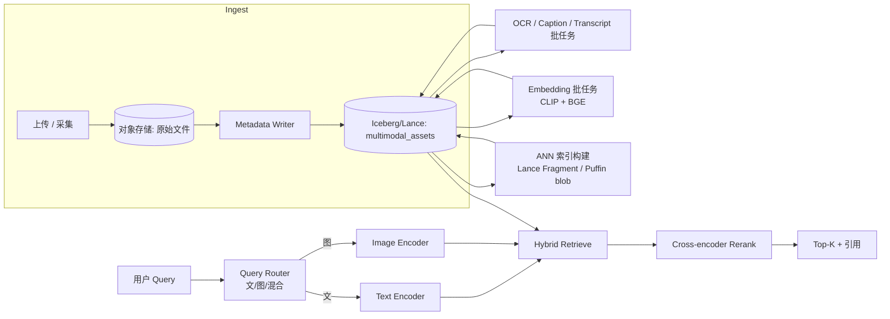

# 多模检索流水线

!!! tip "一句话场景"
    给定"文本查询、图像查询或文 + 图混合查询"，在一张**包含图 / 文 / 音 / 视资产**的湖表上返回 Top-K 最相关结果。

## 场景输入与输出

- **输入**：
    - 查询：文本 / 图片 / 图文混合
    - 可选元数据过滤（`kind`、`visibility`、`ts` 范围、`tags`…）
- **输出**：Top-K 资产 + 相关性分 + 原始 URI + 引用元数据
- **SLO 示例**：
    - p95 延迟：< 400ms
    - Recall@10：> 0.85（以人工标注或 golden set 评估）
    - 语料新鲜度：≤ 小时级

## 架构总览

{ loading=lazy }
{ loading=lazy }

Mermaid 文本版本（便于 diff 数据流）

## 数据流拆解

### 1. 入湖（Ingest）

- 原始文件（图/音/视）落对象存储，URI 写入 `multimodal_assets` 表（[多模数据建模](../unified/multimodal-data-modeling.md)）
- 元数据（来源、权限、标签）同行写入
- 入湖越早打好 `kind` / `visibility`，下游越省事

### 2. 内容扩展（Enrichment）

- **OCR** —— 图片转文字（含版式信息）
- **Caption / Dense Caption** —— 模型生成的视觉描述
- **ASR** —— 音频 / 视频转写
- **语言检测 / 主题分类 / 人脸检测 Tag**

这些结果回写同一张表，可以用 Paimon 流式 upsert 或 Spark 批回填。

### 3. Embedding

- 多模通用向量：**CLIP / SigLIP**，支持文 / 图一致空间
- 长文精细向量：**BGE / E5**，覆盖 caption / OCR / transcript
- 音频向量（如果场景需要）：**CLAP**

写入 `clip_vec` / `text_vec` / `audio_vec` 等分列，保留 `embedding_model_version`。

### 4. 索引构建

- Lance format 的 fragment 自带索引；新 fragment 触发增量索引
- 如用 Iceberg，索引以 [Puffin](../lakehouse/puffin.md) blob 形式写入
- 如用独立向量库（Milvus），通过 CDC / 定时任务同步

### 5. 在线查询

- **Query Router** 判断查询类型（纯文 / 纯图 / 图文混合）
- 文查询走 text_encoder，图查询走 image_encoder；两侧都能编码到同一多模空间
- 结构化过滤（`WHERE kind = 'video' AND ts > ...`）**前置**，不要 post-filter
- Hybrid：多模向量分 + 稀疏（SPLADE / BM25）分 → RRF / 加权融合
- Rerank：Top-100 → Top-10 精排
- 返回结果附上原始 URI 与 metadata，便于前端展示 + 审计

## 推荐技术栈

| 节点 | 首选 | 备选 |
| --- | --- | --- |
| 表格式 | Iceberg + Lance | 纯 Lance / Paimon（流式场景） |
| Embedding 模型 | SigLIP / Jina-CLIP（多模）+ BGE-v2-m3（文） | OpenAI CLIP + OpenAI text-embed-3 |
| 向量库 | LanceDB（嵌入式） | Milvus（分布式） |
| 计算 | Spark 批 embedding / Flink 流 | DuckDB 开发态 |
| Rerank | BGE-reranker-v2-m3 | Jina Reranker / Cohere Rerank |
| 在线服务 | 自研 API Gateway + Python Server | 云托管 |

## 失败模式与兜底

- **Caption / OCR 质量差** —— 直接影响文侧召回。**兜底**：用人工抽检 + 定期对比不同模型在小样本上的差异
- **Query Router 判断错** —— 用户输入图像路径但被当文本。**兜底**：前置强规则 + 明确的 API 字段
- **向量索引损坏或未及时构建** —— 检索结果质量骤降。**兜底**：监控"新 fragment → 索引就绪"延迟；未就绪时只返回已索引数据并标明
- **隐私 / 权限越权** —— `visibility` 过滤没下推。**兜底**：Catalog 层强制 row-level policy，不信任应用层
- **多模对齐漂移** —— 模型升级后老向量和新向量不共空间。**兜底**：`embedding_model_version` 字段 + 增量回填 + 过渡期双索引

## 相关

- 概念：[多模 Embedding](../retrieval/multimodal-embedding.md) · [Hybrid Search](../retrieval/hybrid-search.md) · [Rerank](../retrieval/rerank.md)
- 架构：[Lake + Vector](../unified/lake-plus-vector.md) · [多模数据建模](../unified/multimodal-data-modeling.md)

## 延伸阅读

- Meta 公开的多模检索系统 blueprint
- LanceDB 多模 tutorial 系列
