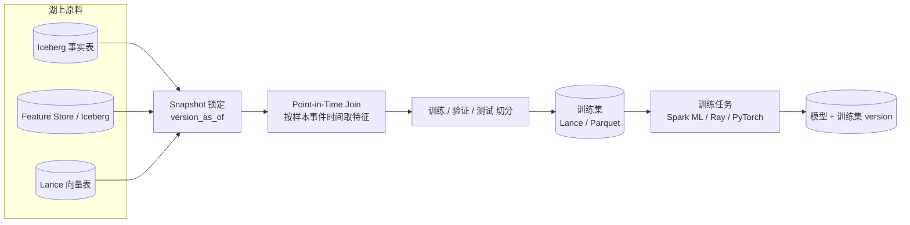

# 离线训练数据流水线

!!! tip "一句话场景"
    从湖上把**训练集**稳定、可复现、可版本化地喂给模型训练。可复现是最难那件事 —— 时间点、特征集、标签集必须全部锁定。

## 场景输入与输出

- **输入**：湖上的事实表 + 特征表 + 向量表（Iceberg / Paimon / Lance）
- **输出**：模型训练任务能读的训练集（Parquet / Lance / TFRecord），带**明确的版本标识**
- **SLO 典型**：
    - 每次训练集可 100% 复现
    - 训练集生成延迟 < 数小时
    - 避免数据泄露（未来信息不能进训练集）

## 架构总览



## 数据流拆解

### 1. 样本定义

**明确样本是什么**：一次曝光 / 一次点击 / 一条对话 / 一张图片。每个样本带：
- `sample_id`
- `event_time`（样本产生时刻，**训练集 PIT join 的锚点**）
- `label`（标签）
- `weight`（样本权重）

### 2. Snapshot 锁定

**必须**用 Iceberg / Paimon 的 `version_as_of` 或 `snapshot-id` 把所有上游固定到具体版本：

```sql
SELECT f.*, fe.*
FROM facts VERSION AS OF 12345 f
JOIN features VERSION AS OF 54321 fe
  ON fe.user_id = f.user_id
 AND fe.valid_from <= f.event_time
 AND fe.valid_to   >  f.event_time
WHERE f.event_time BETWEEN '2026-01-01' AND '2026-03-31';
```

没有这一步，**两周后"同一次训练"再跑一遍结果可能不同**。

### 3. Point-in-Time Join（PIT）

**训练集不能泄露未来信息**。例如：
- 样本时刻 `2026-03-15 10:00`
- 用户特征表有历史版本（SCD Type 2）
- PIT Join 要取 `valid_from ≤ 10:00 < valid_to` 的那条版本

Feature Store（Feast / Tecton）核心就是做这件事。自建时注意：

- 特征表要有 `valid_from` / `valid_to` 或使用 Iceberg 时间旅行
- Join 条件必须带时间区间

### 4. 数据集切分

- **按时间切分**（训练 / 验证 / 测试）—— 最稳，防未来泄露
- **按用户切分** —— 当没有时间维度时
- **随机切分** —— 只在 IID 场景用

### 5. 物化格式

- **Parquet**：通用，PyTorch / TensorFlow / Ray 都能读
- **Lance**：随机 shuffle 读取友好，适合大规模训练
- **TFRecord**：TensorFlow 生态专用

通常选 Parquet 或 Lance。Lance 在 100GB+ 训练集 + 多轮 epoch 场景优势明显。

### 6. 版本化与注册

最后一步容易被忽略 —— **训练集本身要被 Catalog 注册**：

```yaml
dataset_id: recsys-v3-2026-03
source_snapshots:
  facts: 12345
  features: 54321
  vectors: 98765
split: time-based, 2026-01-01 - 2026-03-15 train, 2026-03-16 - 2026-03-31 eval
size: 3.2 TB, 120M samples
created_at: 2026-04-01
```

模型训练日志里记录 `dataset_id`，一年后复现直接可查。

## 推荐技术栈

| 节点 | 首选 | 备选 |
| --- | --- | --- |
| 上游 | Iceberg + Feast / Tecton | Paimon + 自建 FS |
| PIT Join | Spark SQL + Iceberg Time Travel | Flink + 维表 |
| 切分 | Spark | Ray Data |
| 物化 | Lance（大规模）/ Parquet | TFRecord（TF 独占）|
| 训练 | PyTorch + Lance reader / Ray Train | Spark MLlib |
| 注册 | Unity Catalog / 自建 model registry | MLflow |

## 失败模式与兜底

- **未来数据泄露** —— 最常见也最致命。**兜底**：强制 PIT，CI 校验不允许 `event_time > valid_from` 的 join
- **Snapshot 被过期** —— `expire_snapshots` 清理了训练用的快照。**兜底**：重要训练集锁定时给 snapshot 打 **tag**（Iceberg 原生）
- **特征漂移** —— 训练和推理用不同版本特征。**兜底**：Feature Store + 统一字典
- **模型训好，数据不可复现** —— **兜底**：每次训练集生成都 commit 一份 manifest（dataset version + source snapshots + SQL）

## 和 Feature Store 的关系

这条流水线本质是 **Feature Store 离线侧的一条工作流**。如果团队选用 Feast / Tecton，这些步骤（PIT / Snapshot 锁 / 版本化）被框架帮你管。

自建场景可以参考 Feast 的"Entity + Feature View + Materialization"抽象。

## 相关

- [Feature Store](../ai-workloads/feature-store.md)
- [湖表](../lakehouse/lake-table.md)、[Time Travel](../lakehouse/time-travel.md)
- [Lance Format](../foundations/lance-format.md)
- 场景：[Feature Serving](feature-serving.md)

## 延伸阅读

- *Feature Engineering for Machine Learning* (Casari & Zheng)
- Feast docs: Offline Store section
- Ray Data + Lance tutorials
