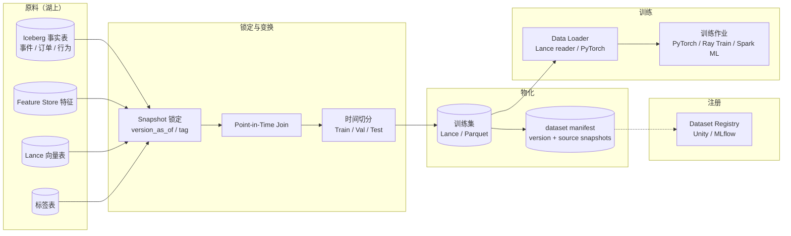

# 离线训练数据流水线

!!! tip "一句话场景"
    从湖上产出**可复现、无泄露、版本化**的训练集。看似"写 SQL 取数"，实际**PIT Join + Snapshot 锁定 + 数据集注册**三件事做不好，模型上线后必然"离线 0.95 线上 0.74"。**这是 MLOps 生命周期的第一环，也是最容易出事的一环**。

!!! abstract "TL;DR"
    - **三件核心事**：Snapshot 锁定 · Point-in-Time Join · 数据集 version 化
    - **PIT Join 的本质**：特征取"事件发生那一刻"的值，不能取未来
    - **Feature Store 是 PIT 的工程化**（Feast / Tecton 框架级保证）
    - **物化格式**：Lance（大规模训练）· Parquet（通用）· TFRecord（TF 专用）
    - **复现性**：dataset_id + source_snapshots + SQL 全记录
    - **错一步代价**：离线 AUC 飙 / 线上崩塌

## 1. 业务痛点 · 为什么这条管线这么重要

### 典型事故 #1 · 数据泄露（"离线 AUC 飙"）

```
训练样本时间: 2024-06-15
特征 user_total_gmv 取值:
  ❌ 错：NOW() 时刻的 user_total_gmv（包含 6 月后订单）
  ✅ 对：2024-06-15 那一刻的 user_total_gmv
```

**错的代价**：模型"学到"了未来 → 离线 AUC 0.95 → 上线后业务指标暴跌。

### 典型事故 #2 · 数据不可复现

- 2024-06 跑出的训练集，两个月后重跑 → 结果不同（数据动了）
- 审计问"你这个模型用的是哪个版本数据" → 答不上
- 合规挂

### 典型事故 #3 · 训推特征漂移

- 离线用的是 Spark SQL 计算特征
- 在线推理用的是 Java 实时算
- 两套逻辑**必然漂移**

### 典型事故 #4 · Snapshot 被过期

- 训练集引用的 Iceberg snapshot 被 `expire_snapshots` 清理
- Time Travel 查不到 → 训练集失效

## 2. 架构总览



## 3. 核心环节拆解

### 环节 1 · 样本定义

**明确样本是什么**：
- 一次曝光 / 一次点击 / 一条对话 / 一张图片

每个样本必须带：

| 字段 | 作用 |
|---|---|
| `sample_id` | 唯一标识 |
| `event_time` | **PIT Join 的锚点**（必填） |
| `label` | 标签（或未来的 label） |
| `weight` | 样本权重（可选） |
| `dataset_version` | 所属数据集版本 |

**常见错误**：把 `event_time` 和 `label_observation_time` 搞混。点击是 `event_time`，但"30 天未购买流失"的 `label_time` 是 `event_time + 30d`。

### 环节 2 · Snapshot 锁定（必做）

用 Iceberg / Paimon 的 `VERSION AS OF`：

```sql
SELECT f.*, fe.*
FROM facts VERSION AS OF 12345 f
JOIN features VERSION AS OF 54321 fe
  ON fe.user_id = f.user_id
  AND fe.valid_from <= f.event_time
  AND fe.valid_to > f.event_time
WHERE f.event_time BETWEEN '2024-01-01' AND '2024-03-31';
```

**更好**：给 Snapshot 打 tag 防过期：

```sql
ALTER TABLE facts CREATE TAG `training_2024q1` AS OF VERSION 12345;
ALTER TABLE features CREATE TAG `training_2024q1` AS OF VERSION 54321;
```

Tag 不受 `expire_snapshots` 影响。

### 环节 3 · Point-in-Time Join（最核心）

#### 基本形态

```sql
-- 对每个样本，取其 event_time 那一刻的特征值
SELECT
  s.sample_id,
  s.event_time,
  s.label,
  f.avg_7d_gmv AS feature_gmv
FROM samples s
ASOF LEFT JOIN features_scd2 f
  ON f.user_id = s.user_id
  AND f.valid_from <= s.event_time
  AND f.valid_to > s.event_time
```

#### Feast 的 PIT Join（框架级）

```python
from feast import FeatureStore

store = FeatureStore(repo_path="feature_repo/")

entity_df = spark.sql("""
SELECT user_id, event_time, label
FROM samples
WHERE event_time BETWEEN '2024-01-01' AND '2024-03-31'
""").toPandas()

training_df = store.get_historical_features(
    entity_df=entity_df,
    features=[
        "user_fv:avg_7d_gmv",
        "user_fv:vip_level",
        "user_fv:last_purchase_ts",
    ],
).to_df()
```

Feast 内部用 **ASOF JOIN** + TTL 自动做 PIT。

#### 自建时的常见错误

```sql
-- ❌ 错误：简单 LEFT JOIN 取最新
SELECT s.*, f.avg_7d_gmv
FROM samples s
LEFT JOIN features f ON f.user_id = s.user_id  -- 取的是当前最新值

-- ❌ 错误：JOIN 带时间但没 SCD2 valid 区间
SELECT s.*, f.avg_7d_gmv
FROM samples s
LEFT JOIN features f
  ON f.user_id = s.user_id
  AND DATE(f.update_time) = DATE(s.event_time)  -- 粒度不够
```

#### 正确的性能优化

PIT Join 在 100M+ 样本 × 100 特征时是性能噩梦。优化：

- **分桶 + 排序**：samples 和 features 都按 `(user_id, event_time)` 预排
- **时间裁剪**：同一 batch 训练样本时间区间集中 → features 扫描窗口变小
- **Feast 的 materialize_incremental**：让 features 表本身 partition by event_time
- **Spark ASOF JOIN hint**（Databricks 有扩展）

### 环节 4 · 数据集切分

**三种策略**：

| 策略 | 适合 | 注意 |
|---|---|---|
| **时间切分**（train < t1 < val < t2 < test）| 大多数业务 | **最稳、防未来泄露** |
| **用户切分** | 用户级预测、冷启动 | 用户要干净分开 |
| **随机切分** | 真正 IID 数据 | 业务数据很少 IID |

时间切分示例：

```python
df = training_df
train = df[df['event_time'] < '2024-03-01']
val   = df[(df['event_time'] >= '2024-03-01') & (df['event_time'] < '2024-03-15')]
test  = df[df['event_time'] >= '2024-03-15']
```

### 环节 5 · 物化格式

| 格式 | 适合 | 性能 |
|---|---|---|
| **Parquet** | 通用、生态最广 | 顺序读好、shuffle 一般 |
| **Lance** | 大规模 + 多 epoch + 随机 shuffle | **随机读 4-10× 比 Parquet 快** |
| **TFRecord** | TensorFlow 生态 | 闭环但绑 TF |
| **WebDataset / TAR** | 海量小图像 / 音频 | 流式友好 |

**推荐**：
- < 100 GB：Parquet 够
- 100 GB - TB：**Lance**（训练 shuffle 会快 5-10×）
- 多模（图 / 音）大规模：WebDataset / Lance

### 环节 6 · 版本化与注册

**这一步最容易被忽略**，但对复现 / 审计至关重要：

```yaml
# dataset manifest
dataset_id: recsys-v3-2024-q1
source:
  samples: iceberg.ml.samples @ snapshot 12345
  features: iceberg.ml.user_features @ snapshot 54321
  vectors: lance.ml.item_embeddings @ commit abc123
sql_hash: sha256:abcdef...
size: 3.2 TB
samples: 120M
schema_version: v3
split:
  train: 2024-01-01 to 2024-02-29 (80%)
  val:   2024-03-01 to 2024-03-15 (10%)
  test:  2024-03-15 to 2024-03-31 (10%)
created_at: 2024-04-01T00:00:00
created_by: airflow@data-platform
git_commit: abc123def
code_version: pipelines/training/recsys@v3.2.1
```

存到：
- Unity Catalog / Polaris Catalog
- MLflow Dataset
- 自建 Git 仓库

训练日志里记录 `dataset_id` → 一年后复现 `dataset get recsys-v3-2024-q1`。

## 4. 推荐技术栈

| 环节 | 首选 | 备选 |
|---|---|---|
| **事实表 / 特征表** | Iceberg + Feast / Tecton | Paimon + 自建 FS |
| **向量表** | Lance format | Parquet + ANN 索引 |
| **Snapshot 锁定** | Iceberg tag | Paimon tag |
| **PIT Join** | Feast get_historical_features / Spark ASOF | Flink + 维表 |
| **切分** | Spark | Ray Data |
| **物化** | **Lance**（大规模）/ Parquet | TFRecord |
| **训练读取** | Lance reader + PyTorch / Ray Train | Petastorm |
| **注册** | Unity Catalog / MLflow | 自建 Postgres |

## 5. 性能数字

### 典型规模

| 规模 | 处理时间 |
|---|---|
| 1M samples × 20 features PIT | 2-5 分钟 |
| 10M samples × 50 features PIT | 10-30 分钟 |
| 100M samples × 100 features PIT | 1-3 小时 |
| 1B samples × 200 features PIT | 6-12 小时 |

### 加速手段

| 手段 | 加速比 |
|---|---|
| Feature 表按 event_time 分区 | 2-5× |
| Bucket JOIN（samples + features 同桶） | 2-3× |
| Feast materialize_incremental 预计算 | 5-10× |
| Lance 替代 Parquet（多 epoch） | 3-10× 训练读速度 |

### 实际业务案例

- **Uber Michelangelo**：日产训练集 5000+ 个，PIT 框架化
- **LinkedIn**：数百 TB 日训练集，Feathr + Spark + Lance
- **字节 / 阿里**：内部 FS 处理百亿级样本

## 6. 代码示例

### 完整一天一次的 Airflow DAG

```python
from airflow import DAG
from datetime import datetime
from airflow.providers.apache.spark.operators.spark_submit import SparkSubmitOperator

with DAG("recsys_training_daily",
         start_date=datetime(2024, 1, 1),
         schedule="@daily") as dag:

    # 1. Tag Snapshot（保护数据不被 expire）
    tag_snapshots = SparkSubmitOperator(
        task_id="tag_snapshots",
        application="jobs/tag_for_training.py",
        conf={"spark.sql.catalog.iceberg.type": "rest"}
    )

    # 2. PIT Join + 切分 + 物化
    build_dataset = SparkSubmitOperator(
        task_id="build_training_dataset",
        application="jobs/build_dataset.py",
        conf={"spark.sql.adaptive.enabled": "true"}
    )

    # 3. Register
    register = PythonOperator(
        task_id="register_dataset",
        python_callable=lambda: register_to_mlflow(...)
    )

    # 4. 触发训练
    train = SparkSubmitOperator(
        task_id="train_model",
        application="jobs/train_ray_recsys.py"
    )

    tag_snapshots >> build_dataset >> register >> train
```

### Spark 写 Lance 训练集

```python
import pyspark.sql.functions as F
from pyspark.sql import SparkSession

spark = SparkSession.builder.appName("build-dataset").getOrCreate()

# 1. 从 Iceberg snapshot 读样本
samples = spark.sql("""
SELECT user_id, item_id, event_time, label
FROM iceberg.ml.samples VERSION AS OF 12345
WHERE event_time BETWEEN '2024-01-01' AND '2024-03-31'
""")

# 2. PIT Join 特征（这里用 Feast）
from feast import FeatureStore
store = FeatureStore("feature_repo/")

training = store.get_historical_features(
    entity_df=samples.toPandas(),
    features=[
        "user_fv:avg_7d_gmv",
        "user_fv:vip_level",
        "item_fv:avg_rating",
    ]
).to_df()

# 3. 时间切分
training_spark = spark.createDataFrame(training)
train = training_spark.filter(F.col("event_time") < "2024-03-01")
val   = training_spark.filter((F.col("event_time") >= "2024-03-01") & (F.col("event_time") < "2024-03-15"))
test  = training_spark.filter(F.col("event_time") >= "2024-03-15")

# 4. 写 Lance
import lance
train.write.format("lance").save("s3://ml-datasets/recsys-v3-2024q1/train")
val.write.format("lance").save("s3://ml-datasets/recsys-v3-2024q1/val")
test.write.format("lance").save("s3://ml-datasets/recsys-v3-2024q1/test")
```

### PyTorch + Lance DataLoader

```python
import lance
import torch
from torch.utils.data import DataLoader

dataset = lance.dataset("s3://ml-datasets/recsys-v3-2024q1/train")

# Lance 原生 shuffle 快
loader = DataLoader(
    dataset.to_pytorch(batch_size=1024, shuffle=True, num_workers=16),
    batch_size=None,
)

for epoch in range(10):
    for batch in loader:
        # batch shape / loss / optimizer.step()
        ...
```

## 7. 现实检视 · 2026 视角

### 成熟度

- **Feast + Spark + Iceberg**：稳定可用
- **Lance**：大规模训练友好，2024+ 生产采用增多
- **Tecton**：商业级 PIT 最成熟
- **自建**：50% 团队仍在自建 → PIT 是事故源头

### 2024+ 新趋势

- **Tag-based Snapshot 管理**：替代手动 snapshot_id
- **Ray Data + Lance**：下一代训练数据管线
- **Feature Store 和 Dataset Registry 解耦**：两个独立概念

### 争议

- **每次训练都重新 PIT** 还是**增量 PIT + 合并**？
  - 重新：简单、复现稳
  - 增量：快但复杂、需严格对账
  - **中小团队用重新**、大厂用增量

## 8. 陷阱与反模式

- **没 PIT 用当前值**：数据泄露 #1
- **Snapshot 不锁**：重跑结果不同
- **Snapshot 过期不 tag**：训练集失效
- **`DATE(update_time) = DATE(event_time)` 粒度错**：精度不够
- **切分用随机**：业务场景几乎总有时间维度
- **没 dataset manifest**：审计过不了
- **训练代码 hardcode 路径**：迁移成本爆
- **特征表无 TTL / 不 compact**：查询越来越慢
- **标签观测时间忽略**：30 天未购买要等 30 天才有 label

## 9. 相关 · 延伸阅读

### 相关页面

- [Feature Store](../ai-workloads/feature-store.md) · [Feature Serving](feature-serving.md)
- [MLOps 生命周期](../ai-workloads/mlops-lifecycle.md)
- [经典 ML 预测](classical-ml.md) · [推荐系统](recommender-systems.md)
- [Lance Format](../foundations/lance-format.md) · [Iceberg Time Travel](../lakehouse/time-travel.md)

### 权威阅读

- **[Feast Historical Features docs](https://docs.feast.dev/getting-started/concepts/feature-retrieval)**
- **[Uber Michelangelo blog](https://eng.uber.com/michelangelo-machine-learning-platform/)**
- **[Feathr (LinkedIn)](https://github.com/feathr-ai/feathr)**
- *Feature Engineering for Machine Learning* (Casari & Zheng)
- *Designing Machine Learning Systems* (Chip Huyen) 第 7 章
- **[Lance documentation](https://lancedb.github.io/lance/)** · **[Ray Data for Training](https://docs.ray.io/en/latest/data/data.html)**
