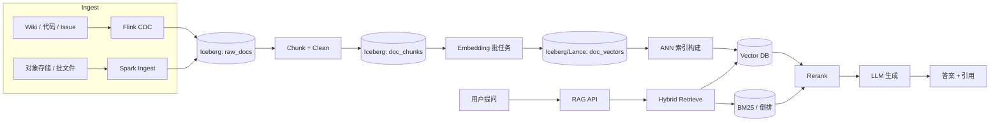

# RAG on Lake

!!! tip "一句话场景"
    把**湖仓作为 RAG 的单一事实源**：原始语料以 Iceberg/Paimon 表承载，embedding 与索引也以表形式沉淀，检索层与 LLM 生成层都从湖上消费。

## 场景输入与输出

- **输入**：多源文档（内部 wiki、代码、issue、设计文档、产品知识、日志）持续入湖
- **输出**：一个 RAG 服务，支持自然语言问答 + 引用回溯
- **SLO 示例**：
    - 端到端 p95 延迟：< 1.5s
    - 语料新鲜度：< 30 分钟
    - 可引用率：≥ 95%

## 架构总览

## 数据流拆解

1. **Ingest** —— 流式 CDC（Flink）+ 批次对齐；目标表 `raw_docs`（Iceberg 或 Paimon）承载原始文本与元数据（source、url、ts、author、visibility）
2. **Chunk & Clean** —— 语义 / 结构感知的分块（按标题层级、代码块完整保留）；产出 `doc_chunks` 表，字段包括 `chunk_id`, `doc_id`, `content`, `section`, `token_count`
3. **Embedding** —— 批次任务按 `doc_chunks` 的增量 snapshot 计算 embedding；落 `doc_vectors`（Lance format 或 Iceberg + 向量列）
4. **Index** —— ANN 索引（[HNSW](../retrieval/hnsw.md) 或 IVF-PQ）；同一表同时落 sparse term 向量（SPLADE/BM25）
5. **Serve** —— 查询来时 [Hybrid](../retrieval/hybrid-search.md) 召回 → Rerank → 拼 Prompt → LLM → 引用回写

## 各节点推荐技术

| 节点 | 首选 | 备选 | 取舍 |
| --- | --- | --- | --- |
| 入湖（流）| Flink CDC + Paimon | Kafka → Iceberg via Spark Streaming | Paimon 原生 upsert；Iceberg 生态更广 |
| 入湖（批）| Spark + Iceberg | Trino / DuckDB 写入 | Spark 吞吐稳 |
| Chunk | 自研 + llamaindex splitter | 纯长度切分 | 先上自研确保质量 |
| Embedding | BGE-large / E5 / Jina | OpenAI text-embedding-3 | 私有数据离线模型优先 |
| 向量存储 | [LanceDB](../retrieval/vector-database.md) 或 Iceberg + Puffin | Milvus 独立服务 | 湖上方案更便于跨引擎读 |
| 索引 | [HNSW](../retrieval/hnsw.md) | IVF-PQ（内存紧时） | 高 recall 优先 |
| 稀疏侧 | SPLADE / BM25 | 纯 BM25 | SPLADE 更语义化 |
| Rerank | bge-reranker / Cohere | 无 rerank | 强烈建议保留 |
| LLM | 内部部署或云 API | — | 视合规 |

## 失败模式与兜底

- **语料新鲜度漂移** —— Embedding 批任务失败 → 回答基于旧数据；**兜底**：给答案加 "数据截止" 时间戳，并监控 Snapshot 延迟
- **检索召回崩了** —— 向量索引损坏 → 直接回退到纯 BM25；**兜底**：在 API 层做 dual-path，对比两个分布，触发降级
- **幻觉** —— 检索到的片段不相关但 LLM 硬答；**兜底**：强制引用式回答，若无引用则直接回 "不知道"
- **隐私泄露** —— 检索跨越了 visibility 过滤；**兜底**：在向量库侧做强制 metadata filter，不依赖 Prompt 约束

## 参考实现

- 社区：<https://github.com/run-llama/llama_index>、<https://github.com/langchain-ai/langchain>
- 湖上方向：LanceDB RAG example、Milvus + Iceberg 组合
- 这一场景的详细选型依据会在 [一体化架构](../unified/index.md) 展开

## 相关

- 概念：[RAG](../ai-workloads/rag.md)、[向量数据库](../retrieval/vector-database.md)、[Hybrid Search](../retrieval/hybrid-search.md)
- 底座：[湖表](../lakehouse/lake-table.md)
