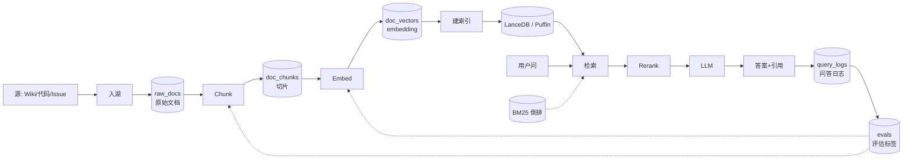

# RAG on Lake · 企业知识库问答

!!! info "本页是场景视角"
    机制深挖见：[RAG 架构与范式](../ai-workloads/rag.md) · [RAG 评估](../ai-workloads/rag-evaluation.md) · [向量数据库](../retrieval/vector-database.md) · [Hybrid Search](../retrieval/hybrid-search.md) · [Embedding](../retrieval/embedding.md) · [Rerank](../retrieval/rerank.md)。本页**讲湖上编排 + 5 表架构** · 不复述机制原理。

!!! tip "一句话理解"
    把**湖仓作为 RAG 的单一事实源**：原始语料、chunk、embedding、日志全以 Iceberg/Paimon 表承载；检索层（向量 + BM25）和 LLM 生成层都从湖上消费。**核心价值**：一份数据，多模型共用；血缘可追溯；测试和生产一致。

!!! abstract "TL;DR"
    - **架构**：5 个核心表（raw_docs → chunks → embeddings → logs → evals），每层独立演化
    - **chunk 策略决定召回上限**：结构感知 > 语义 > 定长
    - **单纯向量不够**：Hybrid (dense + BM25/SPLADE) + Rerank 是工业标配
    - **Evaluation 必做**：**离线 BEIR / RAGAS + 在线用户打分**闭环
    - **典型延迟预算**：召回 < 150ms + rerank < 100ms + LLM < 1s · 端到端 p95 < 1.5s
    - **多租户 / 权限**：**元数据过滤在向量库侧强制**——别指望 Prompt 能约束

## 业务图景

RAG 的典型落地场景，技术栈相似但侧重不同：

| 子场景 | 语料 | 问题复杂度 | 延迟预算 | 关键挑战 |
|---|---|---|---|---|
| **企业内部问答** | Wiki / Confluence / SharePoint | 中等 | < 2s | 权限 / 时效 |
| **客服 / 工单** | 产品文档 + FAQ + 历史工单 | 低-中 | < 1s | 准确率 / 升级路径 |
| **代码问答** | 代码库 + README + Issue | 高 | < 3s | 代码结构感知 |
| **法务 / 合规** | 合同 / 法规 / 案例 | 高（多跳推理） | 可接受 5-10s | 引用完备、零幻觉 |
| **科研辅助** | 论文 / 实验记录 | 高 | 可接受 30s | 多模（图表公式） |
| **客户自助** | 产品 FAQ + 用户手册 | 低 | < 1s | 多语言 / 简洁 |

---

## 核心架构：五张表

RAG-on-Lake 的关键是**把每个中间产物也做成表**，而不是埋在服务内部状态里。



### T1 · raw_docs（原始文档）

```sql
CREATE TABLE raw_docs (
  doc_id       STRING,
  source       STRING,          -- wiki / github / confluence / ...
  url          STRING,
  title        STRING,
  content      STRING,
  content_type STRING,          -- markdown / code / pdf / html
  author       STRING,
  visibility   ARRAY<STRING>,   -- 访问权限 tag
  tags         ARRAY<STRING>,
  version      STRING,
  created_ts   TIMESTAMP,
  updated_ts   TIMESTAMP,
  source_hash  STRING            -- 变更探测
) USING iceberg
PARTITIONED BY (source, days(updated_ts));
```

- **关键字段**：`visibility`（权限）· `source_hash`（增量探测）· `version`
- 增量入湖：**只有 `source_hash` 变化才重新 chunk / embed**

### T2 · doc_chunks（切片）

```sql
CREATE TABLE doc_chunks (
  chunk_id     STRING,
  doc_id       STRING,
  chunk_idx    INT,
  content      STRING,
  section_path ARRAY<STRING>,    -- [章, 节, 段]
  token_count  INT,
  start_offset INT,
  end_offset   INT,
  -- 冗余 (提高检索后过滤效率)
  source       STRING,
  url          STRING,
  visibility   ARRAY<STRING>,
  created_ts   TIMESTAMP
) USING iceberg
PARTITIONED BY (source);
```

- 每条 chunk 保留**父文档指针 + section 路径**，便于引用展示
- `visibility` **冗余一次**——向量库侧也要这列做过滤

### T3 · doc_vectors（embedding）

```sql
-- Iceberg + Puffin 或 Lance format
CREATE TABLE doc_vectors (
  chunk_id        STRING,
  embedding_v1    ARRAY<FLOAT>,   -- BGE-large-zh
  embedding_v2    ARRAY<FLOAT>,   -- multilingual E5 (可选)
  sparse_vec      MAP<INT,FLOAT>, -- SPLADE (可选)
  model_version   STRING,
  ts              TIMESTAMP
) USING lance
PARTITIONED BY (model_version);
```

- **一个 chunk 可以有多套 embedding**（中英双模型、BGE 新旧版本对比）
- 切换模型只要加一列不改表

### T4 · query_logs（问答日志）

```sql
CREATE TABLE query_logs (
  qid          STRING,
  user_id      STRING,
  query        STRING,
  retrieved    ARRAY<STRUCT<chunk_id, score>>,
  rerank       ARRAY<STRUCT<chunk_id, score>>,
  answer       STRING,
  citations    ARRAY<STRING>,
  model        STRING,
  tokens_in    INT,
  tokens_out   INT,
  latency_ms   INT,
  cost_usd     DECIMAL(10,4),
  ts           TIMESTAMP
) USING iceberg
PARTITIONED BY (days(ts));
```

这张表**非常重要**——是**评估、调优、审计**的数据源。

### T5 · evals（评估标签）

```sql
CREATE TABLE evals (
  qid          STRING,
  dataset      STRING,          -- beir / custom / user_feedback
  rel_chunks   ARRAY<STRING>,   -- 人工标注或 gold
  user_thumbs  STRING,          -- up / down
  feedback     STRING,
  ts           TIMESTAMP
);
```

---

## 关键环节 1 · Chunk 策略

**Chunk 决定召回上限**。模型再强，分块不合理也检索不到关键信息。

### 三种策略

| 策略 | 适用 | 优 | 劣 |
|---|---|---|---|
| **定长切分** | 纯文本、快速启动 | 简单、均匀 | 切断语义 |
| **结构感知** | Markdown / HTML / 代码 | 尊重标题层级 | 实现复杂 |
| **语义切分** | 长散文 / PDF | 语义聚合 | 耗时、需额外模型 |

### 推荐配置

```python
# 结构感知 + 长度约束 + overlap
chunk_config = {
    "min_tokens": 200,
    "max_tokens": 800,
    "overlap": 50,
    "respect_headers": True,      # H1/H2/H3 边界不切
    "preserve_code_blocks": True,
    "preserve_tables": True,
}
```

### 代码文档特殊处理

- 按**函数 / 类**为单位切，不按行数
- 保留函数签名和文档字符串
- 工具：`tree-sitter` 做语法感知切分

### PDF / 扫描件

- **版式感知 OCR**（Nougat · MinerU · PaddleOCR-VL）而不是纯文字
- 表格、公式、图表**单独 chunk**，带描述

---

## 关键环节 2 · Embedding 选型

| 选项 | 场景 | 优 | 劣 |
|---|---|---|---|
| **BGE-large-zh/en** | 私有化、中文 | 开源 SOTA、中文友好 | 自己维护推理服务 |
| **E5-multilingual** | 多语言 | 多语好 | 略弱于专语模型 |
| **Jina v3** | 通用 | API 友好、长文本 | 非完全开源 |
| **OpenAI text-embedding-3** | 云 / 快速 | 效果稳定 | 数据出境 |
| **Cohere embed-multilingual** | 多语 | 强 | 商业授权 |
| **Voyage AI** | 代码、法律 | 领域专用 SOTA | 小众 |

**实务建议**：
- 私有数据 → **BGE 系列** + 自建推理
- 要快速起步 → 云 embedding
- 一定做**离线评估**（MTEB / 自家评估集）再决定
- 详见 [Embedding 模型横比](../compare/embedding-models.md)

---

## 关键环节 3 · 检索：Hybrid + Rerank

### 纯向量不够

- **向量泛化**：语义相似但**不一定精确匹配**
- **关键词命中**：产品名 / 错误码 / 人名 —— BM25 更准
- **长尾 query**：向量模型未见过的词组 → BM25 兜底

### 工业标配：Hybrid

```
Query → [Dense embedding] → 向量 TopN
      → [BM25 / SPLADE]   → 关键词 TopN
      → RRF / 加权融合     → 合并 TopK
      → Rerank (Cross-Encoder)
      → Top-K 给 LLM
```

**融合方式**：
- **RRF (Reciprocal Rank Fusion)** —— 无参数、鲁棒
- **加权求和** —— 需调参但上限高
- **Linear Learned** —— 小模型学融合权重

详见 [Hybrid Search](../retrieval/hybrid-search.md)。

### Rerank 强烈推荐

- 召回粗、rerank 精
- 常见选择：
  - **bge-reranker-large** —— 开源 SOTA、中英双语
  - **Cohere Rerank 3** —— API 方案
  - **Jina Reranker** —— 开源 API 双版本
- 从 TopN (50-100) → TopK (5-10)
- 延迟：< 100ms

---

## 关键环节 4 · Prompt 构造

### 基础模板

```
你是 XXX 公司的内部助手。请**仅基于下面的参考资料**回答问题。
若资料不足，请回答"资料中没有找到相关信息"。
每个答案必须带引用编号。

# 参考资料
[1] {chunks[0].title} ({chunks[0].url})
{chunks[0].content}

[2] {chunks[1].title} ({chunks[1].url})
{chunks[1].content}

# 问题
{user_query}

# 你的回答（使用中文 / 引用格式 [n]）
```

### 技巧

- **引用编号在 Prompt 里明确**：LLM 更愿意写引用
- **截断**：chunk 超过 token budget 时砍尾巴而不是砍头
- **压缩**：用 LLM 自己先把 chunks 压缩到要点（`ContextualCompression`）
- **排序影响**：相关度最高的 chunk 放**最后一条**（"**Lost in the Middle**"现象）

---

## 关键环节 5 · Evaluation（大多数团队漏掉的）

### 离线评估

| 维度 | 方法 | 工具 |
|---|---|---|
| **检索质量** | Recall@K · MRR · NDCG | BEIR · 自建评估集 |
| **答案质量** | Faithfulness (是否符合引用) | **RAGAS** · **TruLens** |
| **相关性** | Answer Relevance | RAGAS |
| **无幻觉率** | Grounded rate | 人工 + LLM-as-judge |

### 在线评估

- **用户点赞 / 点踩** → 写入 `evals` 表
- **点击引用**（点了就说明答案靠谱）
- **follow-up 率**（问了又问 = 没答好）
- **解决率**（客服场景直接看）

### 基准 Benchmark

benchmark 矩阵（BEIR / MS MARCO / Natural Questions / HotpotQA / RAGBench）与各自适用场景 · 统一见 [RAG 评估章](../ai-workloads/rag-evaluation.md) · 本页不重复枚举。

### RAGAS 四指标（最常用）

```python
from ragas import evaluate
from ragas.metrics import (
    faithfulness,        # 答案是否忠于 context
    answer_relevancy,    # 答案是否贴合问题
    context_precision,   # 召回的 context 精确度
    context_recall       # 召回是否覆盖 ground truth
)

result = evaluate(
    dataset=...,
    metrics=[faithfulness, answer_relevancy, context_precision, context_recall]
)
```

---

## 多租户 · 权限

**这是生产的硬约束**。

### 错误做法

- 在 Prompt 里写"只回答 team_A 相关内容"—— **会被绕过**
- 检索后在应用层过滤 —— **可能泄露在 LLM 上下文里**

### 正确做法

1. **元数据过滤在向量库侧强制**（**必须**）：

   ```python
   # LanceDB 示例
   results = table.search(q_vec) \
                  .where(f"array_has(visibility, '{user_role}')") \
                  .limit(10) \
                  .to_list()
   ```

2. **多 tenant 隔离**：每个租户独立分区 / 独立 collection
3. **行级安全 (RLS)**：Iceberg 层的访问控制
4. **审计日志**：每次检索写入 `query_logs`，能复盘

---

## 多语言 · 多模

### 多语言

- 用**多语 embedding 模型**（E5-mul · BGE-multilingual）
- 或**每语种独立 embedding 列**，query 时按 language 选列
- **跨语检索**需要测试（中文问题找英文文档）

### 多模

- 图片 / 图表 → **CLIP / SigLIP embedding**
- 表格 → 转成 Markdown 文本再 embed
- 视频 → 抽关键帧 + ASR 转文本
- 详见 [多模检索流水线](multimodal-search-pipeline.md)

---

## 延迟预算分解

```
用户输入 → 答案输出
  0ms
  │
  5ms   ┤ 输入校验、user_id 转 tenant
  │
  50ms  ┤ Query embedding (BGE 单 GPU 推理 ~30ms)
  │
  150ms ┤ 向量检索 (HNSW 100k 节点 ~50ms) + BM25 (~30ms) + 融合
  │
  250ms ┤ Rerank (cross-encoder 10 doc ~80ms)
  │
  400ms ┤ Prompt 拼接 + 首 token 延迟
  │
  1200ms ┤ LLM 流式生成（通常是主要开销）
  │
  1500ms ┤ 后处理 + 引用展开 + 日志落表
  ↓
  end
```

**p95 < 1.5s** 的关键：
- Query embedding **预热** / 小模型
- 向量索引内存常驻（不要冷启动）
- **LLM 流式输出** —— 首 token 快就够
- 日志**异步**写湖

---

## 失败模式 · 兜底

| 失败 | 症状 | 兜底 |
|---|---|---|
| **向量索引崩了** | 检索 0 结果 | 自动降级到纯 BM25 |
| **LLM 超时 / 抖** | 答案慢 / 部分输出 | 超时返回"请稍后再试"，不要挂起 |
| **Embedding 漂移** | 新模型召回崩了 | 双模型灰度 + A/B |
| **幻觉** | 答案里编造 | **强制引用回答**；无引用退回"不知道" |
| **权限泄露** | 用户看到不该看的 | 向量库侧元数据过滤 + 审计查询 |
| **语料新鲜度崩** | embedding 批失败 | Snapshot 延迟监控 + 答案带"数据截止"日期 |
| **成本失控** | LLM 账单爆 | **Token / QPS 限流** · 缓存 / 语义缓存 |

---

## 可部署参考

- **[我们的 60 分钟 RAG on Iceberg tutorial](../tutorials/rag-on-iceberg.md)** —— 端到端最小可跑版
- **[LlamaIndex](https://github.com/run-llama/llama_index)** —— 最全面的 RAG 库
- **[LangChain](https://github.com/langchain-ai/langchain)** —— 通用编排
- **[Haystack](https://github.com/deepset-ai/haystack)** —— 生产级管道
- **[Verba](https://github.com/weaviate/Verba)** —— Weaviate 出品的开箱即用 RAG UI
- **[RAGFlow](https://github.com/infiniflow/ragflow)** —— 开源企业级 RAG，支持版式感知
- **[Quivr](https://github.com/QuivrHQ/quivr)** —— 开源 RAG 生产力工具

---

## 工业案例 · RAG 场景深度切面

!!! info "本节定位 · RAG 场景的案例切面"
    **不重复公司全栈介绍**（见 [cases/](../cases/index.md) 深度页）· 只分析 3 家在**RAG / AI 问答场景**的独特做法 · 关键数字 · 踩坑。

### Databricks · Lakehouse AI + Genie（RAG 商业化代表）

**为什么值得学**：Databricks 是**RAG 商业化最完整的平台**。Unity Catalog + Vector Search + AI Functions + Foundation Model API 全栈打通。**全栈视角见 [cases/databricks](../cases/databricks.md)**。

**在 RAG 场景的独特做法**：

1. **"UC 作为 RAG 语料治理平面"**：
   - 文档 / Volume（图文 PDF）/ Vector Index / Model / Function · **都是 UC 一等公民**
   - 权限 / 血缘 / Tag 策略 · **BI 和 AI 一套 RBAC**
   - RAG 语料的**分片 · 向量 · 索引 · 查询日志**都在 UC 里

2. **Vector Search + Hybrid + Reranker 三段式**：
   - Delta 表上一等向量索引（HNSW）
   - Hybrid：向量 + Full-text BM25
   - Rerank：集成的 Rerank 模型
   - 和本页 5 表架构高度对应

3. **AI Functions · SQL 里直接写 RAG**：
   - `ai_embed` · `ai_retrieve` · `ai_generate` 可串联
   - 数据不出 Databricks · 合规友好
   - 细节 API 在 [query-engines/compute-pushdown](../query-engines/compute-pushdown.md)

4. **Genie · Text-to-SQL + RAG 融合**：
   - 自然语言问 BI 问题 · 背后融合 Schema RAG + LLM SQL 生成
   - 2024+ 产品化 · 客户规模增长

**踩坑和教训** `[来自 cases/databricks §9]`：
- UniForm 在**复杂 schema evolution 下有 bug**（2024 客户报告）· 多格式互操作不是零成本
- UC OSS 2024 才捐 LF AI · 3 年窗口让 Polaris 抢占 Iceberg Catalog 心智

**和本页推荐架构的对比**：
- ✅ 5 表架构（raw_docs → chunks → embeddings → logs → evals）和 Databricks UC 架构**高度对齐**
- ✅ Hybrid + Rerank 三段式是**工业标杆**
- ⚠️ 商业平台深度锁定（Delta + UC + Photon）· 开源栈替代成本高

### Snowflake · Cortex RAG（"数据不出栈"的合规优势）

**为什么值得学**：Snowflake Cortex 是**SQL LLM UDF 工业先驱**（2024 GA · 早于 Databricks AI Functions）。**全栈视角见 [cases/snowflake](../cases/snowflake.md)**。

**在 RAG 场景的独特做法**：

1. **"数据不出 Snowflake"的合规锚点**：
   - 所有 RAG 组件（Embed / Search / LLM）都在 Snowflake 内部
   - 客户合规场景（金融 / 医疗）最敏感的"数据主权"问题直接解
   - 商业产品的**合规卖点** · 对**强合规客户**是首选

2. **Cortex Search · 向量检索**（2024 GA）：
   - 原生向量索引 + Hybrid + Reranker 三段式
   - 和 Snowflake 表一等集成
   - 对标 Databricks Vector Search

3. **Cortex Agents · Text-to-SQL + RAG 融合**（2025+）：
   - 类似 Databricks Genie · 但路线是"**SQL 优先**"
   - 客户体验和 Databricks 对比 · 核心差异在"SQL vs Notebook"哲学

**Cortex 后端 LLM 限制**：
- 支持 Mistral / Llama 3 / Snowflake Arctic
- **不直接支持 OpenAI GPT / Anthropic Claude**（数据主权原因）
- 追求最强 LLM 的客户要用 Claude 等需要额外接入

**和本页推荐架构的对比**：
- ✅ 合规场景（"数据不出栈"）· Snowflake 是**首选**
- ⚠️ 追求最前沿 LLM（Claude 4.X · GPT 最新版）的场景 · Cortex 是短板

### Netflix · 内部 RAG 实践（全栈开源视角）

**为什么值得学**：Netflix 作为 Iceberg 诞生地 · 内部 RAG 实践**以开源栈为主** · 和商业平台路线对比鲜明。**全栈视角见 [cases/netflix](../cases/netflix.md)**。

!!! warning "以下为作者推断 · 非 Netflix 官方 RAG 具体产品披露"
    Netflix 公开的 RAG 具体产品较少（不是主业务）· 以下是**基于其数据平台能力的合理推断** · 非官方产品。

- **数据底座**：Iceberg 10 万+ 表 + S3 EB 级 · 文档表可直接 Iceberg
- **ML 平台**：Metaflow（pipeline · 2024 商业化）+ MLflow（Registry）
- **LLM 方式**：推测用外部 API（OpenAI / Anthropic）+ 部分自托管 · **不完全 in-house**
- **关键启示**：**"开源 + 外部 LLM"路径可行** · 不一定需要 Databricks / Snowflake 一体化商业栈

### 跨案例对比

| 维度 | Databricks | Snowflake | Netflix 推断 |
|---|---|---|---|
| **路径** | 商业一体化 | 商业一体化 + 合规锚点 | 开源 + 外部 LLM |
| **LLM 支持** | DBRX / Llama / Claude 代理 | Mistral / Llama / Arctic（**不含 GPT/Claude**） | 外部 API 为主 |
| **合规强度** | 中高（UC 治理） | 高（"数据不出栈"） | 看自主实施 |
| **SQL-first vs Notebook-first** | Notebook + SQL 并重 | **SQL 为中心** | Notebook 为主 |
| **对中国团队参考** | 可借鉴架构 · 商业成本高 | 同上 · 跨云能力好 | **开源路径 · 最可复制** |

**共同规律**（事实观察）：
- RAG 是**多组件组合** · 不是"一个产品"
- **Catalog 治理 + 权限 + 血缘** 是 RAG 生产的必需（不是加分项）
- **SQL LLM UDF** 正在成为 BI 侧 RAG 的主要入口（详见 [query-engines/compute-pushdown](../query-engines/compute-pushdown.md)）

---

## 陷阱

- **以为向量检索万能**：信息检索 50 年积累的 BM25 不要丢
- **Chunk 一刀切 512 tokens**：代码 / 表格 / PDF 各有最佳策略
- **Embedding 追最新**：新模型不一定对你的语料更好；做 MTEB 评估
- **没有 query_logs**：出问题排查只能靠拍脑袋
- **不做 Evaluation**：上线靠直觉，迭代靠运气
- **Rerank 砍掉**：贵但值；砍了效果明显掉
- **Prompt 里写权限规则**：肯定被绕过；权限要在向量库侧强制
- **忽视成本**：LLM / embedding token 账单爆炸，要实时监控
- **没有降级**：向量库一挂整个系统瘫；BM25 / 规则兜底必备

---

## 和其他场景的关系

- **vs [推荐系统](recommender-systems.md)**：推荐侧重**个人化排序**，RAG 侧重**内容问答**；共享向量库技术
- **vs [Agentic 工作流](agentic-workflows.md)**：RAG 是 Agent 的一种 Tool；Agent 可以决定**是否调用 RAG**
- **vs [多模检索流水线](multimodal-search-pipeline.md)**：多模是更广义的检索；RAG 在文本子集上加了 LLM 生成层

---

## 相关

- 概念：[RAG](../ai-workloads/rag.md) · [向量数据库](../retrieval/vector-database.md) · [Hybrid Search](../retrieval/hybrid-search.md) · [Rerank](../retrieval/rerank.md)
- 对比：[Puffin vs Lance](../compare/puffin-vs-lance.md) · [Embedding 模型横比](../compare/embedding-models.md) · [向量数据库对比](../compare/vector-db-comparison.md)
- 教程：[60 分钟 RAG on Iceberg](../tutorials/rag-on-iceberg.md)
- 底座：[湖表](../lakehouse/lake-table.md)
- 业务：[业务场景全景](business-scenarios.md) · [Agentic 工作流](agentic-workflows.md)

## 延伸阅读

- *Retrieval-Augmented Generation for Large Language Models: A Survey* (Gao et al., 2023)
- *Lost in the Middle: How Language Models Use Long Contexts* (Liu et al., 2023)
- *RAGAS: Automated Evaluation of Retrieval Augmented Generation* (Es et al., 2023)
- **[LlamaIndex RAG Best Practices](https://docs.llamaindex.ai/en/stable/optimizing/production_rag/)** · **[Anthropic Contextual Retrieval](https://www.anthropic.com/news/contextual-retrieval)**
- Vespa / ElasticSearch / Weaviate / Qdrant 的 RAG 技术博客
