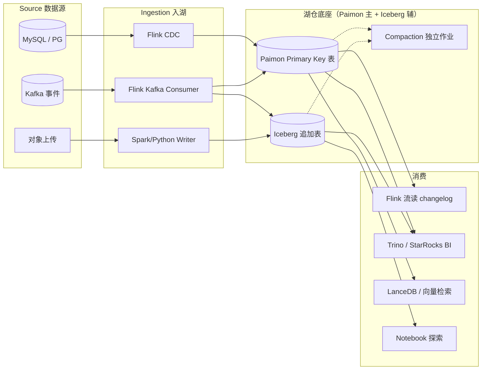

# Real-time Lakehouse · 端到端分钟级一体化

!!! tip "一句话场景"
    让 **BI 仪表盘 + AI 检索 + 数据科学探索** 都能读到**分钟级新鲜度**的数据，而不是 T+1。核心方程式：Flink CDC + Paimon Primary Key 表 + **Compaction 跟得上**。

!!! abstract "TL;DR"
    - 端到端延迟 = Source lag + Flink checkpoint interval + Paimon commit interval + 读侧 freshness read
    - 合理目标：**1–5 分钟端到端**（不是毫秒级，也不是 T+1）
    - 三条链路并行：**CDC 流 / 事件流 / 上传流**，落同一张湖表
    - Paimon 的 **Changelog Producer** 模式选择决定下游能不能流式消费
    - 最大风险：**Compaction 跟不上**，一周内查询降速 10 倍

## 场景输入与输出

- **输入**：OLTP CDC、Kafka 事件流、第三方 webhook、多模文件上传
- **输出**：
    - BI 仪表盘 / 大屏：p95 刷新 < 3s，数据新鲜度 < 5min
    - AI 在线服务：检索源数据分钟级同步
    - 数据科学探索：Snapshot 级一致性 + 可回溯
- **SLO 典型**：
    - 端到端延迟 p95 < 5min
    - Flink 作业可用性 ≥ 99.9%
    - 小文件数（每表）< 10,000
    - 读 p99 < 3s

## 架构总览



## 数据流拆解

### 1. CDC → Paimon（最新鲜的链路）

```sql
-- Flink SQL (简化)
CREATE TABLE source_orders (
  order_id BIGINT PRIMARY KEY NOT ENFORCED,
  user_id BIGINT, amount DECIMAL(18,2), status STRING, ts TIMESTAMP(3)
) WITH (
  'connector' = 'mysql-cdc',
  'hostname' = 'mysql.internal', 'database-name' = 'ops', 'table-name' = 'orders'
);

CREATE TABLE paimon_orders (
  order_id BIGINT PRIMARY KEY NOT ENFORCED, user_id BIGINT,
  amount DECIMAL(18,2), status STRING, ts TIMESTAMP(3)
) WITH (
  'connector' = 'paimon',
  'path' = 's3://warehouse/ops/orders',
  'bucket' = '16',
  'changelog-producer' = 'lookup',
  'snapshot.time-retained' = '7 d'
);

INSERT INTO paimon_orders SELECT * FROM source_orders;
```

- **checkpoint interval** 决定 commit 频率（典型 1–2 min）
- **bucket** 控制并行度和文件分布
- **changelog-producer = lookup** 产生下游可订阅的精准 +I / -U / +U / -D 事件

### 2. 事件流 → Paimon 或 Iceberg append

- 订单点击、用户行为 → **Iceberg append-only**（写吞吐最高）
- 需要 upsert 的聚合（实时 DAU 等） → **Paimon Primary Key 表**

### 3. Compaction（看不见但最关键）

**这是最容易翻车的环节**。流式写入天然产生大量小文件：

- Paimon：启动专门 compaction job
  ```sql
  CALL sys.compact('ops.orders');
  ```
  或写配置自动触发
- Iceberg：
  ```sql
  CALL system.rewrite_data_files('ops.events',
    options => map('min-input-files', '10', 'target-file-size-bytes', '536870912'));
  ```

**SLO**：任何时刻**每个分区内** < 数百小文件。超过就触发或加频率。

### 4. 读侧 —— 三条消费通道

**BI 仪表盘（Trino / StarRocks）**：
- 直读 Paimon / Iceberg 表
- 新鲜度取决于 commit 频率（通常 1–5 分钟）
- 加 **StarRocks 物化视图** 提速到亚秒级（详见 [BI on Lake](bi-on-lake.md)）

**AI 检索（LanceDB / Milvus）**：
- Paimon 流式消费 changelog → 触发 embedding 增量作业
- 或用定时（5 min）触发增量 re-embed

**数据科学探索（Notebook）**：
- pyiceberg / duckdb 读同一表
- Snapshot 锁定用于复现

## 端到端延迟分解

```
总延迟 = Source lag
       + Flink 处理时间 (network + serde)
       + Checkpoint 间隔 (commit 由 checkpoint 触发)
       + Paimon commit 开销
       + 读侧 freshness read lag
```

粗略预算（以 5min 目标）：

| 阶段 | 典型耗时 |
| --- | --- |
| Source (binlog 到 Flink) | 几秒 |
| Flink process | < 1s |
| Checkpoint (2 min interval) | 最多 2 min |
| Paimon commit | 数秒 |
| 读侧发现新 snapshot | 秒级 |
| **总计** | **2-3 min 平均，5 min p95** |

想追到**亚分钟端到端**：checkpoint interval 降到 30s、bucket 增加、compaction 更激进。但代价是集群成本翻倍。

## 推荐技术栈

| 节点 | 首选 | 备选 |
| --- | --- | --- |
| CDC | Flink CDC 3.x | Debezium + Kafka Connect |
| 流处理 | Flink | Spark Structured Streaming |
| Primary Key 湖表 | Paimon | Hudi MoR |
| Append 湖表 | Iceberg | Paimon append-only |
| Compaction 作业 | 独立 Flink / Spark job | 引擎内置 scheduler |
| BI 交互 | Trino + StarRocks 物化视图 | ClickHouse 加速副本 |
| 流订阅 | Flink on Paimon changelog | Kafka 中转 |
| 向量同步 | Flink → LanceDB sink | 定时批作业 |
| 观测 | Prometheus + Grafana + Flink UI | 自研 |

## 失败模式与兜底

| 故障 | 症状 | 兜底 |
| --- | --- | --- |
| **Compaction 跟不上** | 查询慢一周加剧 10×；小文件爆 | 加大 compaction 并行度 / 频率；监控 file count |
| Flink 作业 crash + state loss | savepoint 丢 | savepoint 定期备份到对象存储；checkpoint + externalized |
| Source 延迟积压 | 端到端延迟升到 10min+ | 扩 Flink 并行度 + Paimon bucket |
| MySQL DDL 变更 | CDC 作业崩 | 用 Flink CDC 3.x 的 schema evolution；CI 检查 DDL 兼容性 |
| Downstream 查询放大小文件影响 | BI 偶尔 p99 > 30s | 引入加速副本 + 调 Compaction 更激进 |
| Paimon changelog-producer 配错 | 下游流消费拿不到 update 事件 | 切到 `lookup` 模式 |

## 监控关键指标

- **端到端 lag**（source.event_time vs current time）
- **Flink job uptime + checkpoint size / duration**
- **Paimon snapshot latency**（commit 间隔 + commit 耗时）
- **每表 file count / avg size**（小文件健康度）
- **BI 查询 p95**（读侧延迟）
- **Consumer lag**（如中转 Kafka）

## 和其他场景的关系

- [流式入湖](streaming-ingestion.md) —— 专注 "数据怎么进"，Real-time Lakehouse 是更全景版
- [BI on Lake](bi-on-lake.md) —— 新鲜度要求高时这个场景就会变成本场景
- [RAG on Lake](rag-on-lake.md) —— AI 侧，如果要求实时 RAG，就叠加这个场景

## 反模式

- **既要端到端毫秒又要湖仓成本便宜** → 选 Kafka + ClickHouse / Pinot 独立栈。湖仓不是毫秒级系统
- **Checkpoint 开得太频** → Flink CPU 爆，commit 开销成为瓶颈
- **不做 compaction** → 自杀
- **Compaction 抢走业务查询资源** → 独立集群 / Queue 隔离
- **流式作业不上 savepoint** → 升级 Flink 版本时 state 全丢

## 相关

- [Streaming Upsert / CDC](../lakehouse/streaming-upsert-cdc.md) · [Compaction](../lakehouse/compaction.md)
- [事件时间 / Watermark](../foundations/event-time-watermark.md)
- [Apache Paimon](../lakehouse/paimon.md) · [Apache Flink](../query-engines/flink.md)
- [流式入湖场景](streaming-ingestion.md) · [BI on Lake](bi-on-lake.md)

## 延伸阅读

- *Streaming Lakehouse is Here*（Paimon 社区博客系列）
- *The Real-time Data Warehouse*（Netflix Data Platform Blog）
- *Real-time Analytics at Uber*
- Flink Forward 主旨演讲回放
