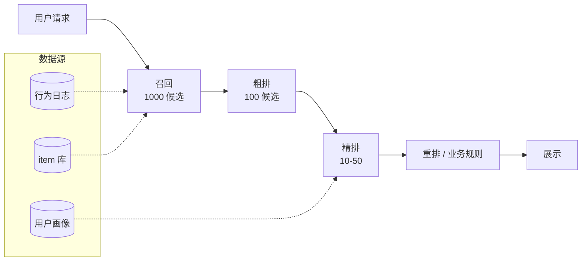
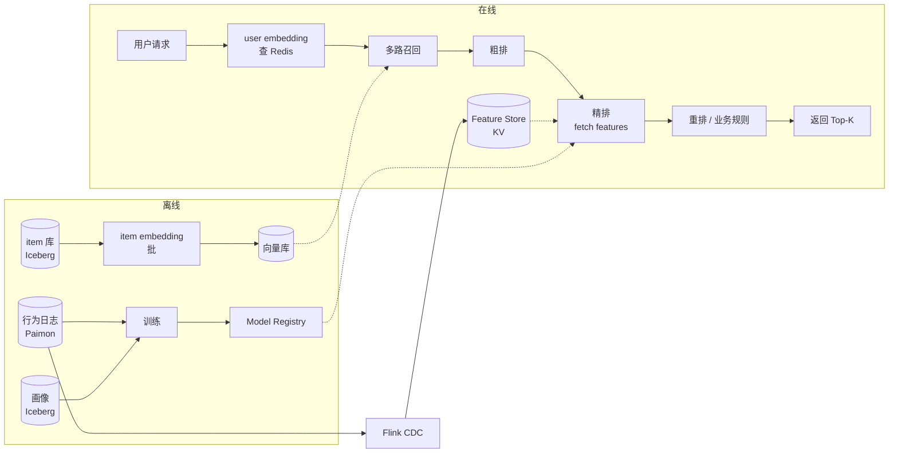

# 推荐系统 · 搜索 · 发现

!!! tip "一句话理解"
    给用户**从千万-亿级候选中**挑出最可能喜欢的几十条，**毫秒级返回**。工业推荐系统 = **四阶段流水线**（召回 → 粗排 → 精排 → 重排 / 业务规则），每一阶段的技术栈都不同。向量检索主战场 **召回** 阶段；Feature Store 是**精排**的生命线。

!!! abstract "TL;DR"
    - 流程：**召回 (1000s) → 粗排 (100s) → 精排 (10s) → 重排 → 业务过滤**
    - **召回阶段**是向量数据库最大的工业用法（远大于 RAG）
    - **训练数据 + 在线特征必须一致**（train-serve skew）→ Feature Store 是必需
    - **近实时**（分钟级用户反馈）比离线 T+1 效果好 2–10%
    - 最难的不是模型，是**数据新鲜度 + 冷启动 + 多目标 trade-off**

## 业务图景

三大场景，技术栈相似但侧重不同：

| 场景 | 候选池 | 推荐"什么给谁" | 延迟预算 |
| --- | --- | --- | --- |
| **电商推荐** | 百万-亿级 SKU | 给用户商品 / 广告位 / 活动 | 100–300ms |
| **内容 Feed** | 百万-亿级内容 | 视频 / 帖子 / 文章 | 100–400ms |
| **搜索** | 全量索引 | 查询 → 相关结果 | 50–200ms |

## 四阶段流水线



### 1. 召回（Recall）· 核心价值：覆盖 + 性能

从千万 item 挑**上千候选**。目标：**别漏关键候选**；能快就快。

**多路召回**（并行跑，合并）：

| 路 | 技术 | 优 | 劣 |
| --- | --- | --- | --- |
| **向量召回** | 双塔模型 + ANN (HNSW/IVF-PQ) | 语义泛化好 | 冷启动不友好 |
| **协同过滤** | ItemCF / UserCF / Matrix Fact | 头部效果强 | 稀疏行为失效 |
| **Query-based**（搜索） | BM25 + TF-IDF + dense | 关键词命中强 | 不泛化 |
| **基于标签 / 类目** | 规则 + 倒排 | 可解释 · 冷启动 | 手工成本 |
| **热门 / 实时** | Redis 维护 Top-K | 低延迟 | 头部效应 |
| **图召回** | GNN on 用户-item graph | 发现新关系 | 训练重 |

**延迟预算**：每路 < 20ms · 合并 < 10ms · 合计 < 50ms

### 2. 粗排（Pre-ranking）· 削减到百级

把上千候选打分排出 Top-100–200。用**轻量模型**，每条 < 1ms。

- 双塔模型（向量内积）
- FM / DeepFM 简化版
- Knowledge distillation 从精排压缩

### 3. 精排（Ranking）· 最重模型在这里

真正决定排序质量。特征极多（数百列）。单次打分允许几 ms。

**经典范式**：
- **LambdaMART / GBDT** (XGBoost / LightGBM) — 特征工程重
- **Wide & Deep** — Google 经典
- **DIN / DIEN** — 阿里，用户兴趣建模
- **DCN** — 特征交叉
- **Transformer-based rerank** — 最新

**关键工程点**：
- **Feature Store 必备**：训练和在线特征必须一致（详见 [Feature Store](../ai-workloads/feature-store.md)）
- **Point-in-Time Join**：训练时特征取事件发生时刻的值（详见 [离线训练数据流水线](offline-training-pipeline.md)）
- **特征多样性**：user / item / context（设备 / 时段 / 位置） / 交叉

### 4. 重排 · 业务规则

- **多样性**：避免首屏全是同一品牌 / 同一类目
- **去重 / 打散**：最近看过的不再推
- **业务强约束**：广告位 / 加热商品 / 库存限制
- **公平性**：新手商家流量保底
- **A/B 实验**：哪些规则上线要打标

---

## 存储诉求

### 行为数据（事实表）

- **曝光（impression）/ 点击 / 转化** 明细
- **百亿-千亿行 / 年**的规模很常见
- 典型分区：`dt × tenant × event_type`

```sql
CREATE TABLE user_behaviors (
  user_id        BIGINT,
  session_id     STRING,
  event_type     STRING,     -- impress / click / add_cart / buy
  item_id        BIGINT,
  category_id    INT,
  price          DECIMAL,
  context        STRUCT<device, city, page_type, ts_ms>,
  ts             TIMESTAMP
) USING paimon
PARTITIONED BY (days(ts), event_type, bucket(32, user_id));
```

### 用户画像（Profile 宽表）

- 数百列（长期 / 短期兴趣 / 人口属性 / 账户状态）
- 更新频率：**短期特征分钟级，长期特征天级**

### Item 元数据

- 标题 / 类目 / 品牌 / 标签 / 文本 / 图片
- 向量列：item embedding（双塔训练产出）

### 向量库（召回用）

- User embedding + Item embedding
- 亿级 item 典型选 **Milvus**（分布式）或 **LanceDB**（湖一体）
- 用户侧 embedding 放 Redis / DynamoDB（在线请求拿来做 ANN 查询）

### Feature Store（精排用）

- 离线：Iceberg / Paimon 宽表
- 在线：Redis / Aerospike / ScyllaDB KV
- **一致性**：同一份特征定义（via Feast / 自研），离线在线双发

---

## 计算诉求

### 离线训练

- Spark 生成训练样本（PIT Join）
- PyTorch / Ray Train 训练双塔 / 精排模型
- **GPU 友好**：双塔训练吃 GPU，XGBoost 用 CPU 也行

### 离线批更新 item embedding

- 每日 / 每几小时一次批量 embedding
- 增量模式：只重新 embed 变化的 item
- 写到向量库（LanceDB / Milvus）

### 实时 pipeline

- 用户行为触发**特征更新**（Flink → Feature Store online KV）
- 实时推荐时拉最新特征

### 在线推理

- **双塔召回**：用户向量 → ANN（LanceDB / Milvus）
- **精排模型**：TorchServe / TensorFlow Serving / Triton
- **延迟预算**：整条链路 p99 < 300ms

---

## 端到端组件链路



---

## 冷启动（新用户 / 新 item）

**最大现实难题**。

| 情形 | 对策 |
| --- | --- |
| 新用户 · 无行为 | 人口属性粗召回 · 热门兜底 · 快速问答引导兴趣 |
| 新 item · 无曝光 | item 内容向量（title / 图）做**内容召回** |
| 类目新上 · 无历史 | 用相似类目迁移 · 规则强保底流量 |

**多模 embedding 在冷启动特别有用**：新 item 还没有行为特征，但有图 + 文，CLIP embedding 就能做召回。

---

## 近实时个性化（前沿）

传统 T+1 更新特征 → 用户行为改变后要 24h 才反映在推荐。**近实时** = 分钟级。

**栈**：

- 行为 → Kafka → **Flink** 实时聚合特征
- Feature Store **双写**（Iceberg 离线 + Redis 在线）
- 在线模型拉**最新特征**

**业务收益**：通常 +2% 到 +10% CTR / 转化（行业报告）；新用户 / 低频用户效果更明显。

**复杂度成本**：Flink 作业 + Feature Store 双写 + 监控一致性 → 工程投入显著增加。

---

## 评估

### 离线指标

- **AUC / LogLoss**（分类）
- **NDCG / MRR**（排序）
- **Hit Rate @ K**（召回）
- **GAUC**（分用户的 AUC，更接近线上）

### 在线指标（更重要）

- **CTR**（Click-Through Rate）
- **CVR**（Conversion Rate）
- **停留时长 / 消费时长**
- **多样性 / 新颖度**
- **长期留存**（最难但最有价值）

**规则**：**离线 AUC 涨不等于线上涨**。必须 AB 验证。

---

## Benchmark / Dataset

- **[MovieLens](https://grouplens.org/datasets/movielens/)** —— 电影评分，经典评估集
- **[Criteo Terabyte Click Logs](https://ailab.criteo.com/ressources/)** —— 1TB 广告点击，CTR 预估
- **[Taobao User Behavior](https://tianchi.aliyun.com/dataset/649)** —— 淘宝用户行为，中文场景
- **[RecSys Challenge](http://www.recsyschallenge.com/)** —— 每年竞赛数据集
- **[YOOCHOOSE](https://www.kaggle.com/chadgostopp/recsys-challenge-2015)** —— Session-based 推荐

---

## 可部署参考

- **[RecBole](https://github.com/RUCAIBox/RecBole)** — Python 推荐系统库，集成 70+ baseline
- **[EasyRec](https://github.com/alibaba/EasyRec)** — 阿里开源推荐框架，工业级
- **[Merlin](https://github.com/NVIDIA-Merlin/Merlin)** — NVIDIA GPU 推荐 e2e 框架
- **[Feast](https://feast.dev/)** + 自建召回 + XGBoost —— 最小工程化闭环
- **[LangChain Recommender patterns](https://www.langchain.com/)** —— LLM + 召回的新范式

---

## 陷阱

- **训练集直接用历史曝光数据**：没做 PIT → 未来特征泄露 → 离线 AUC 飙但线上崩
- **只看离线指标上线**：必须 AB
- **特征计算离线在线两份代码**：一致性必坏 → 用 Feast 或自研 SDK 统一
- **向量库当唯一召回**：冷启动 / 长尾漏
- **精排模型越大越好**：百毫秒内跑 70B 不现实；小而精 > 大而慢
- **不做多样性打散**：首屏全是同款
- **A/B 实验不分流正确**：实验污染

---

## 相关

- [Feature Store](../ai-workloads/feature-store.md) · [Feature Serving](feature-serving.md) · [离线训练数据流水线](offline-training-pipeline.md)
- [Embedding](../retrieval/embedding.md) · [HNSW](../retrieval/hnsw.md) · [Hybrid Search](../retrieval/hybrid-search.md)
- [Real-time Lakehouse](real-time-lakehouse.md)（近实时个性化的底座）
- [业务场景全景](business-scenarios.md)

## 延伸阅读

- *Recommender Systems Handbook* (Ricci et al., 3rd ed. 2022)
- *Deep Learning for Matching in Search and Recommendation* (Xu et al.)
- 阿里 / 字节 / Pinterest / Meta 公开的推荐系统技术博客
- *The Cold Start Problem* — Andrew Chen（产品视角）
