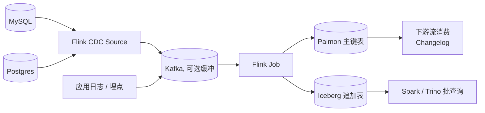

# 流式入湖

!!! info "机制深挖"
    [CDC 内部原理](../pipelines/cdc-internals.md)（Debezium / Flink CDC / Paimon CDC）· [Pipeline 韧性](../pipelines/pipeline-resilience.md)（exactly-once / 回填 / DLQ）· [Streaming Upsert / CDC](../lakehouse/streaming-upsert-cdc.md)（入湖 upsert 语义）· [Flink](../query-engines/flink.md)。

!!! tip "一句话场景"
    把**OLTP 业务库 / 日志 / 事件流**持续、低延迟地落到湖表，让后续的 BI / AI 负载从湖读到**准实时**的数据。

## 场景输入与输出

- **输入**：MySQL / PG / Mongo binlog、Kafka 事件、第三方 webhook
- **输出**：Iceberg / Paimon / Hudi / Delta 表，分钟级新鲜度，可被 Spark / Trino / Flink / DuckDB 读
- **SLO 典型**：
    - 端到端延迟 < 5 分钟（CDC）/ < 30 秒（事件流）
    - 语义：至少一次（幂等 sink）→ 事实上的 exactly-once
    - 吞吐：百万 event/min

## 架构总览

**两种目标表类型**：

- **Paimon / Hudi Primary Key 表** —— 承载 upsert 语义的 CDC 表
- **Iceberg append-only 表** —— 事件流 / 日志类场景

## 数据流拆解

### 1. Source 层

- **Flink CDC**：直接读 binlog / WAL / oplog；自带**全量 + 增量无缝切换**（2.0+）
- **Debezium + Kafka**：解耦模式，适合多消费者
- **日志 Agent → Kafka**：对日志类事件流

### 2. 解析与格式统一

- **Schema 统一**：上游不同表用 Avro / JSON schema registry 统一
- **字段裁剪**：只取下游需要的
- **PII 处理**：敏感字段在入湖前脱敏或加密

### 3. 幂等写入

每条消息带**稳定主键 + 版本号**。sink 侧按主键 upsert（Paimon / Hudi）或 append（Iceberg）：

- Flink checkpoint + 2PC sink → exactly-once 近似
- 或：at-least-once + 写入幂等

### 4. 小文件治理

流式写入的致命伤。三条线并行：

- **Sink 端 bundle**：Flink 按 checkpoint 凑一批再 commit
- **周期 Compaction** 作业并行跑
- 监控文件数告警

### 5. Schema Evolution 传播

上游加列，怎么流到下游？

- **CDC source 自动追踪** schema version
- **Paimon / Iceberg** 支持 **隐式加列**（带默认值）
- 破坏性变更（删列、改类型）要**人为审批**

## 推荐技术栈

| 节点 | 首选 | 备选 |
| --- | --- | --- |
| CDC 抽取 | Flink CDC 3.x | Debezium + Kafka Connect |
| 缓冲 | Kafka / Pulsar | 无（直连） |
| 计算 | Flink | Spark Structured Streaming |
| 目标表（upsert）| Paimon | Hudi MoR / Iceberg MoR |
| 目标表（追加）| Iceberg | Paimon append |
| Compaction | 独立 Flink / Spark 作业 | 引擎内置 |
| 监控 | Prometheus + Grafana | — |

## 失败模式与兜底

- **上游 binlog 过期** —— Flink CDC offset 丢失无法追赶。**兜底**：保留 binlog ≥ 任务最大落后时间 × 3
- **Schema 变更未兼容** —— Flink 作业 fail。**兜底**：schema registry + CI 校验
- **小文件失控** —— 查询性能崩溃。**兜底**：独立 compaction 作业健康度监控
- **Kafka 积压** —— 下游追不上。**兜底**：并行度动态扩 + 限速源端
- **重放事故** —— checkpoint 之外的重复数据。**兜底**：sink 幂等（以主键 + `_op_ts` 去重）

## 监控关键指标

- **端到端 lag**：原始事件时间 → 表 commit 时间
- **Kafka consumer offset lag**
- **每表 commit 频率 + 每 commit 小文件数**
- **Compaction 跟进情况**（commit 堆积与合并比）
- **DLQ（Dead Letter Queue）量**

## 工业案例 · 流式入湖场景切面

### LinkedIn · Kafka 全家桶

**核心做法**（见 [cases/linkedin §5.1](../cases/linkedin.md)）：
- **Kafka 作核心事件总线** · 所有服务"生产方只写一次 · 消费方订阅"
- **Brooklin** · 数据分发（Kafka → 其他系统）· 2017 开源
- **Samza → Flink**（2020+）· 流处理
- 规模：**7000+ Kafka brokers · 每日数百 PB 事件** `[量级参考]`

**启示**：Kafka 作"**公司统一事件总线**"是流式入湖的**基础范式** · 不要让每个业务自己造。

### 阿里巴巴 · Flink CDC + Kafka

**核心做法**（见 [cases/alibaba §5.2](../cases/alibaba.md)）：
- **Flink CDC**（阿里主导的开源贡献 · 2024+ 3.x 事实标准）
- OLTP（MySQL / PG / OceanBase）→ Flink CDC → Paimon
- 2024+ Fluss（流存储新思路 · 分析优化）探索

**启示**：**Flink CDC 是 CDC 的事实标准** · Paimon 作流式湖表底座 · 中国团队首选组合。

### 共同规律（事实观察）

- 流式入湖的**设计模式** = 生产方 Kafka 写 + 消费方订阅 + 流处理落湖
- CDC 是 OLTP 入湖的**核心能力**（Debezium / Flink CDC 是主流）
- 详见 [pipelines/kafka-ingestion](../pipelines/kafka-ingestion.md) · [pipelines/cdc-internals](../pipelines/cdc-internals.md)

---

## 相关

- [Streaming Upsert / CDC](../lakehouse/streaming-upsert-cdc.md)
- [Apache Paimon](../lakehouse/paimon.md)
- [Apache Flink](../query-engines/flink.md)
- [Compaction](../lakehouse/compaction.md)

## 数据来源

工业案例规模数字标 `[量级参考]`· 来源：LinkedIn Engineering Blog（Kafka / Brooklin 系列）· 阿里云官方博客。数字为公开披露范围内 · 未独立验证 · 仅作规模量级的参考。

## 延伸阅读

- Flink CDC 3.x docs: <https://flink.apache.org/>
- *Streaming Lakehouse with Paimon* 博客系列
- Debezium docs: <https://debezium.io/>
