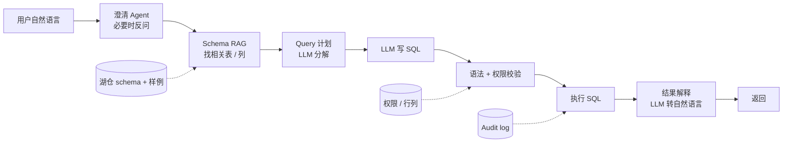

# Text-to-SQL 平台

!!! tip "一句话理解"
    让**业务人员用自然语言查询湖仓**。"给我看过去 30 天华北区 iPhone 销量"→ 系统自动写 SQL 并返回结果。2024-2025 年 LLM + Schema 理解 + 权限穿透 → 终于可用。**下一代 BI 的关键入口**。

!!! abstract "TL;DR"
    - **核心挑战**：**Schema 理解 · 列语义 · 多表 JOIN · 权限穿透 · 准确性评估**
    - **三大技术栈**：Vanna（开源 OSS）· LlamaIndex SQL · 自研（LLM + RAG over schema）
    - **准确性**：**不应该做 100%，应该做"高置信度 + 人工可纠错"**
    - **Benchmark**：Spider（学术 SOTA ~90%）· BIRD（工业 ~55%）
    - **工程护栏**：READ-ONLY + 超时 + 结果大小限制 + 审计
    - **价值关键**：**节省分析师时间**（业务自助），不是取代分析师

## 1. 业务图景

### 痛点

```
业务：我想看上周各区域 iPhone 15 Pro 销量
     ↓
无 Text-to-SQL 时：
     → 找分析师排期
     → 2 天后拿到数字
     → "能按天拆吗？"
     → 1 天后拿到
     → "能按店拆？"
     → ...
```

分析师 60%+ 时间做**重复 ad-hoc 查询**，业务等待 + 分析师疲惫双输。

### Text-to-SQL 的承诺

- 业务**自助**得到数字
- 分析师解放去做**深度分析**
- 数据**民主化**

### 现实约束

- **准确性**：随便写错 SQL = 业务看错数字 = 决策错误
- **权限**：不能让销售小哥查到 HR 薪资表
- **Schema 理解**：湖仓几千张表、上万列
- **上下文理解**："上周" = 周一到周日还是近 7 天？

## 2. 核心技术管线



### 五个关键环节

### 1 · Schema RAG（关键）

万张表 × 上万列不可能全部塞 Prompt。需要：
- **每张表 + 列描述做 embedding**
- **Query 来时检索 Top-K 相关表 / 列**
- **只塞相关 schema 到 LLM**

```python
# Schema chunk 例子
schema_doc = {
  "table": "prod.sales.orders",
  "description": "订单表，含用户下单 / 支付 / 物流记录",
  "columns": [
    {"name": "order_id", "type": "bigint", "desc": "订单唯一 ID"},
    {"name": "region", "type": "string", "desc": "华北/华东/华南等区域代码"},
    {"name": "product_id", "type": "bigint", "desc": "商品 ID，关联 products 表"},
    ...
  ],
  "sample_queries": [
    "SELECT region, SUM(amount) FROM prod.sales.orders WHERE ts >= ... GROUP BY region"
  ]
}
```

### 2 · 业务术语 / 同义词

- "华北" = 'north' / 'N'
- "去年" = 具体日期范围
- "iPhone 15 Pro" = product_name LIKE

**做法**：业务词典 + 示例 query 作为 few-shot context。

### 3 · Query 分解

复杂问题拆成多步：

```
Q: "对比华北和华南过去 30 天 iPhone 销量的环比变化"

Plan:
1. 近 30 天 华北 iPhone 销量
2. 近 30 天 华南 iPhone 销量
3. 前 30 天 华北 iPhone 销量（对比基线）
4. 前 30 天 华南 iPhone 销量
5. 计算环比
```

然后生成一条或多条 SQL。

### 4 · 权限穿透

- SQL 生成后**在用户 identity 下执行**
- 行级安全 / 列级安全自动生效
- 被过滤的数据不在结果中

### 5 · 结果展示

- **数字**：表格 / 图表
- **文本解释**："华北销量 1234 万，同比增长 +15%..."
- **可视化**：LLM 直接选图表类型 + 生成 Vega-Lite spec

## 3. 主流技术栈

### Vanna（开源 OSS）

- Python 库 + 简单 UI
- 内置 training pipeline（收集企业 SQL 示例训练）
- 支持主流向量库 + LLM
- 适合中小团队快速起步

### LlamaIndex SQL Query Engine

- LlamaIndex 家族的 SQL 模块
- **NLSQLRetriever + SQLTableRetrieverQueryEngine**
- 可以和其他 RAG 组件联动

### 自研（LLM + RAG over schema）

企业级最常见，通常包括：
- Schema 索引服务
- Prompt 工程 + few-shot
- 权限层（ACL 注入）
- 结果验证 + 缓存
- Feedback loop（错误回流训练）

### 商业产品

- **Databricks AI/BI Genie**
- **Snowflake Copilot**
- **Tableau GPT / Einstein**
- **DataHerald**
- **DataChat**

## 4. 准确性策略

### Benchmark 现状

| Benchmark | 数据 | SOTA |
|---|---|---|
| **Spider**（学术） | 学校 schema | ~90% |
| **BIRD**（工业） | 复杂真实 schema | ~55% |
| **WikiSQL**（简单）| 单表 | ~95% |

**工业现实**：**55-80% 一次正确**，所以必须有纠错机制。

### 准确性提升手段

| 手段 | 提升 |
|---|---|
| **业务词典**（术语表 + 同义词）| +10-15% |
| **Few-shot examples**（选几个典型）| +5-10% |
| **Schema description 详细**（列意义、范围）| +5-10% |
| **Query validation**（语法 + 逻辑检查）| +3-5% |
| **Query self-correction**（LLM 看错误重写）| +5-10% |
| **Re-ranking**（多个候选选最好）| +3-5% |

组合后可以从 baseline 55% 提升到 80%+。

### 当置信度不够

- **反问澄清**："你说的 iPhone 是 15 还是 16 系列？"
- **返回候选查询**："我理解的是 SQL A，也可能是 SQL B，你想要哪个？"
- **引导到分析师**：置信度太低时标记 "建议人工复核"

## 5. 权限与安全

### 必做

- **只读连接**（不允许 INSERT / UPDATE / DELETE）
- **查询超时**（30s）
- **结果大小限制**（1M 行）
- **敏感列过滤**（表级 / 列级权限透穿）
- **审计日志**（每次 Q + SQL + Result 记录）
- **Rate limit**

### 常见风险

- **SQL Injection**：LLM 生成的 SQL 不审查直接跑
  → 用 parameterized query / query AST 校验
- **数据泄露**：权限穿透没做好
  → 用户身份上下文一路保持
- **资源耗尽**：`SELECT * FROM ...` 扫全表
  → Query planner 预估代价、拒绝过大查询
- **Prompt Injection**：数据内容"导演" LLM 越权
  → Input 护栏 + sandbox execution

## 6. 典型管线（自研参考）

```python
class TextToSQLAgent:
    def __init__(self, vector_store, llm, catalog, executor):
        self.schema_rag = SchemaRAG(vector_store, catalog)
        self.llm = llm
        self.executor = executor
        self.validator = SQLValidator()

    def answer(self, user_query: str, user_id: str) -> Response:
        # 1. Schema 检索
        relevant_tables = self.schema_rag.retrieve(user_query, k=5)

        # 2. Prompt
        prompt = self.build_prompt(user_query, relevant_tables, examples=self.get_fewshot())

        # 3. LLM 生成 SQL
        sql = self.llm.generate(prompt)

        # 4. 校验
        if not self.validator.syntax_ok(sql):
            # self-correction: 让 LLM 修复
            sql = self.self_correct(sql, error=...)
        if not self.validator.read_only(sql):
            raise PermissionError("Write queries not allowed")

        # 5. 权限穿透执行
        result = self.executor.execute(sql, user_id=user_id, timeout=30)

        # 6. 结果解释
        explanation = self.llm.explain(user_query, sql, result)

        # 7. 审计
        self.audit_log(user_id, user_query, sql, result.meta)

        return Response(sql=sql, data=result, explanation=explanation)
```

## 7. 评估 / 运营

### 指标

- **Accuracy @ 1**（一次生成正确率）
- **Accuracy @ 3**（3 次候选有一个正确）
- **User Acceptance Rate**（用户是否采纳结果）
- **Self-correction 成功率**
- **平均 Token 成本**
- **Audit 异常数**

### 持续优化

- **Feedback Loop**：用户点"这个对" / "这个错" 收集
- **Error 聚类**：典型错误分类，针对性训练 / Prompt
- **新表 / 新列加入**：自动加入 Schema RAG
- **月度 Review**：Top 失败 query 人工修复、加 few-shot

## 8. 陷阱与反模式

- **追求 100% 准确**：达不到；**改为"高置信度 + 可审查"**
- **Schema 全塞 Prompt**：token 爆 + 精度降 → 必须 RAG
- **权限交给 LLM**：LLM 在 Prompt 里写"WHERE user=..." → 不可靠
- **没做 SQL 验证**：LLM 写的错 SQL 直接炸数据库
- **缓存太激进**：同样问题不同用户权限不同，答案必须不同
- **不做 feedback**：一次性系统，两个月后漂移
- **高并发没限流**：每个 query 都调 LLM + 跑 SQL，成本爆
- **无审计**：业务投诉"数字不对"查不到哪个 query 错

## 9. 可部署参考

- **[Vanna](https://github.com/vanna-ai/vanna)** —— 开源 Text-to-SQL 主流选项
- **[DataHerald](https://github.com/Dataherald/dataherald)** —— 开源 + 商业
- **[LlamaIndex SQL Query Engine](https://docs.llamaindex.ai/en/stable/module_guides/querying/structured_outputs/)**
- **[Dify](https://github.com/langgenius/dify)** —— 内置 Text-to-SQL 应用
- **[Text-to-SQL cookbook (OpenAI)](https://cookbook.openai.com/)**

## 10. 和其他场景的关系

- **vs [BI on Lake](bi-on-lake.md)**：Text-to-SQL 是 **BI 入口的自然语言升级**
- **vs [Agentic Workflows](agentic-workflows.md)**：Text-to-SQL 是 Agent 的一种 Tool
- **vs [RAG on Lake](rag-on-lake.md)**：共用 Schema RAG 技术

## 延伸阅读

- **[Spider dataset](https://yale-lily.github.io/spider)** · **[BIRD benchmark](https://bird-bench.github.io/)**
- *Retrieval-Augmented Generation for Text-to-SQL* (多篇 2023-2024 论文)
- **[Vanna 博客](https://vanna.ai/blog/)**
- Databricks AI/BI Genie 技术博客
- Pinterest / Netflix 内部 Text-to-SQL 系统分享

## 相关

- [业务场景全景](business-scenarios.md) · [BI on Lake](bi-on-lake.md) · [Agentic Workflows](agentic-workflows.md)
- [RAG](../ai-workloads/rag.md) · [MCP](../ai-workloads/mcp.md) · [向量数据库](../retrieval/vector-database.md)
- [BI × LLM](../bi-workloads/bi-plus-llm.md) · BI 视角的 LLM 入口 · 本页是场景编排对照
- [语义层](../bi-workloads/semantic-layer.md) · Text-to-SQL 经 SL 中介是 2026 主流路径
