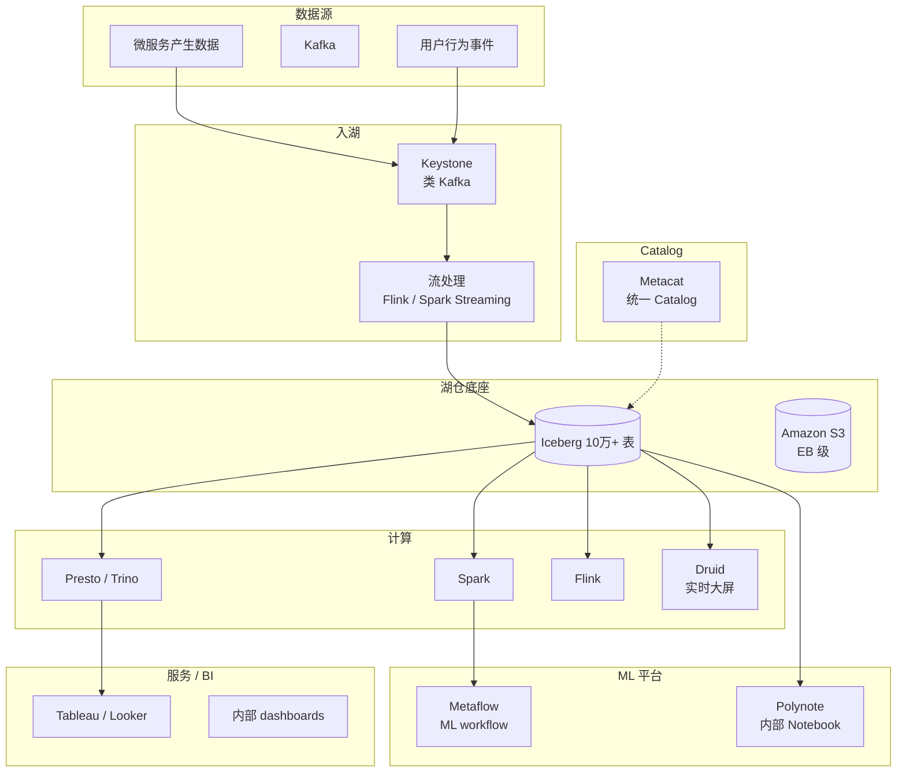

# 案例 · Netflix 数据平台

!!! tip "一句话定位"
    **Apache Iceberg 的创始地**。Netflix 2017 年启动 Iceberg 项目，彻底重构 Hive 时代的湖仓基础设施。今天的规模：**10+ 万张 Iceberg 表 · 最大 PB 级单表 · 每日查询 3M+**。全球数据工程最佳实践的灯塔。

!!! abstract "TL;DR"
    - **起因**：Hive Metastore 百万分区崩、schema 演化破数据
    - **创新**：**Iceberg**（2017）· **Metacat**（Catalog 统一）· **Genie**（Job Service）· **Maestro**（Scheduler）
    - **规模**：10 万+ tables · PB 级单表 · 数百 Spark 集群 · 自建 Trino
    - **开源贡献**：Iceberg · Metacat · Genie · DeltaConnectors
    - **给中国团队的启示**：**"从一张小表开始，先跑起来"**

## 1. 历史背景

### 2012-2016：Hive 时代的困境

Netflix 早期栈：
- HDFS（后来 S3）
- Hive Metastore + Hive
- Pig / MapReduce / Spark
- Presto（2015 年内部部署）

遇到的痛：
- HMS 单点 + 百万分区 → 查询 planning 分钟级
- Schema 演化手工乱改 → 历史数据错位
- 并发写同一分区 → 数据损坏
- 跨 region S3 → rename 不原子
- **用户抱怨**：分析师一个简单查询等 30 分钟

### 2017-2018：Iceberg 诞生

Ryan Blue（Netflix）团队提出：**把表 ACID 从 HMS 迁到对象存储 + metadata 文件**。

核心创新：
- Manifest 索引文件
- Snapshot 原子提交
- 列 ID（schema evolution）
- Hidden partitioning

2018 年贡献给 Apache。后来演化为**整个行业的湖表标准**。

## 2. 现今架构

## 3. 关键技术组件

### Metacat · 统一 Catalog

开源：[Netflix/metacat](https://github.com/Netflix/metacat)

- 联邦多种 metastore（Hive、Iceberg、RDS、Elasticsearch）
- 元数据统一查询 API
- 血缘追溯

### Genie · Job Service

[Netflix/genie](https://github.com/Netflix/genie)

- 提交 Spark / Hive / Presto / Pig 作业的统一 API
- 资源路由（按集群负载 / 权限）
- 作业历史追溯

### Maestro · Scheduler

2022 开源。替代 Airflow。

- 资产为中心（类似 Dagster 思想）
- 支持十万级每日作业
- 内部数据血缘集成

### Metaflow · ML Platform

[metaflow.org](https://metaflow.org/)

- Netflix 开源的 ML workflow 工具
- Python-first，无 DSL
- 自动版本化 + 云 / 本地统一
- **全公司 ML 团队标准**

## 4. Iceberg 在 Netflix 的规模

| 维度 | 量级 |
|---|---|
| Iceberg 表总数 | **10 万+** |
| 最大单表 | **PB 级** |
| 每日新增数据 | **PB 级** |
| 每日查询（Presto）| **3M+** |
| Spark 作业 | 数十万 / 天 |
| Schema Evolution 频率 | **日常** |
| Time Travel 使用 | **常规 debug 工具** |

### Iceberg 使用的典型模式

- **主键升级**：业务库 schema 变更 → Iceberg 表 alter column → **零停机**
- **大表重构**：改分区策略，**不改历史数据**
- **批 + 流并存**：同一张表批作业夜间重写 / 流作业持续追加
- **审计与回滚**：生产事故后 `CALL rollback_to_snapshot`

## 5. 从中学到的（对中国团队的启示）

### 启示 1 · "从一张小表开始"

Netflix 不是一天切到 Iceberg。**2017 年第一张 Iceberg 表只有几 GB**，然后逐步迁移。

对应中国团队：**别一次性推 PB 级迁**，**先挑一张痛点表**（比如"最近 schema 演化出事过的"）试点。

### 启示 2 · 治理先于技术

Metacat 的意义不在技术，**在"全公司一个 Catalog"的组织共识**。没有这个共识，工具再好也乱。

### 启示 3 · 开源贡献即招聘广告

Netflix 开源 Iceberg / Metaflow 不是公益，是**建立技术权威 → 吸引顶尖工程师**。值得中国大厂学。

### 启示 4 · Self-Service 工具 > 集中化服务

Genie / Maestro / Metaflow 本质都是 **"让数据工程师自己来"**。中心团队做**平台**而非**服务台**。

### 启示 5 · 持续开源生态投入

Iceberg spec 持续演进（v1 → v2 → v3）靠 Netflix + Apple + LinkedIn + Databricks 持续投入。中国团队**消费开源** + **贡献开源**是长期策略。

## 6. 失败的尝试（重要）

- **早期 Kafka 入湖方案**：自建多轮失败，最后收敛到 Iceberg + CDC
- **Druid 扩展**：尝试自研 Pinot 替代，没成功，回到 Druid
- **自研 Scheduler**：Maestro 花了 3 年迭代

**教训**：大公司也会走弯路；关键是**敢开源 + 敢承认失败**。

## 7. 技术博客系列（必读）

- **[Iceberg 系列](https://netflixtechblog.com/tagged/iceberg)** —— 原理 + 迁移故事
- **[Metacat](https://netflixtechblog.com/metacat-making-big-data-discoverable-and-meaningful-at-netflix-56fb36a53520)**
- **[Metaflow](https://netflixtechblog.com/open-sourcing-metaflow-a-human-centric-framework-for-data-science-fa72e04a5d9)**
- **[*Data Mesh Platform* Philosophy](https://netflixtechblog.com/)** （搜索 data mesh）
- **[Studio Data Engineering](https://netflixtechblog.com/)** —— Netflix 制作端数据
- **[Keystone 流平台](https://netflixtechblog.com/evolution-of-the-netflix-data-pipeline-da246ca36905)**

## 8. 教训总结 · 给团队的清单

- [ ] **先做"统一 Catalog"的组织共识**，再选技术
- [ ] **Iceberg 从一张表试点**
- [ ] **Self-service 工具**（我们的 Genie 是什么？）
- [ ] **血缘 Day 1 做**（Metacat 起始于此）
- [ ] **开源贡献是长期策略**，不是一次性 PR
- [ ] **Model Registry + ML Platform** 像 Metaflow 一样"以人为本"

## 相关

- [Iceberg](../lakehouse/iceberg.md) —— Netflix 创造的协议
- [案例拆解（全家公司）](case-studies.md)
- [案例 · LinkedIn](case-linkedin.md) · [案例 · Uber](case-uber.md)
- [湖表](../lakehouse/lake-table.md) · [三代数据系统演进史](../foundations/data-systems-evolution.md)
