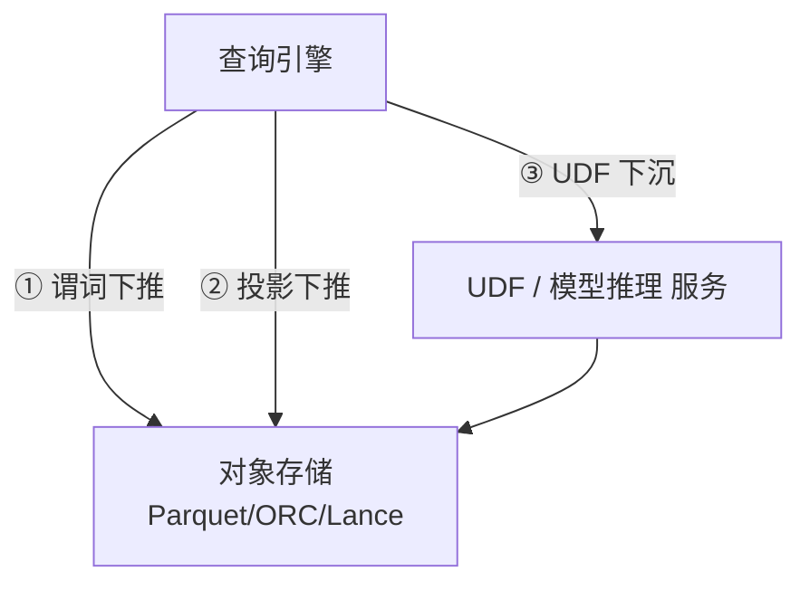

# Compute Pushdown（计算下沉到湖）

!!! tip "一句话理解"
    把**过滤 / 投影 / 函数调用 / 模型推理**等计算下沉到靠近数据的地方——数据文件格式层（谓词下推）、存储节点（Push to storage）、或湖上 UDF / 模型。**目的是搬数据少、搬计算多**。

## 三层下沉



### 层 1：谓词 / 投影下推到文件格式

这是免费的加速。任何现代湖上引擎都会做：

- **谓词下推**（predicate pushdown）：`WHERE ts > '2026-04-01'` 推到 Parquet footer 的 min/max 检查
- **投影下推**（projection pushdown）：`SELECT a, b` 只读 a、b 列的 chunk

见 [谓词下推](../query-engines/predicate-pushdown.md) 专页。

### 层 2：存储端执行（S3 Select / 分布式存储层）

让**存储节点**执行部分 SQL，只把结果回传：

- **S3 Select / S3 Object Lambda** —— 云存储原生的 SQL 下推
- **Alluxio Policy** —— 缓存层的谓词执行
- **Iceberg Puffin stats** —— 让 Catalog 层直接回答 `SELECT count(*)` 这类元数据级查询

## 层 3：UDF / 模型推理下沉到湖

**这是"一体化湖仓"时代的新型态**，也是本页的重点。

### 为什么要下沉模型推理

传统做法：把湖上数据导出 → 调模型服务 → 写回结果。痛点：

- 数据搬运成本高
- ETL 和推理割裂，难以和 SQL 组合查询
- 无法"一条 SQL 里调 LLM / Embedding"

**Compute pushdown 视角**：把模型当 UDF 部署在湖的计算侧，SQL 里直接调：

```sql
SELECT asset_id,
       describe_image(raw_uri) AS caption,
       embed(describe_image(raw_uri)) AS text_vec
FROM multimodal_assets
WHERE caption IS NULL;
```

`describe_image` 是调 VLM 的 UDF，`embed` 是调 embedding 模型的 UDF。引擎负责批处理 + 并行 + 故障恢复。

### 落地方案

| 方案 | 说明 | 适用 |
| --- | --- | --- |
| **Spark Python UDF + Ray** | Spark 调用，Ray 做模型服务 | 批推理，GPU 可扩 |
| **Spark Pandas UDF** | 向量化 Python UDF | 纯 Python 推理场景 |
| **DuckDB 扩展 / UDF** | 进程内推理 | 小批 / 本地开发 |
| **Trino Python UDF**（新） | Trino 集成 Python runtime | 交互查询内的轻推理 |
| **自建 SQL 层 + 模型 gateway** | SQL AST 识别 UDF 自动路由 | 企业级方案 |

### 批 vs 流

- **批推理下沉**：一次扫一批大文件，GPU 吃满
- **流式下沉**：CDC 到一条更新一条；适合 Paimon + 自定义 sink

## 四条值得追的下沉线

1. **Iceberg Puffin 里放索引** → 让"近邻查询"成为引擎的一等算子
2. **标准化 Vector UDF**（SQL 层）→ 让 `vec_distance`、`embed`、`rerank` 跨引擎可移植
3. **LLM as UDF** → `GPT(x)` 成为 SQL 表达式
4. **多模 UDF**（`describe(img)` / `transcribe(audio)`）的批量异构算子

## 陷阱

- **模型版本漂移**：UDF 依赖的模型版本在湖上必须可追溯；建议表里记 `model_version`
- **回填成本**：一次模型升级意味着对所有行重跑 UDF
- **幂等**：同一行同一模型重跑要得到同样结果
- **GPU 资源**：SQL 级并行度不等于 GPU 可扩 —— 需要 Ray / 托管模型服务做资源池

## 相关

- [谓词下推](../query-engines/predicate-pushdown.md)
- [Lake + Vector 融合架构](lake-plus-vector.md)
- [Embedding 流水线](../ml-infra/embedding-pipelines.md)
- [Feature Store](../ml-infra/feature-store.md)

## 延伸阅读

- *Ray + Spark for Scalable AI on Lakehouse*（Databricks / Anyscale 博客）
- *Functions in Data Platforms: From UDF to Remote Inference*（SIGMOD 2024 综述方向）
