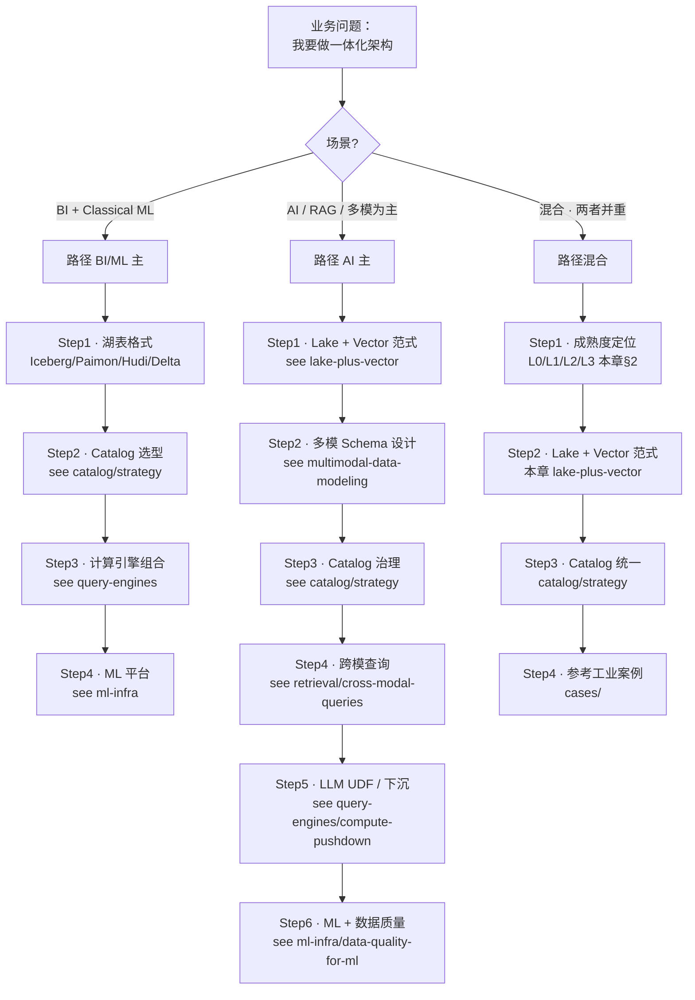
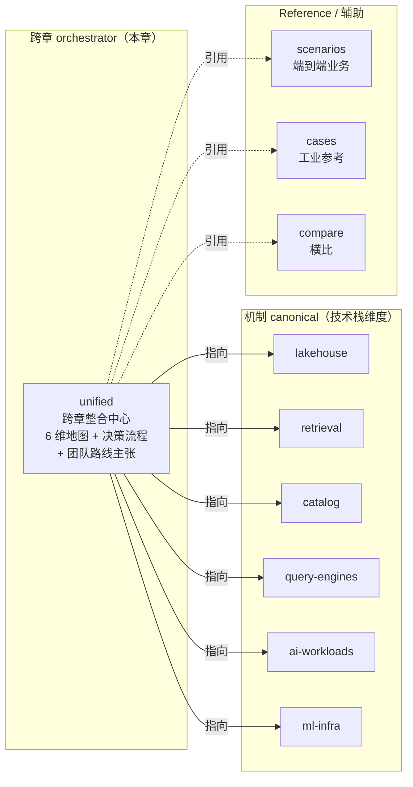

# 一体化架构 · 跨章整合决策中心

!!! info "本章为什么只有 3 页 · 这是 feature 不是 bug"
    本章按 [ADR-0006 §章节归属规则](../adr/0006-chapter-structure-dimensions.md) **极严格**约束：每次新增必须验证"≥5 个单章都无法单独承载"才放这里。
    
    2026-Q2 S29 治理后从 10 页精简到 3 页 —— **窄是设计成果**：避免与机制 canonical 打架。如果你期待这里有"湖表细节 / Catalog 选型 / 检索算法"，请去对应技术栈章；本章只做**跨章 orchestrator**（地图 + 决策流程 + 团队主张）。

!!! tip "一句话定位"
    **跨章整合决策中心**。"一体化架构"是**跨章节概念** · 不在单一技术栈章 · 需要**跨章 orchestrator**。本章 = 6 维整合地图 + 成熟度模型 + 决策流程 + 团队"多模一体化湖仓"路线主张（和客观知识**分层**标注）。

!!! warning "读前必读 · 本章的三类内容是分层的"
    读者常见困惑："这是客观事实还是团队观点"。本章**明确分层**：
    
    1. **客观知识**（三类整合范式 / 成熟度分级 / 跨章 canonical 地图）—— 行业共识 · 带来源 · 可被独立引用
    2. **决策框架**（如何在范式间选择 / 如何跨章决策）—— 有观点但可辩 · 有适用边界
    3. **团队路线主张**（"我们推荐走湖 + 向量一体化"）—— 明确是**观点** · 不是唯一答案
    
    页内会用 admonition 标注每段性质。不认可团队主张可只读前两类。

!!! abstract "TL;DR"
    - **一体化不是单一概念** · 至少 **6 个整合维度**：数据 / Catalog / 计算 / 查询 / ML / 运维
    - 本章**自己只深讲两维**（数据 · 多模 schema）· 其余 4 维 **canonical 在各章**
    - **成熟度 L0-L3** 帮你判断团队当前所处阶段 · 决定**投入什么 · 不投入什么**
    - **跨章决策流程**（Mermaid）· 业务问题 → 各章 canonical 入口
    - **团队路线主张**（独立节 · 标注观点性）：推荐多模一体化湖仓路线 · 适用于 BI + AI 并存场景
    - **核心 2 页**：[lake-plus-vector](lake-plus-vector.md)（融合范式）· [multimodal-data-modeling](multimodal-data-modeling.md)（多模 schema）

## 1. 一体化 ≠ 单一维度 · 6 维整合地图

"一体化架构"最容易被误解的一点：**把它等同于"Lake + Vector 融合"**。这只是 6 个整合维度之一。

### 6 个整合维度

| # | 维度 | 典型问题 | **Canonical 章** | 关键页 |
|---|---|---|---|---|
| 1 | **数据整合**（湖 + 向量 + 多模）| 向量放湖表还是独立库？Puffin / Lance / 外部怎么选？ | **本章** | [lake-plus-vector](lake-plus-vector.md) |
| 2 | **多模 Schema 整合** | 一张表怎么承载图/文/音+多向量？元数据怎么设？ | **本章** | [multimodal-data-modeling](multimodal-data-modeling.md) |
| 3 | **Catalog / 治理整合** | Catalog 选谁？多模资产怎么管？权限跨 BI+AI？ | [catalog/](../catalog/index.md) | [catalog/strategy](../catalog/strategy.md) |
| 4 | **计算整合**（下沉 + 多引擎） | SQL 里直接调 LLM / Embedding？多引擎共享 Catalog？ | [query-engines/](../query-engines/index.md) | [compute-pushdown](../query-engines/compute-pushdown.md) · [predicate-pushdown](../query-engines/predicate-pushdown.md) |
| 5 | **查询语义整合**（跨模态 / Hybrid） | 一条 SQL 做结构化过滤 + 向量 + 跨模？ | [retrieval/](../retrieval/index.md) | [cross-modal-queries](../retrieval/cross-modal-queries.md) · [hybrid-search](../retrieval/hybrid-search.md) |
| 6 | **ML / 运维整合** | 训推一致？模型治理 + 数据治理一套？跨 BI + AI 监控？ | [ml-infra/](../ml-infra/index.md) | [mlops-lifecycle](../ml-infra/mlops-lifecycle.md) · [feature-store](../ml-infra/feature-store.md) · [model-monitoring](../ml-infra/model-monitoring.md) |

!!! note "客观知识 · 非观点"
    以上 6 维划分是**行业观察** · 非团队主张。Databricks / Snowflake / Netflix / LinkedIn / Uber 等工业案例（见 [cases/](../cases/index.md)）在这 6 维上各有取舍。

### 为什么 unified/ 自己只讲 2 维

- **维度 1 + 2**（数据整合 + 多模 Schema）是**跨章组合视角本身** · 没有单章能独立承担
- **维度 3-6** 在各技术栈章已有深厚机制 canonical · unified/ 重写会造成 canonical 打架（S29 前的问题）
- **本章角色** = 跨维整合地图 + 跨章决策 orchestrator · 不是把各章内容搬进来

## 2. 一体化成熟度模型 L0-L3 · 判断你处于哪一阶段

!!! note "客观分级 · 非观点"
    成熟度模型是**工程阶段描述** · 不代表"越高越好"。多数团队在 L1 或 L2 最优 · 未必需要走到 L3。

### L0 · 独立烟囱（多数团队起点）

```
数据：MySQL / PG / 数仓     向量：Milvus / Qdrant    模型：MLflow / HF
Catalog：HMS / 无         计算：Spark + Python + 业务脚本
```

- **特征**：每类资产各自系统 · ETL 搬运为主
- **适合**：规模小 · 场景单一 · 团队 < 5 人
- **代价**：双写一致性 / 权限割裂 / 血缘断链

### L1 · 湖仓统一 + 向量独立（常见稳态）

```
数据：Iceberg / Paimon / Delta 统一     向量：独立 Milvus / Qdrant
Catalog：HMS / Polaris / UC       计算：Spark / Trino 多引擎
模型：MLflow / UC Models          治理：逐步统一
```

- **特征**：**数据层一体化**但向量独立 · Catalog 统一中
- **适合**：BI 主 · AI 辅 · 中等规模
- **工业案例**：Netflix / LinkedIn（见 [cases/](../cases/index.md)）
- **这是 2024-2026 最常见的工业稳态 · 不必强行升 L2**

### L2 · Catalog 统一治理平面（推荐目标）

```
数据：Iceberg + 向量（可外可内）    Catalog：UC / Polaris 统一治理
    + 模型 + Volume + Function 在同一 Catalog 下
RBAC / 血缘 / 审计：一套
```

- **特征**：**治理一体化** · 数据可物理分离但逻辑统一
- **适合**：BI + AI 并存 · 合规要求强 · 团队 > 10 人
- **工业案例**：Databricks（UC）· Snowflake（Polaris）
- **这是本 wiki 的推荐目标** · 大多数"一体化"价值在这一级就拿到了

### L3 · 湖 + 向量原生一体化（前沿）

```
向量索引：湖原生（Iceberg Puffin / Lance）· 不再独立向量库
模型权重：作 Iceberg / UC 一等公民
推理日志：回写湖 · 作下一轮训练数据源
```

- **特征**：**物理一体化** · 零 ETL · 湖本身就是 AI 的运行时
- **适合**：多模场景极重 · 工程能力强 · 可承担前沿探索成本
- **工业案例**：Databricks MosaicML + Delta · 内部早期方案
- **不是所有团队都该追求 L3** · 多数 L2 已经够用

!!! tip "选择 L2 还是 L3 · 决策要点"
    **L3 的代价**：Puffin / Lance 生态新 · 工程成本高 · 需要定制化运维。**L2 的成本**：治理层一次性投入 · 收益持续。除非你是**多模场景主线**（图像 / 视频 / 大规模多模 RAG）· L2 更经济。

## 3. 跨章整合决策流程（orchestrator）

一个业务问题进来 · 怎么一路走到各章 canonical？



**使用方式**：
1. 从**业务问题**起点切入
2. 按**场景分支**选路径
3. 每 Step 指向一个**canonical 页** · 深入该页
4. 做完 Step · 回来对照**整合地图**（§1）检查是否覆盖全部相关维度

## 4. 跨章 Canonical 地图（权威归属表）

**"我该去哪里找答案"——按问题类型查**：

| 问题类型 | 权威 canonical | 本章有什么 |
|---|---|---|
| **湖 + 向量三种融合范式怎么选** | [lake-plus-vector](lake-plus-vector.md)（本章）| ✅ |
| **多模表 schema 7 类字段怎么设** | [multimodal-data-modeling](multimodal-data-modeling.md)（本章）| ✅ |
| **Catalog 选 Unity / Polaris / Nessie / Gravitino** | [catalog/strategy](../catalog/strategy.md) | 指向 |
| **多模检索架构模式（6 种）** | [retrieval/multimodal-retrieval-patterns](../retrieval/multimodal-retrieval-patterns.md) | 指向 |
| **一条 SQL 做跨模态查询** | [retrieval/cross-modal-queries](../retrieval/cross-modal-queries.md) | 指向 |
| **SQL LLM UDF / Compute 下沉** | [query-engines/compute-pushdown](../query-engines/compute-pushdown.md) | 指向 |
| **Feature Store × Agent** | [ml-infra/feature-store §6.6](../ml-infra/feature-store.md) | 指向 |
| **ML 平台 13 页闭环** | [ml-infra/](../ml-infra/index.md) | 指向 |
| **LLM 应用（RAG / Agent / Prompt）** | [ai-workloads/](../ai-workloads/index.md) | 指向 |
| **端到端业务场景（推荐 / 风控 / RAG）** | [scenarios/](../scenarios/index.md) | 指向 |
| **Netflix / LinkedIn / Uber 工业案例** | [cases/](../cases/index.md) | 指向 |
| **Embedding 模型横比 / 向量库横比** | [compare/](../compare/index.md) | 指向 |

!!! info "本章的 SSOT 范围（很窄但清晰）"
    本章**只对 2 个问题作 canonical**（§4 表前 2 行）· 其余 **9 类问题的权威在各章**。这是 S29-S30 治理后的精确定位 · 避免顶层答案分散问题。

## 5. 团队路线主张 · "多模一体化湖仓"

!!! warning "以下是主张 · 不是客观知识"
    本节**明确标注观点性**。不认同可以跳过 · 不影响读前 4 节的客观知识。

### 5.1 主张

**对于"BI + AI 并存的中大型团队"· 我们推荐走多模一体化湖仓路线**：

1. **数据底座**：Iceberg 作主表格式（[ADR-0002](../adr/0002-iceberg-as-primary-table-format.md)）· Paimon 辅（流重场景）
2. **向量层**：LanceDB 为多模主向量（[ADR-0003](../adr/0003-lancedb-for-multimodal-vectors.md)）· Milvus 辅（大规模高 QPS 向量服务）
3. **Catalog**：L2 治理一体化 · Unity Catalog OSS 或 Polaris 根据团队
4. **计算**：Spark（批 / 训练）+ Trino（交互）+ Flink（流）· SQL LLM UDF 逐步引入
5. **ML 平台**：Feature Store + MLflow + 统一 Model Registry
6. **AI 应用**：RAG + Agent + LLM Inference + Guardrails 分层（[ai-workloads/](../ai-workloads/index.md)）

### 5.2 主张的前提和边界

- **前提**：团队同时做 BI + AI · 且多模场景（图 / 视频 / 音频 / 长文）是业务主线之一
- **不适用**：
  - 纯 BI 团队（多模一体化投入回不来 · 老老实实 Iceberg + dbt）
  - 纯 LLM 应用团队（数据层轻 · 直接用 HF + S3 + MLflow 简单栈更合适）
  - 纯 Classical ML 训练团队（见 [ml-infra/](../ml-infra/index.md) · 推荐系统 / 风控场景的经典栈）
  - 规模 < 5 模型 · 工程能力 < 2 平台人（先做 L0 → L1 过渡 · 不要跳到 L2）

### 5.3 主张的辩证承认

- **不是最优解 · 是可接受解**：这条路线在 2026 当下是"多数场景较优" · 但不保证 3 年后仍最优
- **会有阵痛**：L0 / L1 → L2 的迁移要 6-12 月 · 投入可观
- **替代方案**：纯 Databricks 一体化栈 · 纯 Snowflake + Cortex 栈 · 都是有效路径
- **应持续 review**：见 [ADR 0007 版本刷新 SOP](../adr/0007-version-refresh-sop.md) · 每季度审视主张有效性

## 6. 本章核心页指南

### [Lake + Vector 融合架构](lake-plus-vector.md)

**跨 lakehouse + retrieval + catalog 的 3 范式选型**（维度 1）：
- 范式 A · 向量下沉到湖表（Iceberg + Puffin）
- 范式 B · 多模原生湖表格式（Lance / LanceDB）
- 范式 C · 独立向量库 + Catalog 统一（Milvus / Qdrant + UC / Polaris）
- 客观三范式对比 + 团队推荐决策树

### [多模数据建模](multimodal-data-modeling.md)

**跨 lakehouse + retrieval 的多模表 schema**（维度 2）：
- 客观 3 条原则（二进制不进表 / 向量列按用途分列 / 元数据一等公民）
- 团队推荐 7 类字段模板
- 演化场景（新模态 / 换模型 / 新字段）

## 7. 角色速查

| 角色 | 首读路径 |
|---|---|
| **架构师 / CTO / Platform Lead** | §2 成熟度 → §3 决策流程 → §4 Canonical 地图 → §5 团队主张 |
| **做技术选型的工程师** | §3 流程 → [lake-plus-vector](lake-plus-vector.md) → [catalog/strategy](../catalog/strategy.md) |
| **多模 / RAG 项目的建模** | [multimodal-data-modeling](multimodal-data-modeling.md) → [retrieval/cross-modal-queries](../retrieval/cross-modal-queries.md) → [ai-workloads/rag](../ai-workloads/rag.md) |
| **研究业界做法** | §4 地图中的 cases 项 → [cases/](../cases/index.md) |
| **辩论路线选择的同学** | §5 团队主张（连带边界和辩证承认） |

## 8. 和其他参考章的关系



## 9. 团队决策 · ADR 指向

- [ADR-0002 选择 Iceberg 作为主表格式](../adr/0002-iceberg-as-primary-table-format.md)
- [ADR-0003 多模向量存储选 LanceDB](../adr/0003-lancedb-for-multimodal-vectors.md)
- [ADR-0004 Catalog 选型](../adr/0004-catalog-choice.md)
- [ADR-0005 引擎组合](../adr/0005-engine-combination.md)
- [ADR-0006 章节结构与维度划分](../adr/0006-chapter-structure-dimensions.md)
- [ADR-0007 版本刷新 SOP](../adr/0007-version-refresh-sop.md)
- [ADR-0008 对抗评审 SOP](../adr/0008-adversarial-review-sop.md)

## 10. 进一步资源

- **实践参考**：[cases/](../cases/index.md) —— Netflix / LinkedIn / Uber / 六家综述
- **业务落地**：[scenarios/rag-on-lake](../scenarios/rag-on-lake.md) · [scenarios/multimodal-search-pipeline](../scenarios/multimodal-search-pipeline.md)
- **新方向跟踪**：[Iceberg v3](../lakehouse/iceberg-v3.md) · [Vendor Landscape](../vendor-landscape.md) · [Embedding](../retrieval/embedding.md)
- **版本 / 数字基线**：[benchmarks](../benchmarks.md)
