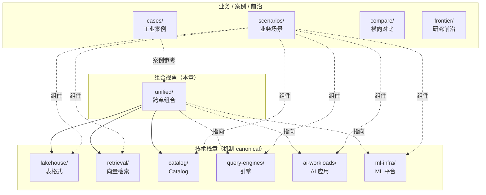

# 一体化架构 · 跨章组合视角

!!! tip "一句话定位"
    **跨章节"组合决策"视角章**——讲"**多个技术栈章节如何组合成一个一体化湖仓**"。**不复述**单项机制（那在对应技术栈章）· **专做**跨章组合选型和团队路线主张。

!!! warning "本章和其他章的明确分工"
    2026-Q2 章节重组（S29）后本章精简为**纯"组合视角"**：
    
    - **Catalog 选型决策** → [catalog/strategy.md](../catalog/strategy.md)（原 unified/unified-catalog-strategy 迁入）
    - **跨模态查询 SQL 语义** → [retrieval/cross-modal-queries.md](../retrieval/cross-modal-queries.md)（原 unified/cross-modal-queries 迁入）
    - **Compute Pushdown / UDF 下沉** → [query-engines/compute-pushdown.md](../query-engines/compute-pushdown.md)（原 unified/compute-pushdown 迁入）
    - **工业案例参考**（Netflix / LinkedIn / Uber / 综述）→ [cases/](../cases/index.md)（原 unified/case-* 迁入）
    
    **本章保留**：2 页真·跨章组合视角 + 本 index。

!!! abstract "TL;DR"
    - **`lake-plus-vector.md`**：三种融合范式（Iceberg + Puffin · Lance / LanceDB · 独立向量库 + Catalog 统一）—— 跨 lakehouse + retrieval + catalog 的组合选型
    - **`multimodal-data-modeling.md`**：多模表 schema（结构化 + 非结构化指针 + 多向量列 + 元数据）—— 跨 lakehouse + retrieval 的表设计
    - **本章不复述单产品** · 产品机制去对应章
    - **本章承载团队"多模一体化湖仓"路线主张** · 是有观点的章节

## 为什么需要这一章

单一技术栈章无法回答的问题：

- "Iceberg + Vector + Catalog + UDF 怎么组合成一套栈？"
- "湖仓一体化三种路线（Puffin / Lance / Catalog 联邦）怎么选？"
- "多模表 schema 怎么设计才同时对 BI 和 AI 友好？"

这些本质是**组合决策** · 每个都跨 2-3 个技术栈章 · 任何单章都不适合承载。本章就是为这种问题存在的。

## 本章 2 个核心页面

### [Lake + Vector 融合架构](lake-plus-vector.md)

**三种融合范式对比 + 选型决策矩阵**：
- 范式 A · 向量下沉到湖表（Iceberg + Puffin）
- 范式 B · 多模原生湖表格式（Lance / LanceDB）
- 范式 C · 独立向量库 + Catalog 统一（Milvus / Qdrant + Unity / Polaris / Gravitino）

**不讲**单产品细节（去 lakehouse/puffin · foundations/lance-format · retrieval/vector-database · catalog/strategy）· **讲**"三种路线怎么选 · 什么时候组合"。

### [多模数据建模](multimodal-data-modeling.md)

**一张湖表同时承载结构化 + 非结构化指针 + 多向量列 + 元数据**的 schema 设计：
- 三条原则：二进制不进表 / 向量列按用途分列 / 元数据一等公民
- 7 类字段模板（标识 / 模态标签 / 资产指针 / 文字侧 / 向量列 / 业务治理 / 分区）
- 演化场景（新增模态 / 换模型 / 新字段）

**不讲**具体 embedding 模型选型（去 retrieval/embedding · retrieval/multimodal-embedding）· **讲**"跨 BI + AI 的表 schema 设计"。

## 和相邻章节的关系

### 和 `scenarios/` 的分工

| | 本章 unified | scenarios |
|---|---|---|
| **视角** | 架构 / 技术栈组合 | 业务端到端 |
| **典型问题** | "湖 + Vector + Catalog 怎么组合" | "推荐系统 / 风控 / RAG 怎么做" |
| **组成** | 跨 2-3 技术栈的选型决策 | 多机制编排成业务方案 |

### 和 `compare/` 的分工

| | 本章 unified | compare |
|---|---|---|
| **视角** | 跨章组合 + 路线主张 | 单类产品横比 |
| **典型页** | "三种融合范式" | "Iceberg vs Paimon vs Hudi vs Delta" |

### 和 `cases/` 的分工

| | 本章 unified | cases |
|---|---|---|
| **视角** | "我们**应该**怎么组合" | "别人怎么做 · 规模多大" |
| **性质** | concept · 架构决策 | reference · 工业案例 |

## 团队决策 · ADR 指向

- [ADR-0002 选择 Iceberg 作为主表格式](../adr/0002-iceberg-as-primary-table-format.md)
- [ADR-0003 多模向量存储选 LanceDB](../adr/0003-lancedb-for-multimodal-vectors.md)
- [ADR-0006 章节结构与维度划分](../adr/0006-chapter-structure-dimensions.md)

## 角色速查

| 角色 | 首读路径 |
|---|---|
| **架构师 / 平台 Lead** | lake-plus-vector → multimodal-data-modeling → [catalog/strategy](../catalog/strategy.md) → [cases/](../cases/index.md) |
| **新项目启动前做技术选型** | lake-plus-vector（三范式决策）→ [catalog/strategy](../catalog/strategy.md)（catalog 选型）→ [cases/](../cases/index.md)（参考别家） |
| **多模 / RAG 项目的建模** | multimodal-data-modeling → [retrieval/cross-modal-queries](../retrieval/cross-modal-queries.md) → [ai-workloads/rag](../ai-workloads/rag.md) |
| **Compute / AI UDF 方向** | [query-engines/compute-pushdown](../query-engines/compute-pushdown.md) → [ml-infra/embedding-pipelines](../ml-infra/embedding-pipelines.md) |

## 相关

- 底座：[湖表](../lakehouse/lake-table.md) · [向量数据库](../retrieval/vector-database.md) · [Catalog 策略](../catalog/strategy.md)
- 应用：[RAG on Lake](../scenarios/rag-on-lake.md) · [多模检索流水线](../scenarios/multimodal-search-pipeline.md)
- 引擎：[Compute Pushdown](../query-engines/compute-pushdown.md) · [跨模态查询](../retrieval/cross-modal-queries.md)
- 案例：[工业案例 · Netflix · LinkedIn · Uber](../cases/index.md)
- 前沿：[Iceberg v3 预览](../frontier/iceberg-v3-preview.md) · [Vendor Landscape](../frontier/vendor-landscape.md)
