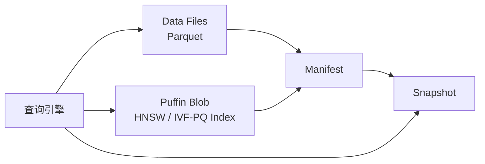
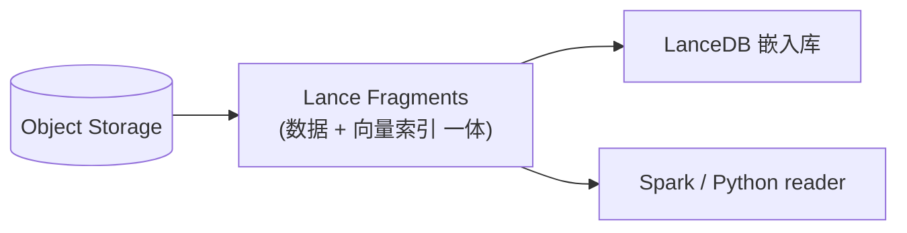
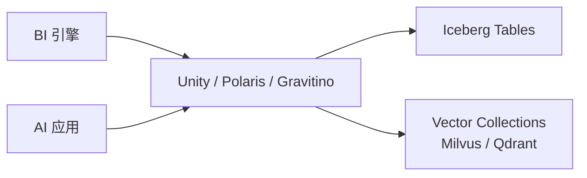

# Lake + Vector 融合架构

!!! tip "一句话理解"
    让**结构化表、非结构化资产（图/音/视/文）、向量索引**都住在同一个湖仓底座上，由同一套 Catalog 治理、被同一套引擎读。这是团队"多模一体化湖仓"路线的技术主线。

## 为什么一体化

把 BI 和 AI 跑在不同系统上，是过去十年的默认做法；但随着 AI 负载频繁触碰湖上的原始数据，**两个世界互相"ETL 过来、ETL 过去"的成本变成最大摩擦**：

- 原始文档在湖，embedding 另建独立向量库 → **双写 + 一致性风险**
- AI 模型需要训练集 ↔ 训练集本来就在湖 → **为啥要走 DB**
- 检索增强生成（RAG）的语料就是 BI 事实表的一部分 → **为啥要跨系统**

Lake + Vector 的主张是：**别搬家，让湖支持向量就地检索**。

## 三种落地范式

{ loading=lazy }
{ loading=lazy }

### 范式 A：向量下沉到湖表（Iceberg + Puffin）

Iceberg 把**辅助索引**（含 HNSW / IVF-PQ 向量索引）放进 Puffin 侧车文件，和 Parquet 数据文件并列、被同一 Manifest 引用。读端引擎认识 Puffin blob 就能直接做 ANN，不需要独立向量服务。

- **优点**：保持 Iceberg 生态（所有引擎都能读），索引和数据同表演化
- **状态**：Puffin 容器标准已稳定，向量索引 blob 类型在社区化

Mermaid 文本版本

### 范式 B：多模原生湖表格式（Lance / LanceDB）

Lance 从零为"多模 + 向量 + 随机访问"设计：**数据、向量索引、版本元数据**三位一体封在同一组 Fragment 里。LanceDB 作为嵌入式库直接打开对象存储；Spark / Ray 也能读同一份 Fragment 做批处理和训练。

- **优点**：为向量 + ML 训练原生设计，随机访问、向量索引、零拷贝更新
- **代价**：生态比 Parquet 新

Mermaid 文本版本

### 范式 C：独立向量库 + Catalog 统一

保留已有 Milvus / Qdrant 作为向量层（大规模 + 高 QPS 强项），但用 Unity / Polaris / Gravitino **统一 Catalog 把 Iceberg 表和向量 Collection 管进同一套治理视图**（权限、血缘、发现）。

- **优点**：继续用成熟向量库能力（分布式、高 QPS）
- **代价**：仍是两套存储，Catalog 只是"把它们对齐"

Mermaid 文本版本

## 怎么选

| 你的情况 | 推荐范式 |
| --- | --- |
| 以 Iceberg 为事实表，向量规模 ≤ 千万，想最少系统 | **A（Puffin）** |
| 多模资产多、训练任务重、向量规模亿级 | **B（Lance / LanceDB）** |
| 已经在跑 Milvus / Qdrant、规模大、不想动 | **C（Catalog 统一）** |

三种不互斥 —— 一家公司可以 A + C 并存：高频小向量表用 Puffin，大型多模向量用独立向量库，通过 Unity / Polaris 统一注册。

## 一体化带来的新能力

- **跨模态 join** —— 一条 SQL `SELECT ... FROM images i JOIN docs d ON vector_distance(i.clip_vec, d.clip_vec) < 0.3`
- **时间旅行的 RAG** —— 可以"用上周的语料回答问题"用于回归测试
- **单权限模型** —— Unity / Polaris 管一份 ACL，向量表也享有
- **流批一体的 embedding 刷新** —— Paimon changelog → 新 embedding → 自动重建索引

## 陷阱与坑

- **不要过早一体化** —— 如果向量规模小、场景单一，独立向量库 + 批同步足够了
- **Catalog 是新瓶颈** —— 一体化后所有东西都过 Catalog，commit 吞吐成为关键
- **版本协议漂移** —— Lance / Puffin / Iceberg Vector 支持的协议都在演进，升级路径要盯紧

## 相关概念

- [湖表](../lakehouse/lake-table.md)、[Puffin](../lakehouse/puffin.md)
- [Lance Format](../foundations/lance-format.md)、[LanceDB](../retrieval/lancedb.md)
- [多模数据建模](multimodal-data-modeling.md)
- [统一 Catalog 策略](unified-catalog-strategy.md)

## 延伸阅读

- *The Composable Data Stack* 系列（a16z / Databricks 相关博客）
- Iceberg Vector Search proposal（社区讨论）
- LanceDB 博客 *"Why we built Lance"*
