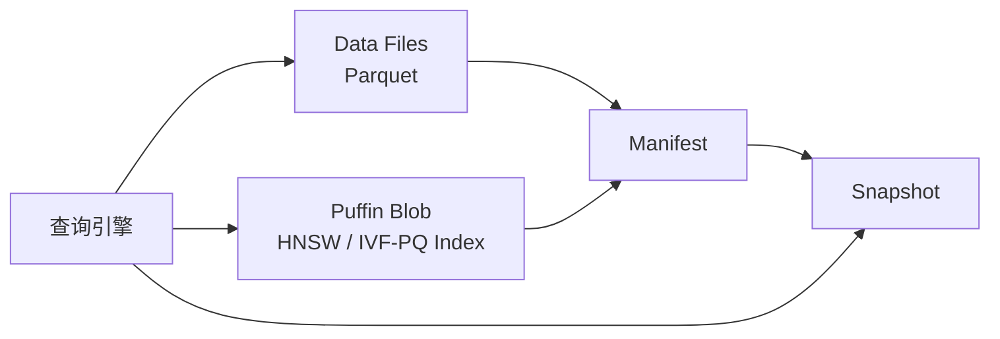
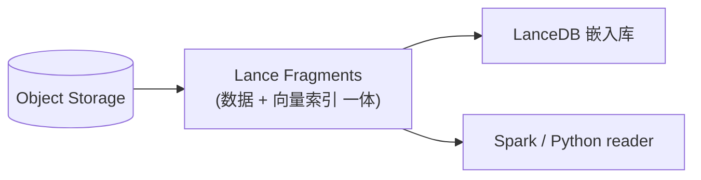
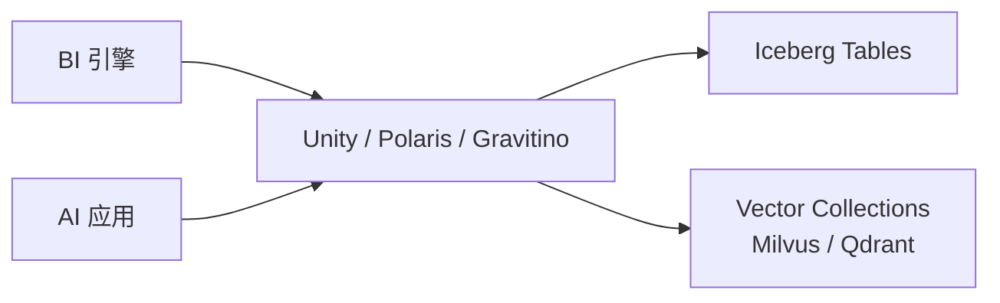

!!! info "本页是跨章组合视角 · 不复述单产品机制"
    三种融合范式涉及的单产品机制请去对应章：
    
    - **Iceberg Puffin** 机制 → [lakehouse/puffin](../lakehouse/puffin.md)
    - **Lance Format** 格式 → [foundations/lance-format](../foundations/lance-format.md)
    - **LanceDB** 产品 → [retrieval/lancedb](../retrieval/lancedb.md)
    - **Milvus / Qdrant** 产品 → [retrieval/milvus](../retrieval/milvus.md) · [retrieval/qdrant](../retrieval/qdrant.md)
    - **Unity Catalog / Polaris / Gravitino** → [catalog/unity-catalog](../catalog/unity-catalog.md) · [catalog/polaris](../catalog/polaris.md) · [catalog/gravitino](../catalog/gravitino.md)
    - **Catalog 选型决策** → [catalog/strategy](../catalog/strategy.md)
    
    **本页专做**：三种路线选型决策 · 不讲单产品。

# Lake + Vector 融合架构

!!! tip "一句话理解"
    让**结构化表、非结构化资产（图/音/视/文）、向量索引**都住在同一个湖仓底座上，由同一套 Catalog 治理、被同一套引擎读。这是团队"多模一体化湖仓"路线的技术主线。

## 为什么一体化

把 BI 和 AI 跑在不同系统上，是过去十年的默认做法；但随着 AI 负载频繁触碰湖上的原始数据，**两个世界互相"ETL 过来、ETL 过去"的成本变成最大摩擦**：

- 原始文档在湖，embedding 另建独立向量库 → **双写 + 一致性风险**
- AI 模型需要训练集 ↔ 训练集本来就在湖 → **为啥要走 DB**
- 检索增强生成（RAG）的语料就是 BI 事实表的一部分 → **为啥要跨系统**

Lake + Vector 的主张是：**别搬家，让湖支持向量就地检索**。

!!! note "本节（§三种落地范式）· 客观知识"
    以下三范式的**机制描述 + 能力对比**是行业共识 · 非团队观点。范式 A（Puffin）、B（Lance / LanceDB）、C（Catalog 联邦）是工业界公认的三条技术路径 · 可被独立引用。对具体产品的好恶 / 选型倾向在下文 §怎么选 和 §相关章节中分层标注。

## 三种落地范式

{ loading=lazy }
{ loading=lazy }

### 范式 A：向量下沉到湖表（Iceberg + Puffin）

Iceberg 把**辅助索引**（含 HNSW / IVF-PQ 向量索引）放进 Puffin 侧车文件，和 Parquet 数据文件并列、被同一 Manifest 引用。读端引擎认识 Puffin blob 就能直接做 ANN，不需要独立向量服务。

- **优点**：保持 Iceberg 生态（所有引擎都能读），索引和数据同表演化
- **状态**：Puffin 容器标准已稳定，向量索引 blob 类型在社区化

Mermaid 文本版本

### 范式 B：多模原生湖表格式（Lance / LanceDB）

Lance 从零为"多模 + 向量 + 随机访问"设计：**数据、向量索引、版本元数据**三位一体封在同一组 Fragment 里。LanceDB 作为嵌入式库直接打开对象存储；Spark / Ray 也能读同一份 Fragment 做批处理和训练。

- **优点**：为向量 + ML 训练原生设计，随机访问、向量索引、零拷贝更新
- **代价**：生态比 Parquet 新

Mermaid 文本版本

### 范式 C：独立向量库 + Catalog 统一

保留已有 Milvus / Qdrant 作为向量层（大规模 + 高 QPS 强项），但用 Unity / Polaris / Gravitino **统一 Catalog 把 Iceberg 表和向量 Collection 管进同一套治理视图**（权限、血缘、发现）。

- **优点**：继续用成熟向量库能力（分布式、高 QPS）
- **代价**：仍是两套存储，Catalog 只是"把它们对齐"

Mermaid 文本版本

## 怎么选

!!! info "本节 · 决策框架（可辩 · 有适用边界）"
    以下决策矩阵是**基于工业实践的经验判断** · 不是唯一答案。**每一行有具体的前提假设**（向量规模 · 团队能力 · 已有栈） · 读者应根据自己场景校验。

| 你的情况 | 推荐范式 | 前提假设 |
| --- | --- | --- |
| 以 Iceberg 为事实表 · 向量规模 ≤ 千万 · 想最少系统 | **A（Puffin）** | Iceberg 生态已铺开 · Puffin 工具链能接受"相对新"· 向量查询 QPS 不极端 |
| 多模资产多 · 训练任务重 · 向量规模亿级 | **B（Lance / LanceDB）** | 团队可以接受 Lance 相对新的生态 · 有一定运维 Lance 格式的能力 |
| 已经在跑 Milvus / Qdrant · 规模大 · 不想动 | **C（Catalog 统一）** | 存量向量库 + 新建 Catalog 可以共存 · 治理层升级比物理搬迁更经济 |

三种**不互斥** —— 一家公司可以 A + C 并存（高频小向量表用 Puffin · 大型多模向量用独立向量库 · 通过 Unity / Polaris 统一注册）。

!!! warning "团队推荐（主张性 · 见 [unified/index §5 团队路线主张](index.md)）"
    对于"BI + AI 并存 + 多模场景主线"的中大型团队 · 本 wiki 的推荐组合是：
    
    - **短期稳态**（L1-L2）：范式 **C**（Iceberg + LanceDB / Milvus 独立 + Unity Catalog / Polaris 统一）
    - **长期目标**（L2-L3）：范式 **B**（Lance 作多模主向量 · 见 [ADR-0003](../adr/0003-lancedb-for-multimodal-vectors.md)）
    - **过渡路径**：**C → B**（先治理统一 · 再物理一体化）
    
    **这是团队主张** · 不认同可以只采纳客观三范式分析部分。纯 BI / 纯 LLM / 纯 Classical ML 团队无需适用本推荐。

## 一体化带来的新能力

- **跨模态 join** —— 一条 SQL `SELECT ... FROM images i JOIN docs d ON vector_distance(i.clip_vec, d.clip_vec) < 0.3`
- **时间旅行的 RAG** —— 可以"用上周的语料回答问题"用于回归测试
- **单权限模型** —— Unity / Polaris 管一份 ACL，向量表也享有
- **流批一体的 embedding 刷新** —— Paimon changelog → 新 embedding → 自动重建索引

## 陷阱与坑

- **不要过早一体化** —— 如果向量规模小、场景单一，独立向量库 + 批同步足够了
- **Catalog 是新瓶颈** —— 一体化后所有东西都过 Catalog，commit 吞吐成为关键
- **版本协议漂移** —— Lance / Puffin / Iceberg Vector 支持的协议都在演进，升级路径要盯紧

## 相关概念

- [湖表](../lakehouse/lake-table.md)、[Puffin](../lakehouse/puffin.md)
- [Lance Format](../foundations/lance-format.md)、[LanceDB](../retrieval/lancedb.md)
- [多模数据建模](multimodal-data-modeling.md)
- [Catalog 策略](../catalog/strategy.md)

## 延伸阅读

- *The Composable Data Stack* 系列（a16z / Databricks 相关博客）
- Iceberg Vector Search proposal（社区讨论）
- LanceDB 博客 *"Why we built Lance"*
