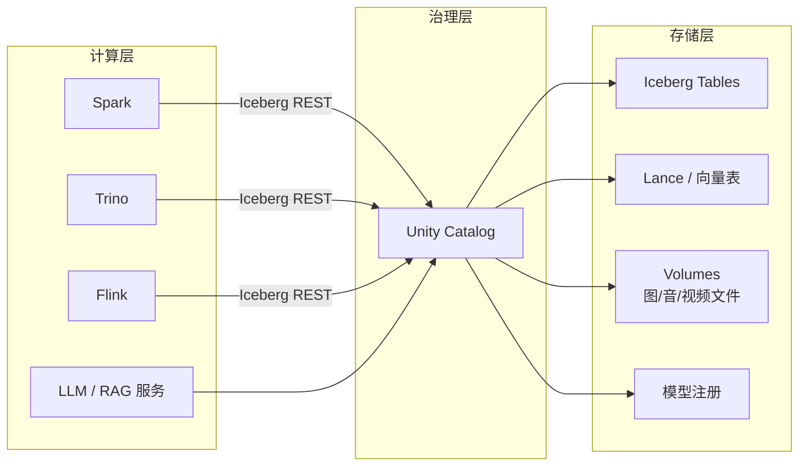

# 统一 Catalog 策略

!!! tip "一句话理解"
    一体化湖仓需要**一个 Catalog 统管所有资产类型**：表、向量表、模型、文件 Volume、Function。选型不再是"哪个 Catalog 好"，而是"谁能做多模资产 + 治理 + 协议开放三件事"。

## 为什么 Catalog 突然重要

早年 Catalog 只是"表注册中心"——HMS 够用。一体化湖仓时代它的角色膨胀到：

1. **多模资产**：表、向量、模型、Volume、Function 的统一命名空间
2. **治理入口**：权限、血缘、审计、脱敏、Tag 策略
3. **协议层**：定义读写、commit、扩展字段的开放标准
4. **多引擎中枢**：所有引擎都绕着它转（Spark / Trino / Flink / DuckDB / 向量库 / 模型库）

Catalog 从"字典表"升级成了"治理平面"。

## 现代 Catalog 选手对比

| 候选 | 来源 | 强项 | 弱项 |
| --- | --- | --- | --- |
| **Unity Catalog** | Databricks / LF AI&Data | 多模资产最全、治理能力最强 | 早期生态与 Databricks 紧 |
| **Apache Polaris** | Snowflake | 纯 Iceberg REST + 权限，协议最"纯净" | 范围偏窄 |
| **Apache Gravitino** | Datastrato | 多元数据源桥接、多引擎统一 | 相对年轻 |
| **Nessie** | Dremio | Git-like 分支 / 标签 / 事务 | 多模资产不是重点 |
| **Iceberg REST Catalog** | Iceberg 社区 | 协议标准本身 | 只是协议，需选实现 |
| **Hive Metastore** | Hadoop 时代 | 生态兼容 | 能力老旧，不适合一体化 |

## 选型决策树（实操向）

1. **我们已经在用 HMS 且还有大量存量？**
   → 先上 Iceberg REST Catalog 包裹 HMS，逐步迁移
2. **主要负载是 AI/ML + 向量 + 模型管理？**
   → Unity Catalog（OSS 或托管）
3. **强调数据 Git-flow、分支发布、审计？**
   → Nessie + 外层治理
4. **想要最"纯净"的 Iceberg 协议，自己加治理？**
   → Polaris
5. **多元数据源（多个 HMS / 多个集群 / 外部系统）？**
   → Gravitino 作为中间层

## 一体化下的 Catalog 最小能力清单

- 对象命名空间支持：Table / Volume / Vector / Model / Function
- 协议开放：至少兼容 Iceberg REST Catalog
- 权限：RBAC + 行列级策略 + Tag 策略
- 血缘：列级 + 跨引擎
- 审计：Query / Commit / Access 全路径可溯
- 扩展：能为"多模资产"类自定义 metadata schema

现阶段能全满足的是 **Unity Catalog**；Polaris + 外部治理是紧跟的备选。

## 部署拓扑常见模式

## 陷阱与坑

- **不要一次性迁移全部** —— 先把新负载接新 Catalog，老负载继续 HMS，做双写或适配
- **权限模型跨 Catalog 迁移痛苦** —— 提前盘点 GRANT 表
- **扩展字段要和上游 OSS 对齐** —— 自造 metadata 字段会在升级 Iceberg 协议时冲突
- **Catalog 本身是单点**：HA / 备份 / 恢复要按数据库级标准来

## 相关

- [Iceberg REST Catalog](../catalog/iceberg-rest-catalog.md)
- [Unity Catalog](../catalog/unity-catalog.md)
- [Nessie](../catalog/nessie.md)
- [Lake + Vector 融合架构](lake-plus-vector.md)

## 延伸阅读

- Apache Gravitino: <https://gravitino.apache.org/>
- Apache Polaris: <https://github.com/apache/polaris>
